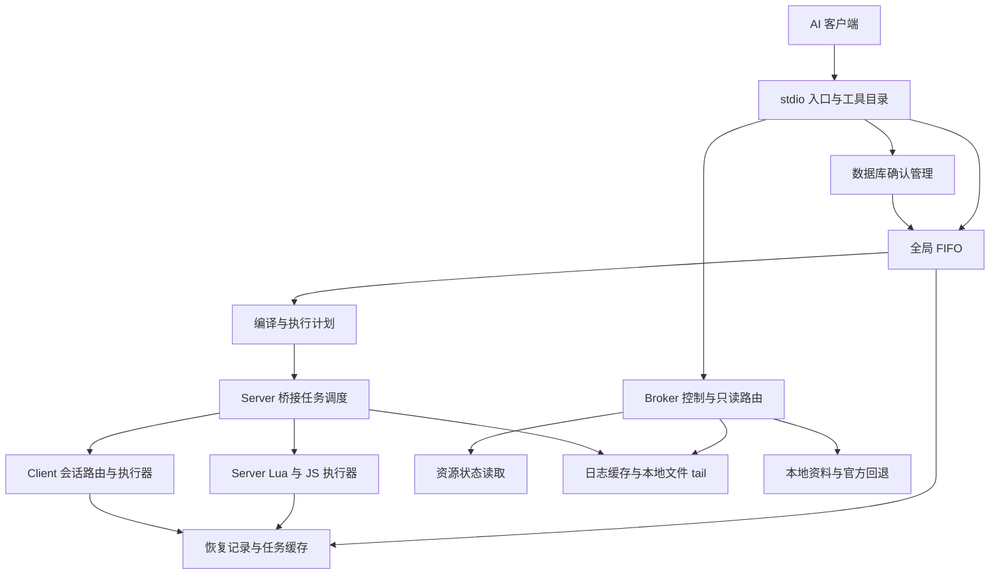

# RFC：FiveAI MCP 完整调试能力补齐

日期：2026-09-13  
状态：技术修订复审中；产品范围、验收环境与实施授权已确认，2026-09-13 首轮独立技术评审的阻塞项已纳入本文，复审通过前不实施依赖内部协议 v2 的生产代码。  
范围：一个 RFC、全部 10 个工具的完整开发与验收，不拆成多个交付 RFC，不以 status 阶段作为最终完成。  
代码基线：`df86efb` 加本次检查时的工作区改动；不是干净 HEAD，也不是已发布版本。

## 1. 决策摘要

在现有 `packages/mcp`、`packages/fivem-plugin` 和一体化产物上补齐真正的调试调用链：MCP 工具发现与调用、全局 FIFO、双端 Lua/TypeScript、资源生命周期、日志、ESX/QBCore/ox 适配、数据库确认、参考资料，以及持久恢复与结果对账。完成标准不是工具名出现，也不是客户端上报 capabilities，而是本 RFC 的自动化及真实宿主验收矩阵通过。

保留 Windows 本机、同用户一个 Broker、同一服务器环境、多 AI 入口和多游戏客户端的架构。所有产生运行副作用的调用串行；控制与读取独立。未知执行不重放、不强制取消、不凭重连清除阻塞。

本 RFC 明确修订尚未接通的内部任务协议为 v2，修复跨进程时钟、完整事务确认、执行身份和恢复对账缺口。公共工具名称、公共输入及一体化 config v1 保持原设计；实现依赖顺序不构成缩减功能的分期发布承诺。

### 1.1 来源、优先级及替代范围

| 来源 | 本 RFC 如何使用 |
| --- | --- |
| [2026-09-09 调试设计](../specs/2026-09-09-nodejs-debug-mcp-design.md) | 全部 10 工具及功能/安全边界的产品基线 |
| [2026-09-11 一体化设计](../specs/2026-09-11-unified-artifact-design.md) | 一个资源目录、共享配置/凭据、build/pack、状态保留的交付基线 |
| [原调试 RFC](nodejs-debug-mcp-rfc.md) | 继承工具语义、方法清单、容量、未知状态策略；本文显式修订其目录、任务协议、TS 转换交付和验收安排 |
| [一体化 RFC](unified-artifact-rfc.md) | 继承凭据初始化及文件所有权；本文替代其中“仅 status”验收，并细化真实宿主读取/链接边界 |
| 本次用户确认 | 一个全量 RFC；使用当前 Dev 项目；缺失依赖补齐后验收；ESX/QBCore 分别启用；专用测试表/记录/角色；不支持 elicitation 时拒绝需要确认的数据库调用 |

两份设计和已有 RFC 保留原文、原历史状态。冲突时，本 RFC 经技术批准后的显式修订优先，其余继续继承。本文不授权实施、安装、宿主切换、数据库写入、提交或发布。

## 2. 当前事实与差距

### 2.1 代码核对结果

| 能力 | 当前证据 | 距离完成的差距 |
| --- | --- | --- |
| 公共输入/消息 | [schemas.ts](../../../packages/mcp/src/tools/schemas.ts)、[messages.ts](../../../packages/mcp/src/protocol/messages.ts)、[envelope.ts](../../../packages/mcp/src/protocol/envelope.ts) 已有 10 工具输入及多数消息类型 | Schema 存在不代表处理器实现；任务目标、时钟及确认消息需修订 |
| 工具发现 | [registry.ts](../../../packages/mcp/src/tools/registry.ts) 为 `status`；[entry.ts](../../../packages/mcp/src/cli/entry.ts) 另外硬编码 status 列表/调用 | 需要统一目录、全部 handler、请求关联和取消/确认接线 |
| Broker | [server.ts](../../../packages/mcp/src/broker/server.ts) 有鉴权、单 bridge、客户端快照及状态；拒绝 `task.submit`、`approval.result`，日志尚无消费者 | 缺真实调度器、分派、终态处理、控制查询及适配管理；queue 的固定零值不是调度实现 |
| 恢复 | [recovery-store.ts](../../../packages/mcp/src/broker/recovery-store.ts)、[recovery.ts](../../../packages/mcp/src/protocol/recovery.ts) 有原子存储及身份匹配 | 尚未与真实任务 write-ahead、settle、ack 连成闭环 |
| 执行器 | [execution.js](../../../packages/fivem-plugin/shared/execution.js)、[executor.lua](../../../packages/fivem-plugin/shared/executor.lua)、[client/main.js](../../../packages/fivem-plugin/client/main.js) 有编码、执行、绑定和部分去重 | server 固定验证探针不是公共任务分派；缺完整任务缓存/重连对账、TS 编译、生命周期及框架执行 |
| 启动适配 | [server/main.js](../../../packages/fivem-plugin/server/main.js) 已改原生资源内容读取、保留 lstat，并捕获禁止子进程的异常 | 需完整宿主矩阵；不能以单次连接证明所有读取、链接及重启情形兼容 |
| 进程身份 | [process-identity.ts](../../../packages/mcp/src/broker/process-identity.ts) 对创建时间精确比较 | bridge 退化时间来自 uptime 估算；与 OS 时间比较会偏差，不能放宽阈值伪造恢复证据 |
| 构建 | [build-unified.mjs](../../../scripts/build-unified.mjs) 有白名单发布、独立 ZIP、staging 清理；测试已有 fixture 隔离 | 新增编译器/数据必须真正进入可独立运行的包；自动化不能碰正在使用的 dist |
| 框架、日志、资料 | 当前 `src` 中无完整 adapters、scheduler、logs、reference 业务模块 | 属于新增实现，不是仅解除注册限制 |

最终验收同时检查注册表、入口、Broker、资源执行器和产物，禁止只改 `REGISTERED_TOOLS` 后报告全功能完成。

### 2.2 宿主事实与未验证项

本轮对话中用户报告已能从 status 看到 Broker 和一个客户端；此前实际日志显示禁止子进程、Windows 绝对路径读取失败、Node 将 `@resource` 拼入 cwd，且曾发现旧 Broker 配置冲突。上述事实证明需覆盖这些边界，不证明全量调试通过。约 600ms 时间偏差是用户反馈，不是本文新测量的精度结论。

本 RFC 调研只读检查了 `D:\FiveM\Projects\Dev\resources`：有 `[qb]/qb-core`、`[standalone]/oxmysql`，其 manifest 分别自报 `1.0.0`、`1.9.2`；扫描未发现 `es_extended`、`ox_lib`、`ox_target`。目录扫描不是运行状态检查，也可能不遍历链接目标；实施前复核实际资源列表。这里的 `fivem-mcp` 目录不能与 `fiveai-mcp` 专用桥接混淆。

当前已约定的开发链接为 `resources/[exs]/fiveai-mcp` 指向仓库 `dist/fiveai-mcp`。这是开发部署形态，不是 ZIP 格式，也不自动授予运行中 build 的权限。

本文没有运行代码测试、启动宿主、读取凭据内容或执行数据库操作。历史单测通过数不转写为本 RFC 验收通过数。

## 3. 目标、非目标与完成条件

必须实现并注册且仅注册：`status`、`queue`、`execute_lua`、`execute_ts`、`resource`、`logs`、`esx`、`qbcore`、`ox`、`reference`。

必须实现端到端工作流：本地 AI 修改目标资源 → `resource.restart` → `logs` → 双端片段/exports/框架验证 → 查询终态；多个 AI 和客户端共享同一 FIFO，断线/超时后可查询证据而不重复副作用。

不提供：截图捕获、NUI/CDT 代理、源码读写/patch、任意控制台命令、依赖安装工具、FXServer 启停工具、txAdmin、多服并行、远程服务器、脚手架、旧 Prompts/Resources。NUI 仍由 Skill 指导外部 DevTools；截图仅保留禁用契约，不可通过配置开启。

“全部可用”指完整代码路径加支持范围内的真实验收；不意味着 ESX/QBCore 同时运行，不意味着未安装库也能调用，不意味着不支持 elicitation 的客户端可以执行数据库写入。明确缺依赖/缺能力属于正确错误路径，但不能替代该模块正向验收。

## 4. 架构与模块职责



继续使用两个源码包，不迁回旧 RFC 的顶层 `mcp/`/`resources/` 布局。以下为拟新增/细分模块，不宣称已有：

| 模块位置 | 唯一职责 |
| --- | --- |
| `packages/mcp/src/tools/catalog.ts`、`outputs.ts` | 工具名、描述、输入/输出 schema、路由策略；供入口、Broker 和测试共用 |
| `src/cli/entry.ts`、`elicitation.ts` | stdio、JSON-RPC 请求关联、原始客户端确认；不拥有 FIFO、不执行业务 |
| `src/scheduler/` | 内存任务表、顺序、等待者、取消、持久提交、未知阻塞和恢复决策 |
| `src/execution/` | TS 转換、源位置映射、公共参数到严格执行计划；不得在 Broker eval 用户代码 |
| `src/adapters/`、`src/data/adapters/` | 显式方法契约、SQL 分类、适配清单、版本与兼容报告 |
| `src/logs/` | Server 流、Client 标记映射、tail、解析、窗口和查询 |
| `src/reference/`、`src/data/reference/` | 随包索引、精确来源、官方有界在线回退 |
| `packages/fivem-plugin/server/` | I/O 接收、host tick、执行/控制双通道、资源代际、身份绑定、日志采集 |
| `packages/fivem-plugin/client/`、`shared/` | 运行时执行、严格计划校验、终态缓存及本地跨语言关联；生成的适配数据不含凭据 |

handler 从 catalog 取 schema；入口校验用于快速反馈，Broker 仍独立校验，bridge 再校验执行计划及绑定。不得信任“入口已经校验”。目标库缺失不隐藏工具，使用结构化错误及 status 能力表说明。

## 5. 公共工具契约

### 5.1 统一输入与响应

沿用现有 `tools/schemas.ts`：严格对象、拒绝未知字段；clientId/playerId 为正安全整数；client 必填 clientId、server 禁止 clientId；片段 args 默认 `{}`，框架 args 默认 `[]`。空函数体合法。方法必须是 manifest 精确键，禁止原型链路径；资源名精确匹配，不接受路径、通配符和批量。

生成 JSON Schema 应显式表达可表达的条件联合；UTF-8/深度/节点预算仍在运行时校验。生成器不支持某条 refinement 不能成为跳过 Broker 校验的理由。

所有已知工具以 `structuredContent` 返回，并附相同 JSON 文本回退。未知工具使用统一未知工具错误，不能关闭整个 MCP 会话。工具业务错误 `isError=true`；异步任务已接收且仍 queued/running 为 `isError=false`。

新增严格输出 schema，禁止任意 `Record<string, unknown>` 长期承担公共输出。公共任务视图定义：

```ts
type TaskView = {
  taskId: UUID; sequence: number; tool: FifoTool;
  state: "queued" | "running" | "succeeded" | "failed" | "cancelled" | "unknown";
  target: ExecutionBinding; queuedMs: number; executionMs: number;
  resultAvailable: boolean;
  result?: BoundedExecutionValue;
  error?: StructuredError; evidence?: FailureEvidence;
};
```

`resultAvailable` 是完整终态负载是否仍保留：成功对应 result，失败对应 error+evidence。unknown 仅有观测错误；cancelled 是保证未分派的终态。过期/重启导致负载不可用必须明确返回 false，不伪装为空结果。TaskView 的 phase-specific 组合由判别联合校验。

### 5.2 工具与完成语义

| 工具 | 输入摘要 | 路由与输出 |
| --- | --- | --- |
| status | `{clientId?}` | 控制；当前 Broker/bridge/client、真实队列计数、恢复原因、框架方法能力、日志覆盖、build/protocol；clientId 只筛展示 |
| queue | status/cancel/recover；taskId 条件必填，status 可 limit | 控制；status 返回任务/队列，cancel 仅原 entry 的 queued 任务，recover 只检查证据 |
| execute_lua | side、code、clientId?、args?、timeoutMs? | FIFO；MCP 资源 Lua 函数体，支持 Citizen.Await，返回多值编码 |
| execute_ts | 同上 | FIFO；Broker 转换成 JS 异步函数后下发，等待整个 await 链 |
| resource | list/status/start/stop/restart；name 条件必填 | list/status 走 bridge 控制通道；变更 FIFO；返回前后状态、阶段结果与完成证据 |
| logs | side=server/client/all、clientId?、resource/prefix/contains?、limit、includeRaw | 控制；先交集筛选再取最近 N；返回 records、覆盖、缺口及截断 |
| esx | side、scope=framework/player、method、args、playerId?、clientId? | FIFO；严格方法适配，返回值投影后 wire 编码 |
| qbcore | 同 esx | FIFO；保留 Functions 路径及原返回语义 |
| ox | library=ox_lib/ox_target/oxmysql、side、method、args、clientId? | UI/交互等直接 FIFO；数据库先分类并完成必要确认后入队 |
| reference | query、category=native/event/guide/all、side?、limit | 控制；本地优先、零命中才官方回退，结果有来源与版本 |

状态查询不能把“没有已登记任务”写成“调度器已完整实现”。最终版不再出现 `scheduler not implemented`、`adapter manifest not implemented` 等占位成功信息。

没有 FiveM 连接时，已初始化的 MCP 仍返回完整 tools/list；status、reference、已有 queue 状态可读，需宿主的新调用明确失败。没有 Broker 时，入口返回可诊断的 `TARGET_UNAVAILABLE`，不返回假的空工具数组。

### 5.3 容量与时限

继承 [limits.ts](../../../packages/mcp/src/protocol/limits.ts)，集中使用同一常量：

| 项目 | 值 |
| --- | --- |
| 心跳/失联/最后 entry 退出宽限 | 5s / 15s / 30s |
| queued / running-or-unknown | 100 / 1，全局 |
| timeoutMs | 默认 30s，100ms–300s；不含排队，含队首准备/编译 |
| 工具同步任务等待 | 接收入队后最多 20s；之后返回 taskId，不撤销远端 |
| 确认 | 300s，每 entry 最多 5 个；显示完整请求最多 32KiB |
| code / args / 结果 | 64KiB / 128KiB / 256KiB；JSON 深度32、节点10000 |
| 任务结果缓存 | 1000项或30分钟，完整结果合计32MiB；未解决项不驱逐 |
| 日志 | 每流50000条或16MiB、全局64MiB；每行64KiB；查询默认100、最多1000、响应512KiB |
| 内部帧/日志批次 | 1MiB；100条或100ms flush，禁用压缩 |
| 资料 | query256字符；默认10、最多50条；在线总预算8s |

补充有界保护：全局待确认最多32个；每条 entry 连接待完成控制请求最多100个；bridge 只读请求5s超时；拒绝超额而不驱逐合法在途请求。新增常量及边界测试必须随实现进入 limits。

## 6. 内部协议 v2 与身份

### 6.1 升级原则

当前 v1 的 schema 已被严格解析，新字段/消息不应悄悄塞入 v1。统一改为信封 `v:2`、hello `internalProtocol:2`、`/internal/v2/entry` 与 `/internal/v2/bridge`；同步更新三份 bundle，不兼容混用。公共 MCP 协议由 SDK 协商，不能与这里的内部版本混淆。config 保持 version1；恢复文件独立 version2。

保留角色凭据、Host/loopback 检查、拒绝浏览器 Origin、同步安装 WS 处理器等既有边界。buildId 必须相同；adapterDigest 比较的是随包适配契约，不要求所有目标框架都安装。旧 v1 路由只返回明确升级拒绝，不提供双写调度。

`id` 关联内部消息；`requestId` 是 entry 为公共请求生成的 UUID；`taskId` 是任务身份。不得直接以可重用的 JSON-RPC id 作为任务 id。信封 session 绑定当前连接，任务同时携带原始执行绑定。

### 6.2 执行绑定与来源

新增严格 `ExecutionBinding`：`originBrokerInstanceId`、`bridgeEpoch`、`serverEpoch`、`target`；target 沿用 server/client 联合，client 包含 clientId、clientEpoch。serverEpoch 是 Broker 管理的服务器代际，不是 bridgeEpoch 的别名。

`originBrokerInstanceId` 在 Broker 每次启动时生成且不继承。`bridgeEpoch` 由资源进程每次启动生成，并在同一资源进程的传输重连中保持不变。`serverEpoch` 由 Broker 在某个 `bridgeEpoch` 首次通过鉴权时生成；同一 Broker 接受同一 `bridgeEpoch` 的传输重连时复用，Broker 重启后不复用。`clientEpoch` 由 Client 资源实例生成，Client 资源重启或 ID 被新会话复用时必须变化。上述 UUID 均由其唯一权威方生成，禁止从 PID、时间戳或其他代际推导。

在 OS 身份未验证时，serverEpoch 仅作为本次 bridge 会话关联值，不可用于环境重置证明。实际恢复资格是独立的 `identityVerification`，不能事后修改已下发 binding。与结果关联的原始 BridgeEnvironment 在任务生命周期内保持不可变。

Client 接受任务仍核对网络来源、当前挑战、clientEpoch；Server 回收结果按实际 source 和在途 binding 核对。重复 dispatch 摘要必须匹配，同 taskId 不同内容视为冲突，不能覆盖旧任务。Server 代码执行绝不暴露给 client net event。

当前连接身份和原任务身份分两层校验：信封始终必须匹配当前连接的 `brokerInstanceId/sessionId`；`task.result`、`task.statusResult` 的 payload 可以携带旧任务 binding，但仅在该 binding 与恢复存储中的 active 或 released-unknown 记录逐字段相等、摘要相等，且 Bridge/Client 的未确认缓存返回同一 binding 时用于恢复对账。普通新任务禁止携带旧 `originBrokerInstanceId`。迟到终态被当前 Broker 接收，不会改写其原始 binding；settled 记录额外保存 `settledByBrokerInstanceId`。

| 事件 | 当前代际变化 | 旧任务处理 |
| --- | --- | --- |
| 同一 Bridge 传输重连、同一 Broker | 仅 `sessionId` 变化；bridgeEpoch/serverEpoch 不变 | 可按完整旧 binding 查询并收回未确认终态 |
| Broker 重启、Bridge 进程未重启 | originBrokerInstanceId/serverEpoch/sessionId 变化；bridgeEpoch 不变 | 新 Broker 仅按恢复记录发 `task.status`，接受完整旧 binding 的终态；不重发 dispatch/start |
| Bridge 资源重启 | bridgeEpoch/serverEpoch/sessionId 变化 | 旧缓存不可假定存在；not-found 不解除 unknown |
| FXServer 进程重启 | Bridge 必随资源重启而产生新 bridgeEpoch；serverEpoch 变化 | 只有 §7.3 的资源生命周期例外可释放执行槽，业务副作用仍不推断 |
| Client 传输/网络重连且 Client 资源未重启 | clientId 可相同，clientEpoch 不变，challenge/session 更新 | Server 仅允许同 clientEpoch 的缓存对账，不把任务转投其他 Client |
| Client 资源重启或 clientId 被复用 | clientEpoch 与 challenge 变化 | 旧目标不再可执行；旧终态只有带原 clientEpoch 且来源可核对时可接收 |

### 6.3 消息修订表

| 消息 | v2 规范修订 |
| --- | --- |
| hello/welcome | bridge 报告 resourceName、能力及 adapterDigest；entry 报告 form-confirmation 能力；welcome 返回本次绑定的 serverEpoch 和有效容量；能力不是授权 |
| task.submit | 保留 tool、arguments、requestId；Broker 重新校验并绑定环境，禁止 resource 读取进入 FIFO |
| task.accepted | 必含 requestId、taskId、sequence、state，避免多请求乱序匹配 |
| task.dispatch | 必含 binding、taskId、tool、严格 `ExecutionPlan`、payloadDigest、timeoutMs；删除跨进程 deadlineMs |
| task.received | taskId、binding、payloadDigest；只证明接收，不是终态 |
| task.ready/start | taskId、binding、payloadDigest；ready 从实际执行端逐跳返回，start 由 Broker 授予且只消费一次；见 §6.4 |
| task.result | binding、executedBy、taskId、payloadDigest、executionMs、成功 result 或失败 error+evidence；queuedMs 由 Broker 计算，不能信任远端自报 |
| task.resultAck | taskId、binding、resultDigest；只在 settled 落盘后发出 |
| task.resultAcked | taskId、binding、resultDigest；执行端释放匹配的完整终态缓存并保存本地 ack tombstone 后逐跳回报，可幂等重发；Broker 核对后才把 settled 原子迁入 tombstone |
| task.status/statusResult | 请求带原 binding；回复携带同一身份及终态摘要；跨 Broker 对账不得省略原始环境。not-found 不证明未执行 |
| approval.request/result | 见 §10，完整 discriminated databaseCall、绑定和有效期；不再用单个 sql 字符串代表整个事务 |
| control.request/result | 继续服务 status/queue/logs/reference/resource读取；结果为已知工具严格输出 |
| bridge.read.request/result | resource list/status，关联 requestId；live/cached 明确区分并附 observedAt |
| resource.snapshot | 新增：资源名、状态、generation、当前适配可用性；用于变更检测，不等同于执行命令 |
| clients.snapshot/logs.batch | 保留现有语义，校验 bridgeEpoch、唯一 client ID、流序列与容量 |

`ExecutionPlan` 必须是有版本的判别联合，禁止把所有工具都转成任意代码字符串：fragment 使用 language/code/args/virtualSource；resourceMutation 使用 action/name；adapterCall 使用 manifestKey/args/resourceGeneration。公共 `execute_ts` 转换后的 plan.language 为 javascript，不新增 `execute_js` 工具。

### 6.4 时钟与启动许可

删除现有 `TaskDispatchSchema.deadlineMs` 的跨进程单调时间语义。Broker 独占执行观测时钟：队首准备开始取单调 t0，届时加 timeoutMs；bridge/Client 只计算自己的执行耗时，不把另一个进程的 performance.now/GetGameTimer 与本地比较。UTC 只作展示/关联。

为避免宿主卡顿后积压 dispatch 被当成新任务启动，dispatch 先登记为 prepared。新增 `task.ready`（taskId、binding、payloadDigest）和 `task.start`（相同键）：bridge 在可运行的 host tick 发送 ready，Broker 仅在该任务仍是唯一 running 且未超时时发送一次 start；start 前禁止运行。Client 目标的 ready 必须来自该 Client，经 Server 验证转发。

start 的发送意图先持久化。start 一旦可能发出，超时只表示 unknown，仍可能迟到执行，不能宣称撤销。未获得 start 的 prepared 任务不会自行启动，也不在重连时重发 start；安全释放需要对账，不能单凭未收到 received/ready 推定未执行。这样保守处理跨进程延迟，不伪造严格分布式截止时刻。

ready/start 的各跳均校验当前会话、原 binding 与摘要；重复 start 不能重复调用执行器。若完整持久记录证明仅有 dispatch_intent、从未写入 start_intent，且所有发送路径都遵循先持久化再发送，则可据此结算为从未执行的失败，并使对应 prepared 记录失效；不能将缺失或损坏的记录当作此类证据。

### 6.5 规范摘要

所有安全关键摘要由 `src/protocol/digests.ts` 的单一实现生成，算法固定为 SHA-256：`sha256(utf8("fiveai-mcp:" + domain + ":v1") || 0x00 || canonicalBytes)`，输出小写十六进制 64 字符。domain 仅允许 `task-payload`、`task-result`、`approval`、`adapter-manifest`；不同 domain 的摘要不可互换。

`canonicalBytes` 是待摘要对象的 RFC 8785 JSON Canonicalization Scheme UTF-8 字节。协议对象必须先由对应严格 schema 完成默认值填充，再进入规范化；`undefined`、NaN、Infinity、BigInt、循环、孤立 UTF-16 surrogate 和 schema 外字段均拒绝。JCS 规定对象键按原始、未转义属性名的 UTF-16 code units 做无符号词法排序、数组保持顺序、字符串不做 Unicode normalization、数字使用其 ECMAScript JSON 表示，`-0` 规范为 `0`。SQL 的规范值是 JSON 解码后、未经换行或 Unicode 归一化的 JavaScript 字符串；同一字符串的 UTF-8 字节同时用于展示、执行和摘要，不保留 JSON 转义的词法差异。

各摘要输入固定如下，禁止调用方自由增删字段：

- `task-payload`：`{taskId,tool,requestId,binding,executionPlan,timeoutMs}`；`sequence` 只负责排序，不进入远端载荷摘要。
- `task-result`：`{taskId,binding,payloadDigest,executedBy,executionMs,outcome}`，其中 outcome 是严格成功/失败联合。
- `approval`：`{approvalId,requestId,entrySessionId,databaseCall,binding,oxmysqlGeneration,expiresAt,configDigest}`。
- `adapter-manifest`：`{manifestVersion,entries}`；entries 先按 `tool,library,resourceName,side,scope,method` 的 UTF-16 代码单元序稳定排序，每项内部仍由 JCS 排序。

实现必须提供固定字节测试向量，覆盖 RFC 8785 官方非 ASCII 属性名排序向量、至少一个 code-point 顺序与 UTF-16 code-unit 顺序不同的属性名对、对象键乱序、数组顺序、默认值、`-0`、组合/分解 Unicode、SQL 换行、事务全部 statements、binding 字段篡改和 domain 分离。任何规范化失败都是协议/输入错误，不退回普通 `JSON.stringify`。

## 7. 全局 FIFO、缓存与恢复

### 7.1 状态机与调度

Broker 校验/绑定/必要确认完成后，单事件循环分配 sequence 入队。只有一个 running/unknown 占位。资源读取、日志、资料、queue 控制不排在 FIFO 后。TS 准备在队首，不因并行编译完成顺序改变接收顺序。

- queued → cancelled：原 entry 显式取消或断开，保证未分派。
- queued → running：占据队首，开始执行观察计时。
- running → succeeded/failed：编译等可证未远端执行的失败，或身份匹配的已完成远端终态。
- running → unknown：可能已分派后超时/失联/协议故障，整个执行队列暂停。
- unknown → succeeded/failed：核验迟到终态并持久化后解除阻塞。

失败 evidence 必须满足现有 `failureEvidenceIssue`：远端已结束与从未远端执行恰好一个为 true。序列化失败属于执行已结束，不是未知。运行任务不提供强制 cancel；取消公共请求等待只撤销等待者，不能撤销已下发任务。目标会话在队首变更则失败，不转投新客户端。

### 7.2 恢复存储 v2

复用 RecoveryStore 的同目录临时文件、排他创建、flush、rename 和路径检查。该原子替换契约用于进程崩溃恢复；在未取得目录 fsync 与实际文件系统证据前，不宣称可抵御断电。v2 不保存代码、SQL、参数或完整结果。内容摘要不写普通日志，也不作为抵御同用户恶意进程的秘密。

恢复文件 v2 的顶层结构固定为：

```ts
type RecoveryFileV2 = {
  version: 2;
  brokerInstanceId: UUID;
  active: ActiveRecoveryRecord | null;
  releasedUnknown: ReleasedUnknownRecord[];
  settled: SettledSummary[];
  tombstones: AckedTombstone[];
  legacyHistory: LegacyHistorySummary[];
};
```

`active` 至多一项，保存 taskId、原 binding、工具类别、payloadDigest、`dispatch_intent|start_intent` 阶段、创建时间及 OS 观测证据，并且是唯一可占据执行槽的持久记录。`releasedUnknown` 只接收 §7.3 资源生命周期例外已释放执行槽的旧 unknown，额外保存释放证据摘要、释放时间和原 active 全部身份；它不占活动槽，但仍接受迟到终态。`settled` 保存 resultDigest、终态、原 binding、`settledByBrokerInstanceId` 和是否已取回完整结果；`tombstones` 只表示完成 ack 的摘要；`legacyHistory` 只保存成功迁移的 v1 历史摘要，永不被当作 v2 执行证据。这五组互斥，taskId 只能出现于一组；迁移必须在一次原子保存中完成。

`settled` 最多1000项，完整结果仍受32MiB总预算；未完成 ack 的 settled 不按 TTL 淘汰，达到项数或字节上限时阻止新副作用任务。Broker 发送 resultAck 不等于完成 ack；只有收到 binding/resultDigest 匹配的 `task.resultAcked` 并原子迁入 `tombstones` 后，tombstone 才按1000项或30分钟淘汰。`releasedUnknown` 不按 TTL 淘汰，最多1000项；达到上限时以 `CAPACITY_EXCEEDED` 阻止新的资源生命周期例外释放及新副作用任务，不删除旧证据。只有收到身份和摘要完全匹配的终态并原子迁入 settled 后才能移除 released-unknown。不存在 force/delete/ignore 接口。

dispatch 前落盘 dispatch_intent；start 前落盘 start_intent；终态先落盘 settled（resultDigest 及身份），再 ack、推进下一任务。任一写入失败：保留已有文件，停止新分派；已运行任务不重发。进程崩溃后内存 queued/审批失效，不重放。

ack 到达前，Server/Client 各保留唯一未确认任务和完整终态；Broker 重连只问状态/收回结果。ack 按结果摘要逐跳转发到 Client，禁止当前固定探针路径“Server 一收到就提前 ack”。Server 目标由 Bridge 删除匹配完整结果、保存本地 ack tombstone 后发送 `task.resultAcked`；Client 目标由 Client 执行同一顺序，再由 Server Bridge 验证来源并逐跳转发。Bridge/Client 若在保存 tombstone 后、回报前断线，重连状态查询必须返回 acked 摘要并允许重复 `task.resultAcked`，Broker 幂等处理。已 ack 的 tombstone 有界1000条/30分钟；active、released-unknown 或未 ack 结果不能因普通 TTL 被驱逐。桥接自身重启造成缓存丢失要如实报告。

`queue.status` 全局可见但不返回原代码/SQL/args；完整结果存在内存时同用户授权入口可读取。取消仅原 entry 会话；recover 可由任一鉴权 entry 请求，只校验证据。

### 7.3 恢复证据

| 证据 | 是否允许继续 |
| --- | --- |
| 身份和摘要匹配的原任务终态 | 是，先保存 settled；旧 Broker 的迟到结果也需原 binding 匹配 |
| 已有一致 settled 记录 | 是；结果缺失明确 `resultAvailable=false` |
| 完整写前记录证明只有 dispatch_intent、从未产生 start_intent | 是，按 §6.4 保存从未执行的失败终态；损坏/缺失记录不适用 |
| 重连、资源 restart、clientId 重新上线、查询 not-found | 否 |
| PID 改变或约600ms误差被放宽接受 | 否 |
| 自实现 resource 生命周期任务：旧服务器进程已核实退出，新进程身份可靠、资源状态可读、无尚存 start 命令 | 可解除该类控制阻塞，旧任务仍 unknown，不推断业务副作用回滚 |
| 任意片段/exports/框架/SQL 未知任务，只证明服务器重启 | 否，不证明外部操作结束或数据库回滚 |

保留原设计的不支持 force/人工忽略接口。不能通过删除 recovery、换 stateDir、新安装目录或重装插件“解决”未知任务。无法证明时可能长期阻塞；该限制必须写进工具说明和操作手册，不向用户建议自动重试。

资源生命周期恢复例外须先原子保存独立的阻塞解除证据，再释放执行槽；历史任务仍为 unknown。因此“running/unknown 最多一个”指占据执行槽的未解决任务，不能把已获准释放但仍 unknown 的历史记录重新计入活动槽，也不能从历史中删除它。

## 8. 执行器与资源控制

### 8.1 Lua、JS、TS 与结果

复用当前 Lua/JS 编码器，但补齐 wire 契约承诺的 bytes、vector、稀疏表、多返回尾 nil、BigInt、undefined、hole；plain object 不执行 getter。未支持的宿主对象返回 RESULT_UNSERIALIZABLE，不能偷偷变成空对象。

Lua 函数体使用局部 args、Citizen 协程、xpcall 和 table.pack；JS await 异步函数。两者都是 MCP 资源自己的执行环境，不是目标资源私有全局环境。调用其他资源只能使用其公开 exports。所有 natives/exports/本地 Lua 调用与 Client emit 从正确 host 调度线程发起，Node I/O 回调只排队；Promise continuation 中调用 native 也要显式回到宿主线程，不能仅保证第一行。

不等待 detached thread、timer、未 await Promise；不提供杀死任意 CPU 死循环的承诺。测试不得在日常 Dev 项目执行不可恢复死循环，用可完成的延迟和受控断线检验 unknown。

### 8.2 TS 转换与自包含交付修订

原 RFC 的运行期 esbuild 转换会引出平台可执行文件交付问题；目前只打包 JS 的产物不能假设用户有 esbuild 二进制。本文选择锁定现有 TypeScript `5.9.3` 的纯 JS Compiler API，在 Broker 中用内存 AST 检查与 `transpileModule` 转换；构建仍使用 esbuild `0.28.2`。这替代原 RFC §8 的运行期 esbuild 选型，不改变 `execute_ts` 输入与 ES2020 目标。

固定包装文本为 `(\nasync function __fiveai_task__(args: unknown) {\n<USER_CODE>\n}\n)\n`，用户源码从第3行开始，包装偏移固定2行。预扫描拒绝用户源码中的 `//# sourceURL`、`//@ sourceURL`、`//# sourceMappingURL`、`//@ sourceMappingURL`（允许前导空白且大小写敏感遵循 pragma 语法），随后解析完整包装并验证源文件恰好包含一个 expression statement，其表达式恰好是包裹该名称 async function expression 的 parenthesized expression；无其他顶层节点。递归 AST 拒绝静态/动态 import、export、`import.meta`、`require`/`eval`/`Function` 标识符调用、module/namespace、decorator、triple-slash directive 和模块解析请求。

Compiler API 选项固定为：`target=ES2020`、`module=None`、`moduleResolution=Classic`、`sourceMap=true`、`inlineSourceMap=false`、`inlineSources=true`、`removeComments=false`、`importHelpers=false`、`noEmitHelpers=false`、`isolatedModules=true`、`newLine=LineFeed`、`useDefineForClassFields=false`。文件名固定为 `fiveai-task-<taskId>.ts`。先收集 syntactic diagnostics；`transpileModule` 后重新以 ES2020 Script 解析输出，要求仍恰好只有一个 parenthesized async function-expression statement，禁止任何顶层 helper、导入、导出、声明或其他语句。TypeScript AST 的 `pos/end` 是 JavaScript 字符串的 UTF-16 code-unit offset：worker 必须先以 `outputText.slice(0, expression.end)` 取得原始字符串，再将该字符串编码为 UTF-8；禁止把 `expression.end` 直接传给 `Buffer.slice`。禁止重打印或改写 AST；只移除表达式之后的分号、换行和唯一尾部 source-map 注释，因此本次 `transpileModule` 返回的 map 仍描述实际执行字符串。表达式 `pos` 非0、尾部有其他内容或 map 缺失均返回 `COMPILATION_ERROR`。执行器直接对该完整 parenthesized expression 求值，不再次增加会改变行列的包装。

同步编译运行在有显式 seam 的 worker thread；Broker 主线程只发送有界 code/options/taskId 并接收有界 JS/map/diagnostics。worker 首次加载 TypeScript 的成本在队首准备时计入 `timeoutMs`，同一 Broker 可复用 worker；worker 超时、退出、结果超限或协议错误均属于可证未远端执行的失败。status、queue、logs 和心跳不等待 worker。自动化以64KiB极端嵌套/类型语法并发控制请求测量事件循环延迟；若目标机上控制请求5s内无法完成，实施停止并重新评审 worker/限额，而不是放宽控制超时。

编译器及 SQL parser 为 Broker 运行依赖，必须 bundle；编译器不进入 FiveM Server/Client。source map 使用唯一 `fiveai-task-<taskId>.ts` 虚拟名，Broker 用 Node SourceMap 映射已知虚拟帧并减去包装行偏移；无法映射保留原始帧，不编造位置。源码/map 只在任务结果缓存期留内存，不写日志或磁盘。

依赖锁定沿用 MCP SDK1.30.0、Fastify5.12.3、WS11.3.0/8.21.3、Zod4.5.4；新增 SQL parser 采用原 RFC 指定的 node-sql-parser5.4.0。实施时验证 package/lock 和独立解包加载；若固定版本无法满足契约，先提出替代修订，不能静默更新到 latest。

### 8.3 资源控制

精确调用 GetNumResources/GetResourceByFindIndex/GetResourceState；只读5s超时后返回 TARGET_UNAVAILABLE，若提供缓存必须 source=cached、observedAt 明示。禁止把失联缓存标为实时。

start/stop 已满足状态则幂等成功。restart 是一个任务：stop → 观察 stopped → start → 观察 started，不允许其他任务插队。native 布尔返回是调用结果，不是完成证据；native 返回失败且观察到稳定状态可报告明确失败，仍 starting/stopping 到期则 unknown。

实际 resourceName 保护桥接 stop/restart，返回 SELF_RESOURCE_PROTECTED；不以硬编码 fiveai-mcp 保护。生命周期 started 不代表业务、NUI、数据库就绪。依赖资源由 FiveM 自身规则影响，MCP 不自动补发连带操作。

固定验证命令仍默认禁用；启用时必须复用同一任务槽/调度协调，不能与公共工具并行写入游戏状态，不能保留绕过 FIFO 的生产入口。

## 9. 框架适配与方法清单

### 9.1 版本与能力分离

随包 manifestVersion1，每项含 tool/library、resourceName、side、scope、method、严格 argumentSchema、invocation、resultProjection、sourceRevision、testedVersions。构建生成 Broker 校验及桥接映射，digest 覆盖完整契约；不得使用运行时任意路径反射。

旧 RFC 的以下提交仅作为可追溯研究基线，本轮没有重新认证其可安装性或兼容性：

| 资源 | 原研究 revision |
| --- | --- |
| esx_core | `fe59ca0bd6da59e2ec6eb4a8d06ece312e96ae7a` |
| qb-core | `9b3cddcce93e5e12cbcf6b47b866b687d32ac7bf` |
| ox_lib | `b8f5a04351b1d427e0e112150d36094e9889ec7b` |
| ox_target | `bf03d52c09cb5f677ac063531740fddcb51ca7cf` |
| oxmysql | `030d3bda11098fc4a78f1940545b674c374daa45` |

当前项目版本需要独立 compatibility profile。优先在现有安装验证已声明方法；缺少方法时 METHOD_UNSUPPORTED，不能认为 `1.9.2` 的 oxmysql 自动具有研究版全部异步 exports。全量验收前必须补齐兼容适配或取得用户对升级的批准，保留旧安装/数据，不能以跳过方法获得通过。

每次调用重新查资源状态和玩家对象。资源 generation 在启动/停止事件变化，快照断档后标为不可靠；重新握手/重启使待执行绑定失效。资源缺失只禁用相应调用，不影响基础调试。adapterDigest 一致表示代码契约一致，tested/available 表示目标环境能力，两者不得混为同一个布尔值。

### 9.2 完整首版方法集

以下继承原 RFC §9，全部纳入本次，不做 placeholder。可选参数逐方法声明，过量参数拒绝；数据形状需从固定源码及当前兼容 profile 验证。

| 库/执行端与 scope | 方法及参数 |
| --- | --- |
| ESX server/framework | GetPlayerFromId `[serverId]`；GetExtendedPlayers `[key?,value?,minimal?]`；GetJobs `[jobType?]` |
| ESX client/framework | GetPlayerData `[]` |
| ESX server/player | getName/getJob/getMoney `[]`；getAccount `[accountName]`；getInventoryItem `[itemName]`；addMoney/removeMoney `[amount,reason?]`；setJob `[jobName,grade,onDuty?]` |
| QBCore server/framework | Functions.GetPlayer `[serverId]`；Functions.GetPlayers/GetQBPlayers `[]`；Functions.GetDutyCount `[jobName]` |
| QBCore client/framework | Functions.GetPlayerData `[]` |
| QBCore server/player | Functions.GetMoney `[moneyType]`；Functions.AddMoney/RemoveMoney `[moneyType,amount,reason?]`；Functions.SetJob `[jobName,grade]`；Functions.SetMetaData `[key,value]` |
| ox_lib client | notify `[data]`；inputDialog `[heading,rows,options?]`；alertDialog `[data,timeout?]`；progressBar/progressCircle `[data]`；progressActive `[]` |
| ox_target client | isActive `[]`；disableTargeting `[boolean]`；zoneExists `[id]`；addSphereZone/addBoxZone `[data]`；removeZone `[id,suppressWarning?]`；addModel `[models,options]`；removeModel `[models,optionNames]` |
| oxmysql server | query/single/scalar/insert/update/prepare/rawExecute `[sql,parameters?]`；transaction `[[{query,values?},...]]` |

ESX/QBCore 使用 Lua 适配，保持原 closure 调用方式，不多传 self。playerId 是业务玩家，clientId 是执行端，不能混用。ESX 玩家投影 source/identifier/name/job/accounts；QBCore 投影 PlayerData 的 source/citizenid/charinfo/money/job/gang/metadata；缺字段列 omittedFields，不返回对象 handle 或函数。

ox_lib 不在 manifest 中无条件加载 init.lua；仅显式适配已验证 exports，import 型 callback API 不虚构。UI 任务的完成边界分别是调用返回、用户结束对话、进度结束/取消；等待占据 FIFO，不新增排队 close 工具假装能越过当前等待。

ox_target 将声明的 coords/size 数组转为 vector3；options 必须稳定 name，仅允许声明的 JSON 字段，禁止 onSelect/canInteract 函数字符串。注册归属于实际 MCP 资源，不能伪装目标资源所有权，也不承诺删除其他资源的全部交互。重连不自动重建已创建内容。

oxmysql 使用明确的 export 调用映射，默认研究 profile 的 `method_async` 等待原 Promise；旧 profile 仅在验证可保持相同完成/错误语义后使用。禁止数字 store 句柄、回调函数、隐式批量参数组及 startTransaction 函数式事务。不新建数据库连接，不收集数据库密码。

## 10. SQL 分类与原会话确认

只对 oxmysql 专用入口分类；通用片段/exports/框架间接写入不承诺拦截，保留原设计信任边界。

免确认必须全部满足：允许的方法 query/single/scalar/prepare/rawExecute；MySQL AST 恰好单 SELECT；所有子树在允许列表；无 INTO、锁定读、赋值、用户变量、schema函数、CTE、未知 hint、可执行注释及未知函数。允许函数仅 COUNT/SUM/AVG/MIN/MAX/COALESCE/IFNULL/NULLIF/LOWER/UPPER/LENGTH/CHAR_LENGTH/ABS/ROUND/NOW/CURRENT_TIMESTAMP。

写操作、全部事务、多语句、存储过程、未知语法/函数、SHOW/EXPLAIN 均确认；解析失败不改写 SQL，不把未知当只读。AST 原 SQL 与绑定参数分别处理，不拼接参数后执行。

### 10.1 确认消息修订

`DatabaseCall` 为严格联合：statement `{method,sql,parameters}` 或 transaction `{method:"transaction",statements:[{sql,parameters}]}`。保存原 SQL 字节与完整参数；规范序列化仅用于摘要，不修改执行语句。

approval.request 必含 approvalId、requestId、entrySessionId、databaseCall、binding、oxmysqlGeneration、digest、expiresAt。digest 覆盖调用全文、全部绑定、用户配置身份和资源代际。approval.result 仅从原鉴权 entry 接受一次，必须匹配 approvalId/digest；accept 还必须 confirm=true。

entry 在原 tools/call 上下文使用 form elicitation。MCP Server 先连接 stdio 并完成 initialize；`oninitialized` 后读取 `getClientCapabilities()`，再惰性连接 Broker，首次 internal hello 将本 MCP 会话不可变的 `{formElicitation:boolean}` 能力带给 Broker。tools/list 不依赖 Broker；首次 tools/call/status 可触发该连接。initialize 前不发送 entry hello，重连沿用同一 MCP 会话能力；MCP 会话结束后不得复用。

仅接受协商得到 `elicitation.form` 的客户端。调用 `elicitInput` 使用 SDK 1.30.0 可表达的固定 form：`requestedSchema={type:"object",properties:{confirm:{type:"boolean",title:"确认执行",default:false}},required:["confirm"]}`，message 展示完整 method、每条 SQL、完整参数、目标 binding、资源 generation 和 expiresAt。请求 schema 不依赖 `additionalProperties`；entry 对响应 content 独立执行严格对象校验，只有字段集合恰好为 `confirm` 且值为 true 才批准。展示串与执行 `DatabaseCall` 来自同一不可变对象；UTF-8 超32KiB拒绝且不截断。协议未提供客户端显示上限，因此不猜测更低上限；只有未来经版本化能力字段明确协商后才能采用。

entry 显式调用 `elicitInput(params,{timeout:300000,maxTotalTimeout:300000,signal})`，不使用 SDK 默认超时。tools/call 的 AbortSignal、MCP transport 关闭、entry↔Broker 断线、Broker approval 取消和300s定时器进入一个 exactly-once 状态机；首个终态原子删除 pending approval，并最多发送一次拒绝结果。`action=accept` 且 content 严格等于 `{confirm:true}` 才批准；`accept+false`、`decline`、`cancel`、超时、AbortSignal、任一断线均不入队，分别映射为 `APPROVAL_REJECTED`、`APPROVAL_CANCELLED` 或 `TARGET_UNAVAILABLE`。迟到响应只审计为已失效，不改变状态。

数据库凭据不应出现在 SQL 参数里；疑似密码/token 等不适合 elicitation 收集的敏感内容应拒绝并提示改用本地安全流程，不能通过表单索取秘密。

确认最多等待300s，不进入 FIFO、不占执行超时；支持的客户端需保持原请求上下文及确认等待。客户端超时/取消/断线即撤销待确认请求，无普通聊天批准和跨入口代批。只有批准后分配 sequence、taskId，再开始20s任务同步等待。无 form 能力/URL-only 返回 APPROVAL_UNSUPPORTED，其他工具照常。

队首再次核对 binding、oxmysqlGeneration、digest、审批期限；目标变化/失效不执行、不自动再次弹窗，由用户重新提交。批准后的 payload 不允许编辑。全部确认与 SQL 只留内存，不写普通日志，不跨 Broker 重启复用。

## 11. 日志与参考资料

### 11.1 日志闭环

Server 使用真实 RegisterConsoleListener，按 streamId/sequence 批发；分配独立有界低优先级发送缓冲，结果/控制优先，不能因日志洪峰饿死 ack。断线和溢出记录 droppedCount/sourceGaps，不无限补发。

Client 只读取配置 clientLogDir 下 `CitizenFX_log_*.log`，null 明确 LOG_MAPPING_FAILED/未配置，不自动扫用户目录。使用当前 clientEpoch 的唯一 FIVEAI_MCP_SESSION 标记定位，不能选最新 mtime。定位单次扫描每候选最多2MiB末尾、最多32个候选，未找到报告覆盖不足，可由后续新标记/新会话再定位，不无限回溯历史。

记录文件真实路径/标识、epoch、标记偏移、解码状态；读取限于当前绑定会话。共享文件必须结合可验证进程字段区分流，无法区分则拒绝精确映射；不能将同一个文件全量分配给两个客户端。轮转、截断、文件标识变化重新定位。失去唯一映射即停止将新增内容归属到旧客户端。

逐字节 UTF-8 decoder、CRLF/LF、跨块末行、ANSI、过长行有界处理。资源归属仅来自经真实 fixture 证明的频道结构，正文提到资源名不算归属。FxDK forwarded-server 单独续接/标记，能证明转发的副本不重复展示；不能按正文相同去重真实重复事件。

查询 side/client/resource/prefix/contains 交集后取最近N，按采集序号展示；多客户端需 clientId，all 是Server加选定Client。响应包括 records、matchedReturned、effectiveLimit、coverageStart、droppedCount、sourceGaps、truncated、orderBy；不伪称跨进程严格因果顺序。

server/client 断线时保留的缓存必须带 stale/coverage 标记。现有已连接客户端离线后只能显式查询其仍保留的同代记录，ID重用不能读到旧玩家记录。

### 11.2 本地资料与官方回退

随包资料放 `src/data/reference`，构建进 Broker；字段继承原 RFC：id/category/name/aliases/nativeHash?/side/signature?/parameters/returns?/summary/sourceUrl/sourceRevision/license/datasetVersion。构建输出实际条目数与来源清单，至少覆盖验收使用的 Native、核心事件和指南；不能以空数据集加搜索链接冒充本地资料功能。

先按类别/执行端筛选，按精确 hash/名称、别名、前缀、正文 token 排序，稳定 id 打破同分。只在零命中时联网；网络来源仍限制官方 docs/runtime.fivem.net、指定 citizenfx 仓库的 GitHub API/raw 路径，逐跳校验重定向，不访问任意 URL。

每次在线总8s、索引最多2MiB、最多5个候选文档，所有下载合计限制在有界请求内存预算；限流、超时、无匹配分别报告。结果只留本次内存，不持久缓存，不执行资料中的指令。离线仍可查询随包资料；明确零命中与网络不可用，不编造答案。

## 12. 宿主、身份和启动诊断修订

### 12.1 文件访问与链接

FiveM 内部配置/凭据内容使用 LoadResourceFile，在 host tick 调用；Node fs 不解释 `@resource`。GetResourcePath 只用于物理路径与默认路径解析，桌面继续真实路径规范化和 Windows ACL 验证。

保留普通文件、symlink/hard-link、路径归属等安全检查，原生 null 不能假定为 ENOENT。只有可靠“文件缺失”进入首次初始化等待；拒绝/不可验证必须终止并给出非敏感原因。凭据不能通过伪造 stat、放宽 ACL、加入客户端下载 files 或 replicated convar 绕过。

资源根开发链接与凭据文件链接分开处理：显式允许已核对的安装根指向仓库真实资源目录，不因此允许凭据链接/路径逃逸。桌面和 bridge 必须定位同一 config/credential 字节；物理路径 canonicalization 不能一边跟链接一边把路径误判成资源外。外部绝对凭据路径保留旧配置解析语义，但若宿主拒绝访问则清楚报不支持该安装形态，不偷偷改读本地凭据。

LoadResourceFile 与 metadata 检查组合是否能在当前/直接FXServer/开发链接三种场景成立是最早门槛。若 lstat 持续被宿主拒绝，在当前安全契约下属于实现阻塞；必须先提出可信 metadata 方案的修订，不删除检查继续上线。

### 12.2 OS 进程身份

删除资源启动 PowerShell 的必要性，资源只报告 PID及不可用于证明的估算时间。Broker 从当前 WS TCP 四元组查询 Windows 连接的 OwningProcess，再查询同 PID 的 OS 创建时间；唯一匹配且 PID 与 bridge 报告一致、连接仍是同一会话时形成 Broker-owned observation。查询通过隐藏、固定参数的桌面 helper，输入只接受已校验整数端口/PID，不输出完整进程参数、环境或秘密。

新观测身份不要求与 uptime 推算时间相等，更不能用600ms容差接受任意误差。只比较前后由同一 OS 来源得到的精确时间。查询失败/多匹配/连接已换代仍未验证；缓存绑定连接和 bridgeEpoch，不能用已过期异步结果覆盖新会话。

正常鉴权和任务执行不以 OS 进程身份验证成功为前提；只有依赖服务器重置的恢复例外需要该证据。原始 reportedEnvironment、Broker观察和恢复资格分别展示。Windows 查询权限与 FxDK 父子进程关系须实测，无法核验就保持限制，不自动提权或允许 child-process。

### 12.3 旧 Broker 冲突与可诊断启动

继续 SID 级独占 Broker。entry 初始化失败、凭据失败、INSTANCE_CONFLICT、BUILD_MISMATCH 必须写 stderr 并返回明确退出码；stdout 仅 MCP。诊断说明当前安装与需要关闭旧会话的操作，不输出 token，不自动 kill、不自动改端口。

修正终端性握手失败的重连分类：配置/协议/构建/认证错误停止自动重连并限频提示；暂时无 Broker/传输中断退避重试，绝不重发执行。UI“已启动”不等于 initialize/tools/list 成功，验收必须取实际协议返回。

v2 服务仍注册 `/internal/v1/entry` 与 `/internal/v1/bridge`，但只接受 HTTP Upgrade 后立即以当前未占用的 WebSocket close code `4008`、reason `PROTOCOL_INCOMPATIBLE` 关闭；不发送 welcome，不读取 v1 业务帧。v2 的 `/internal/v2/*` 收到 hello 中 `internalProtocol!=2` 时同样使用4008。现有 v1 entry/bridge 必须先发布兼容补丁，只新增4008为终端版本失败，保留既有4001 `SHUTTING_DOWN`、4002 `CONFIG_MISMATCH`、4003 `BUILD_MISMATCH`、4004 `BRIDGE_ALREADY_CONNECTED`、4005 `HANDSHAKE_TIMEOUT`、4006 `HEARTBEAT_LOST`、4007 `PROTOCOL_ERROR`、4401 `UNAUTHORIZED` 的含义和既有重连策略；配置/构建/协议/认证是否终端仍按各自现行契约处理，不能因编号邻近重新分类。4008 停止本 MCP/资源生命周期内自动重连，stderr/console 输出一次不含 token 的升级诊断，并使用非零可区分退出状态；不得自动关闭 Broker、改端口或重发任务。升级顺序先落该兼容补丁，再停止入口/Broker/资源并同步替换 v2；直接从更旧且不识别4008的版本升级必须先人工停止旧进程。

## 13. 一体化交付、迁移与回退

build 更新 `dist/fiveai-mcp/`，不创建或刷新 ZIP；pack 构建后生成 `dist/fiveai-mcp.zip`。staging 为临时校验区，正常成功/失败结束均清理，强制杀进程残留在下次构建经路径校验后清理。包内自包含 JS 依赖，无源码工作区/node_modules/运行期下载依赖。

编译器、SQL parser、适配/资料数据随 Broker bundle；资源 Lua 适配和日志代码优先组合进已有 `shared/executor.lua` 或明确新增白名单文件，Client 只获得客户端必要代码。`mcp/**` 不进客户端 files/shared_scripts。构建身份必须包含新增 data/生成契约的源输入，不能有数据更新但 buildId 不变。

build 仅替换白名单程序文件，已有 config/credentials/state 原字节保留；ZIP 从干净数据与默认 config 组成。独立解包测试不仅 status，还必须实际转换 TS、读取本地 reference、装载 SQL parser/manifest，防止“开发机通过，包内缺依赖”。

协议升级先停止全部入口、等待/确认旧 Broker 退出及资源停止，再同步替换程序；不能针对运行中的开发软链接直接热 build。停止/部署须单独授权。若存在 unknown，不通过升级跳过风险；保留全部状态与程序备份。

恢复文件迁移：v1 pending=null 可校验后原子迁移为v2，保留v1历史摘要为明确 legacyHistory；v1 pending非空保留原文件并返回 LEGACY_RECOVERY_PENDING，禁止分派，需通过旧兼容路径取得终态或另行评审迁移证据。未知/坏版本同样拒绝。v2→v1不自动降级；回退旧代码看不懂状态必须拒绝，而非清空。

补充内部/公共状态错误码：PROTOCOL_INCOMPATIBLE、ADAPTER_INCOMPATIBLE、LEGACY_RECOVERY_PENDING、CAPACITY_EXCEEDED；其余继承现有错误码。状态错误与 unknown 执行错误分开，不能用配置错误证明已下发任务无副作用。返回错误不泄露文件内容。

包回退不撤销游戏/数据库副作用；测试记录恢复须有证据和明确操作许可。迁移说明必须涵盖旧入口路径残留、软链接路径与物理路径、旧 Broker 未退出、失败 ZIP 不是新产物等已发生的问题。

## 14. 全量实施依赖与验证

### 14.1 一个 RFC 内的依赖顺序

这是同一全量开发目标的依赖顺序，不是多个 RFC 或“先发布 status 再说”的完成口径：

1. 固定基线、原生读取/链接/metadata和身份可行性、协议v2与迁移测试。
2. 工具 catalog、entry 路由、FIFO/恢复/任务缓存与真实 Server/Client 执行分派一起接通。
3. TS 转换、资源控制、完整结果及取消/超时/重连对账。
4. 日志采集映射、框架清单和 SQL 确认（可并行实现模块，但不绕过共用调度/协议）。
5. 本地资料/官方回退、Skills、独立产物、全部 AI 客户端与两种宿主验收。

每一项可做内部垂直验证，但只有本节所有必需行通过才可标记全量完成。当前未指定实施人员；模块责任按 §4 划分，实施分工不能由本文虚构。

### 14.2 自动化与故障注入

自动化全部写入临时 fixture。当前用户有真实 Broker 时，不运行会抢占其 SID 管道的进程测试；先报告占用并安排获准停机窗口，或另获准使用测试用户，不自动关闭现有服务。不得把临时文件 fixture 误认为命名管道也已隔离。

| 编号 | 必须检验的行为 |
| --- | --- |
| A01 | tools/list 恰好10个；catalog、handler、输出schema一致；每工具有真实正向结果，不只是存在性断言 |
| A02 | 多入口竞争仅一个Broker；30s退出、异常入口回收、旧配置冲突；v1路径和v2错误hello以4008一次拒绝并停止版本重连，现有4001/4005/4006重试策略不回归，build/config/auth按各自契约处理且不抢占旧Broker |
| A03 | 全局FIFO跨AI、Server/Client、框架、资源；只读/queue在unknown暂停时可响应 |
| A04 | queued取消、入口退出、目标ID重用；无重复副作用、无转投；请求等待取消不取消running |
| A05 | dispatch意图前后、start意图前后、终态保存/resultAck/resultAcked及两端tombstone前后崩溃；五类代际变化按§6.2双层验证；重启不重放、迟到结果与重复ack可对账 |
| A06 | 不同进程时钟原点/墙钟变化；迟到ready不获得start、可能已start只能unknown；错误终态证据拒绝 |
| A07 | Lua多值/尾nil、JS undefined/BigInt/holes、vector/bytes、UTF-8、循环/getter/超限、async错误；TS helper/decorator/namespace/source pragma/无效语法/map失败/worker超时及编译时控制面响应；含非ASCII尾部源码的最终实际执行字符串必须完整，抛错映射回用户源码准确行列 |
| A08 | metadata拒绝、凭据链接/损坏/缺失、原生null、动态资源名、停用迟到callback；Node读@路径必须失败而非被mock接受 |
| A09 | resource幂等、重启阶段、native返回与状态不一致、self保护、读取缓存标记 |
| A10 | 所有manifest方法参数/执行端/玩家投影、资源generation改变、缺库/旧profile/unsupported错误 |
| A11 | SQL全部分类边界、完整事务、参数/目标/generation篡改、initialize后能力快照、300s显式超时、三种action、AbortSignal/双向断线、单次批准、无form、确认容量及未入队 |
| A12 | 日志跨块UTF-8/ANSI/末行/超长行、相同正文不丢、转发续接、双client标记冲突、轮转/截断与缓存边界 |
| A13 | reference本地命中零联网、零命中官方回退、路径/重定向限制、限流超时、零持久缓存 |
| A14 | build/pack字节保留、staging清理、失败不伪报；独立ZIP随机cwd实际TS转换/资料/SQL加载，无开发依赖 |
| A15 | v1无pending迁移、v1有pending阻塞、损坏状态保留、v2回退拒绝；active/releasedUnknown/settled/tombstone互斥迁移、releasedUnknown容量失败关闭，持久化无代码/SQL/参数 |
| A16 | 四类digest固定向量、RFC 8785官方非ASCII键序及UTF-16/code-point差异向量、domain分离、默认值、数组序、-0、Unicode及SQL字节语义；任一 binding/事务字段篡改均拒绝 |

测试使用实际产物及消息边界，不能只检索源码含某字符串。自动化通过不代替下一节。

### 14.3 当前 Dev 项目的真实验收

唯一项目为 `D:\FiveM\Projects\Dev`。FxDK 和直接 FXServer 使用该项目分开运行；不能同时连接两个环境。缺失依赖安装、框架切换、配置/日志路径修改、测试角色创建、数据库操作及最终清理在执行前逐项取得授权。本 RFC 只确定验收安排。

ESX/QBCore 分别启用，用专用测试角色验证钱/职业/metadata 写入，不操作现有玩家。oxmysql 通过当前项目配置连接，仅使用专用测试表和记录；表名带明确测试前缀及本次唯一后缀，测试前确认无同名对象。创建/写入/事务/清理都走实际确认；发生unknown后停止后续写入和自动清理，先核实执行结果，不能重试制造重复。

| 编号 | 实机通过标准 | 当前状态 |
| --- | --- | --- |
| H01 | FxDK：物理安装和当前开发链接、两种启动顺序、配置/凭据读取、真实tools/list与status客户端、监视器无未解释重启循环 | NOT_EXECUTED（用户报告连接成功仅为局部证据） |
| H02 | 直接FXServer：同项目、同包、相同连接/文件/客户端路径，不依赖FxDK转发 | NOT_EXECUTED |
| H03 | 两种宿主 Server/Client Lua和TS执行、真实exports、async结果/错误、资源重启后重新验证；不能用固定探针替代MCP工具 | NOT_EXECUTED |
| H04 | 至少2个AI入口、2个游戏客户端交错调用，实际顺序符合FIFO、结果只到正确目标、ID重用不误投 | NOT_EXECUTED |
| H05 | 受控可结束延迟触发unknown、迟到终态恢复、断线重连、持久化故障；不执行不可控死循环或破坏性外部操作 | NOT_EXECUTED |
| H06 | resource全动作、self保护、依赖影响/生命周期与业务就绪区分 | NOT_EXECUTED |
| H07 | Server/Client日志marker映射、多client、资源归属、筛选、轮转/缺口，两种宿主均有脱敏证据 | NOT_EXECUTED |
| H08 | ESX和QBCore各自启用，§9清单每个方法正向及错误路径、测试角色恢复有记录 | NOT_EXECUTED |
| H09 | ox_lib用户完成/取消、ox_target交互与调用者归属；相应库重启不复用旧绑定 | NOT_EXECUTED |
| H10 | oxmysql专用测试表只读/写入/事务/参数绑定、批准/拒绝/取消、超时不重试及显式清理 | NOT_EXECUTED |
| H11 | Codex、Claude、CodeBuddy分别记录实际版本和10工具发现/调用；有form客户端完成批准，无form客户端安全拒绝；至少一个支持form的客户端完成数据库正向验收 | NOT_EXECUTED |
| H12 | 独立ZIP仅预装Node可用，TS与资料/SQL不依赖仓库；旧Broker冲突可诊断，配套升级/回退保留状态 | NOT_EXECUTED |
| H13 | OS身份与TCP连接所属进程关联可靠；证据不足时恢复例外仍拒绝，不用时间容差绕过 | NOT_EXECUTED |
| H14 | NUI Skill在两种宿主发现正确外部DevTools目标，读取console/DOM；不新增本MCP代理或截图能力 | NOT_EXECUTED |

每条实机证据记录 OS/Node/FXServer/FxDK/AI版本、buildId、资源实际revision或源码摘要、工具输入/脱敏输出、目标身份、实际顺序、PASS/FAIL/NOT_EXECUTED。缺依赖、第二客户端或确认能力时标记阻塞，不将“暂不执行”改成整体通过。

## 15. 风险、替代方案与决策门槛

| 风险 | 影响 | 缓解与检测 |
| --- | --- | --- |
| 模拟host假设再次偏离真实权限/线程 | 连接或执行仍不可用 | A08加H01/H02先行；读取/metadata可行性不成立则暂停后续上线 |
| 当前框架版本与清单不同 | 参数/返回/完成语义错误 | profile与generation逐项测试；补适配或获准升级，不静默降级 |
| 600ms估算偏差被当作安全身份 | 错误解除unknown | 分离reported/OS观察；TCP owner与创建时间证据；失败保持限制 |
| 桥接固定探针绕过FIFO | 并行副作用破坏串行语义 | 默认关闭并统一任务槽，竞争测试 |
| 结果ack太早或重连重发 | 丢失终态/重复写入 | settled落盘后ack、完整binding、崩溃矩阵 |
| 非await背景操作 | 任务结束不等于全部副作用结束 | 明确能力边界，通用unknown禁止自动环境恢复 |
| 数据库测试污染当前项目 | 真实数据损失 | 专用对象/角色、每次确认、未知不重试/自动清理、记录恢复 |
| 日志包含秘密或玩家数据 | 输出泄露 | 不记录凭据/审批正文；结构化错误脱敏；includeRaw不绕过凭据去除；同用户信任边界说明 |
| 新编译/资料依赖未进入包 | 开发通过、用户不可用 | 纯JS运行依赖显式bundle、实际独立解包调用 |
| 长UI/确认导致客户端请求超时 | 调用上下文丢失 | 确认与执行等待分开，取消不执行审批任务，按客户端真实能力测试 |

不采用仅解锁工具名称、关闭沙箱权限、把所有工具转成未经校验的代码拼接、超时重试、自动关闭用户Broker、或新建独立验收项目。它们分别违反真实功能、安全/恢复、单实例或已确认环境约束。

## 16. 未决事项与评审要求

产品范围、一个全量RFC、当前项目、依赖补齐方式和数据库确认已确认，无产品偏好占位。以下是明确的技术验证门槛，不是已知通过：

1. **宿主文件/metadata及开发链接**：实施负责人在分派开发前验证H01/H02，失败需带证据提出安全等价替代，不删除检查。
2. **当前资源版本兼容**：适配实现者在写manifest前记录实际源码摘要/版本；缺失方法按§9处理，需要升级时由用户批准。
3. **OS身份查询可行性**：连接模块实施者验证TCP owner和创建时间来源，未验证只禁用环境恢复例外，不能伪称精确身份。
4. **多客户端日志与elicitation**：对应模块在全量完成前提供H04/H07/H11证据，无法满足必须报告剩余功能而非标为完成。
5. **新技术修订评审**：内部v2、恢复v2、ready/start、规范摘要、worker隔离的纯JS TS转换、完整事务确认需要独立技术复审；2026-09-13 首轮评审提出的恢复集合、跨代身份、摘要、TS输出、elicitation状态机及v1终止重连问题已修订，但本文自查不等于独立批准。

人员未指定，不虚构姓名或期限。技术阻塞允许回到本 RFC 修订，但不授权擅自减少10工具范围。本文没有 `TBD` 隐藏项；上面每项都给出了决策点及失败动作。

## 17. 参考与文档验证

本 RFC 使用当前仓库为实现事实来源；以下官方材料只支持接口/路线，不证明本机互操作：

- [FiveM JavaScript运行时与线程边界](https://docs.fivem.net/docs/scripting-manual/runtimes/javascript/)。
- [FiveM资源文件读取](https://docs.fivem.net/docs/server-manual/migrating-from-citmp/)。
- [TypeScript Compiler API](https://github.com/microsoft/TypeScript/wiki/Using-the-Compiler-API)：选择字符串输入/输出转换，避免运行期构建器外部二进制；本文固定5.9.3而非跟随主版本。
- [MCP form elicitation](https://modelcontextprotocol.io/specification/2025-11-25/client/elicitation)：按协商能力调用，未支持不能回退为聊天批准。
- [Windows Get-NetTCPConnection](https://learn.microsoft.com/en-us/powershell/module/nettcpip/get-nettcpconnection)：TCP端点/所属进程是拟采用的OS观测来源，其本机权限可行性仍需验证。

交付前执行文档本地链接检查、代码路径核对、10工具/验收映射核对、Mermaid结构及围栏自查。仅新增本文；不改原设计/RFC、生产代码、安装和运行状态，不运行会影响现有服务的构建/测试。
