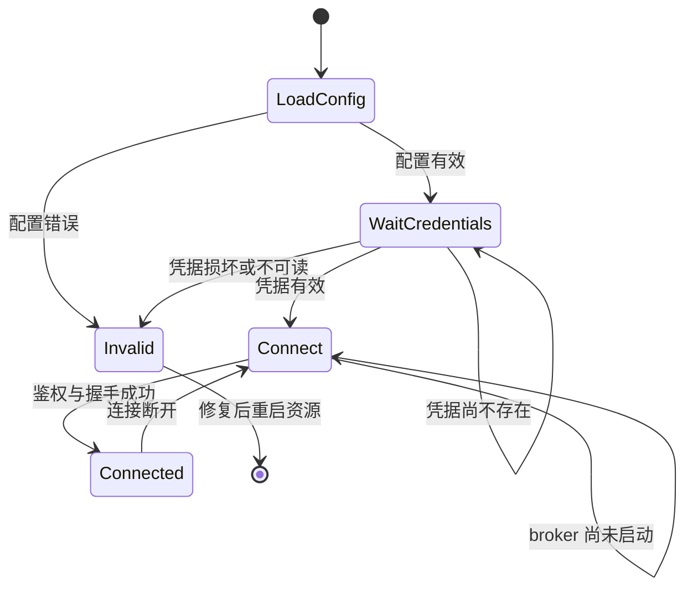

# RFC：FiveAI MCP 一体化构建、配置与凭据初始化

日期：2026-09-11。状态：设计细化完成，待实施；未进行独立评审或宿主验收。

设计来源：[一体化产物设计](../specs/2026-09-11-unified-artifact-design.md)。用户在该文档交付后的会话中已确认完整设计。源文档保留原文，其“待最终设计确认”是交付时状态。

本 RFC 在一体化安装范围内取代[原运行时 RFC](nodejs-debug-mcp-rfc.md) §4.1 的手工配置/凭据和 convar 接入要求。原 RFC 的鉴权、单 broker、任务安全和恢复约束继续有效；不增加通用执行、日志、框架或截图能力。

## 1. 决定与成功标准

保留两个源码包，输出一个名为 `fiveai-mcp` 的 FiveM 资源。用户预装 Node.js >=22.12.0，解压后无需安装 JS 依赖。AI 启动包内 entry，资源和桌面读取同一默认配置，首次启动自动生成包内凭据。

成功标准是从 ZIP 解压到与源码无关的目录后，仅使用预装 Node、FiveM/FxDK 和随包文件即可建立 stdio/status/桥接连接。必须分别记录自动化与真实宿主结果。

## 2. 当前边界与变更归属

| 当前位置 | 已核实行为 | 本次责任 |
| --- | --- | --- |
| 根 `package.json` | 两包分别 build，无项目 pack 脚本 | 统一编排、项目 pack 命令 |
| `packages/fivem-plugin/scripts/build-resource.mjs` | 构建两端 bundle，递归清空旧暂存目录 | 提供干净资源构建；不再清空用户使用的统一目录 |
| `packages/mcp/src/cli/entry.ts` | 强制显式 config，自动发现/启动 broker | 默认配置发现、首次凭据初始化 |
| `packages/mcp/src/cli/config.ts`、`paths.ts` | 绝对路径、配置摘要、现有凭据读取 | 统一配置解析、保留真实路径检查 |
| `packages/mcp/src/broker/pipes.ts` | 用户 SID 级启动/lifetime 互斥 | 保持全局 broker 语义；凭据互斥另命名 |
| `packages/fivem-plugin/server/main.js` | convar 启动快照、WS/tick 队列 | 读取资源内配置和凭据，等待初始化 |
| `packages/mcp/tests/resource.test.ts` | 旧 artifact 路径和 VM 宿主 | 新路径、文件加载和启动顺序覆盖 |

共享的配置/凭据只读契约由 MCP 包提供显式内部子路径导出，FiveM 包声明相应 workspace 依赖并由 esbuild 打包。该子路径不能导入 SDK、broker 或 CLI 副作用。初始化与 Windows 权限操作仅由桌面入口使用，不进入 Client bundle；禁止依赖未声明的兄弟包 node_modules。

## 3. 交付与命令契约

```text
dist/
├─ fiveai-mcp/
│  ├─ fxmanifest.lua
│  ├─ README.md
│  ├─ dist/server.js
│  ├─ dist/client.js
│  ├─ shared/executor.lua
│  └─ mcp/
│     ├─ entry.mjs
│     ├─ broker.mjs
│     ├─ windows-files.ps1
│     ├─ config.json
│     ├─ credentials.json    （运行生成）
│     └─ state/              （运行生成）
└─ fiveai-mcp.zip
```

`windows-files.ps1` 是下面 Windows ACL/不覆盖发布操作的桌面辅助文件，不接触网络、不被 FiveM 加载。Node 内建模块及 Windows 系统工具不随包复制；其余运行依赖均打入 bundle。客户端输出仍为 ES2020、无 Node builtins/require/import；服务端为 Node22 CJS；桌面为 Node ESM。

| 命令 | 必须产生的结果 |
| --- | --- |
| `pnpm run build` | 从当前源码构建并更新 `dist/fiveai-mcp/`；不生成 ZIP |
| `pnpm run pack` | 构建当前源码，再生成 `dist/fiveai-mcp.zip`；不是 pnpm 内置 npm 包归档命令 |
| `pnpm run build:resource` | 保留为统一 build 的兼容入口，避免公开另一个不完整安装目录 |
| 包级 build | 仅供开发编排使用，不承担最终用户交付契约 |

ZIP 内只有一个 `fiveai-mcp/` 根目录。不携带工作区路径、源码、node_modules、凭据、初始化临时文件或运行状态。添加运行依赖时必须显式加入交付白名单及解包验证，不能依靠递归打包扩大内容。

构建顺序是桌面 bundle、资源 bundle、干净交付暂存区、统一目录发布、按需 ZIP 发布。任何一步失败退出非零，不打印成功消息。

## 4. config.json 契约

随包默认值：

```json
{
  "version": 1,
  "broker": { "host": "127.0.0.1", "port": 43189 },
  "stateDir": "./state",
  "credentialFile": "./credentials.json",
  "clientLogDir": null,
  "serverLabel": "local-fivem",
  "verifyEnabled": false
}
```

- 无参数 entry 从 `import.meta.url` 定位旁边的 config。broker 仍接收 entry 解析后的显式绝对 config 路径。
- 原 `--config <Windows绝对路径>` 继续支持；其他参数、缺值、重复参数和相对的 `--config` 参数都返回用法错误。
- FiveM 使用 `GetResourcePath(GetCurrentResourceName())` 定位 `mcp/config.json`，资源改名不影响查找。资源目录获取在宿主 tick 上完成，文件 I/O 不执行 natives。
- 相对的三个数据路径始终相对于配置文件所在目录解析。绝对路径仍支持旧显式配置，不因新增默认值取消规范化、链接与归属检查。
- `stateDir`、`credentialFile` 省略时使用上述相对默认值；`clientLogDir` 省略时为 null；`verifyEnabled` 省略时为 false。旧完整 v1 配置可被新程序读取。version、broker 和 serverLabel 仍须有效，未知字段拒绝。
- host 只接受 `127.0.0.1`；port 范围 1–65535、默认 43189。程序不自动换端口。
- `clientLogDir: null` 只表示未配置日志来源；status 和探针不依赖日志目录。不能展示为日志发现成功。
- 默认值补齐、路径真实解析后计算稳定配置摘要。摘要不包含 token；所有配置消费者使用相同解析规则。新增 verifyEnabled/null 使旧新程序摘要可能不一致，升级必须整体停止并替换两端，不能混用版本。
- 非 Windows、无效 JSON、无效路径、目录不可读等有明确错误；入口诊断只写 stderr，stdout 保留给 MCP。

配置在进程/资源启动时读取。verifyEnabled 修改后重启资源；影响连接或摘要的修改需重启所有 entry、等待旧 broker 退出，再重启资源。缺失配置是安装不完整，不能静默用另一目录的配置代替。

一体化资源不再用 `fiveai_mcp_broker_url`、`fiveai_mcp_bridge_token`、`fiveai_mcp_verify_enabled` 覆盖 JSON。旧分散安装需迁移，不能保留两套具有隐含优先级的配置来源。

## 5. 凭据格式、权限与并发初始化

凭据仍是严格的双字段 JSON：entryToken 和 bridgeToken。新生成值各来自独立的 32 字节 `crypto.randomBytes`，编码为标准 Base64。读取时验证合法编码、至少 32 字节和字段集合，不接受任意文本作为有效 token。

### 5.1 生命周期

1. 桌面入口首先解析配置，不立即创建 broker。
2. 凭据存在则验证并复用。损坏、空文件、权限不足、符号链接或非独占普通文件都明确失败，不通过重建掩盖问题。
3. 不存在时进入下面初始化互斥。只有入口生成凭据；broker 和 FiveM 都只读。
4. 完整凭据就绪后，按原逻辑发现/启动唯一 broker。
5. 没有自动轮换或删除命令。用户主动重置凭据需先停止相关进程并处理原文件；build/pack 不执行重置。

### 5.2 无覆盖发布

为规范化后的凭据路径和当前用户 SID 计算独立摘要，创建专用 Windows named pipe 互斥。它不复用 broker startup/lifetime pipe，也不改变一个用户一个 broker 的范围。

竞争者以短间隔重试获取互斥，单次初始化总等待上限 10 秒；超时返回初始化繁忙，不删除锁、不终止其他进程。OS 在持有者退出后释放 pipe。所有读取失败必须区分不存在、占用和权限错误，不能把任意异常视为可重新生成。

持有者重新检查最终文件；已存在就复用。不存在则：

1. 在相同目录用随机名称和排他创建建立空临时文件，确认真实目录归属。
2. 通过随包 Windows 辅助脚本移除权限继承，只允许当前用户和 Administrators 所需访问，并验证 ACL；在写入 token 之前完成。
3. 写入完整 JSON，flush 并关闭文件；验证内容和权限。
4. 辅助脚本使用同卷、目标存在即失败的 `.NET File.Move(source, destination)` 两参数语义发布最终文件。不能用可覆盖目标的 rename 替代。若目标已出现，验证并复用目标，不能覆盖。目标存在时报错的契约已核对 [Microsoft File.Move 文档](https://learn.microsoft.com/en-us/dotnet/api/system.io.file.move?view=netframework-4.8.1)；崩溃边界仍由进程测试验证。
5. 完成后释放互斥。正常失败只删除本次持有的临时文件；崩溃遗留临时文件不当作凭据，不按年龄强制接管或批量清理。

辅助脚本通过绝对 Windows 系统 PowerShell 路径和 `execFile` 参数数组调用，`windowsHide: true`，不拼接来自路径的 shell 命令，不把 token 放进进程参数。脚本中的文件参数是 literal path；存在错误、无法验证 ACL 或超时就停止初始化。客户端和服务端无需执行此脚本。

本机当前用户本身不是恶意隔离边界；另一用户、游戏客户端及浏览器不能因这个改动获得凭据。已存在凭据也需验证访问边界；不悄悄修改用户既有 ACL。已有配置的迁移说明需指出此权限要求。

## 6. FiveM 启动状态



- 正常缺失凭据使用 1/2/4/8/10 秒封顶退避，持续等待但最多一个文件读取在途；同一等待诊断最多每 30 秒输出一次。
- 异步读取结果通过已有 host tick 队列消费，不能在 I/O 回调执行 natives/exports；资源停止后丢弃迟到结果，清理定时器和 socket。
- 有效凭据加载后使用现有 WebSocket 重连、心跳和身份绑定规则。JSON 和 token 不做后台热更新。
- 配置/凭据错误不允许未经鉴权降级或忙循环。报告错误种类及修复后需重启，不输出文件内容或 token。
- 固定探针只受启动时读取的 verifyEnabled 控制，默认关闭；保持 server-console-only 和现有五项探针语义。
- 普通测试服只需 `ensure fiveai-mcp`；FxDK 在项目中启用该资源。AI/资源两种启动顺序都需覆盖。
- 同一 Windows 用户一次连接一个环境，其他安装/配置应清楚报告 INSTANCE_CONFLICT，不抢占已有 broker。

manifest 的 server_scripts 仅加载 executor 和 Server bundle；client_scripts 仅加载 executor 和 Client bundle。`mcp/**` 不进入 files、shared_scripts 或 client_scripts，不能被宽泛 glob 间接包含。

## 7. build/pack 文件所有权

> **替代说明（2026-09-21）**：本节的「build 更新已有目录」分工已被
> `.notes/fivem-mcp-http/rfcs/fivem-resource-http-mcp-rfc.md` §12.2 与
> `.notes/fivem-mcp-http/specs/2026-09-20-single-package-completion-design.md` §5 取代。
> 现行契约：`build` 只写包的 `fivem-mcp/dist` 中间产物，不发布；候选目录
> `dist/fivem-mcp/` 与 ZIP 由 `pack` 独占。候选目录已存在时，只有仍属构建器拥有且未被使用的输出
> 才可复用；一旦发现凭据文件、非空 `state/`、与仓库默认不同的 `config.json`，或任何白名单外文件，
> 就**拒绝替换并提示改用新的候选输出路径**，绝不清空该目录。下表中 config/credentials/state 与用户文件的
> 「逐字节保留」承诺因此改由「拒绝」兑现，而不是「就地覆盖」——数据保留的强度不变，build 不再就地更新。
> 下表保留原始状态作为历史记录。

交付文件清单定义在构建源码中，以同一份白名单驱动 staging、发布和 ZIP 校验。程序文件与默认 config 明确区分。

| 内容 | build 更新已有目录 | ZIP 来源 |
| --- | --- | --- |
| 白名单程序文件、README、辅助脚本 | 替换为本次构建 | 本次干净 staging |
| mcp/config.json | 存在则逐字节保留；缺失才写默认 | 仓库默认配置 |
| mcp/credentials.json | 不读内容、不修改、不删除 | 永不包含 |
| mcp/state/ | 不修改、不删除 | 永不包含 |
| 用户其他文件 | 不清理 | 不包含 |

不能从本地统一目录压缩后“删除几个敏感文件”；必须正向选取干净产物。ZIP 依赖作为开发依赖锁定，避免运行时联网或依赖用户 PATH 中的第三方压缩程序。

构建暂存/清理目录必须先解析并验证在仓库专用输出范围内。拒绝会使程序文件写入越界的链接或非预期文件类型，不移动整个安装目录来达到清空效果。

build 发布前编译和白名单检查必须全部成功。发布程序文件使用同目录临时文件；单文件替换失败则返回失败，原配置、凭据和状态保持不变。跨文件发布不承诺事务性，也不支持运行中的热部署；失败后停止使用该输出并重新 build 修复程序文件。

pack 在同级临时 ZIP 完成内容校验后才替换最终 ZIP。失败时可以保留上次成功 ZIP，但命令必须非零并明确它不是本次产物。pack 的 staging 与本地 build 配置隔离，不能把默认 config 覆盖到用户修改的文件上。

## 8. 迁移与回退

1. 首次安装从 ZIP 解压，启用资源并配置 AI 的 node/entry 路径。无须手动配置日志目录或凭据。
2. 旧分散安装迁移：先停止所有旧 entry 和资源、等待 broker 退出；将完整新包放入资源目录，把仍需使用的设置转写到包内 JSON。可迁移原有有效凭据到新位置，但必须满足权限要求，不能在旧 broker 仍运行时重新生成一套。
3. 有 pending recovery 的安装必须保留原 state 并处理其既有恢复阻塞，不能通过换新空目录或默认 state 绕过。本次不实现任务解决机制。
4. 升级先停用相关进程，ZIP 解压到临时目录，再复制白名单程序文件到安装目录，保留 config/credentials/state。普通“全部解压并覆盖”不保证保留 config，README 必须直说。
5. 回退到同一一体化契约的旧程序时复用原配置、凭据和状态；回退到旧分散版本需恢复旧配置结构、convar 和对应资源路径。新配置含 null/verifyEnabled，不能直接交给旧严格解析器。
6. 迁移或回退不清空 recovery，不撤销磁盘权限，不改变用户 FxDK 项目设置。构建和文档更新不自动执行安装、宿主启动、提交或发布。

## 9. 验证与落地顺序

先实现共享配置契约及兼容测试，再实现桌面凭据初始化和默认入口、服务端等待状态，最后合并构建/pack 并更新文档。所有阶段必须遵守已确认路径和数据保留规则。

| 验证层 | 必须证明的行为 |
| --- | --- |
| 配置单测 | 旧绝对配置、新相对默认配置、null、未知字段、无效路径；cwd 与安装目录移动不改变相对语义 |
| 凭据进程测试 | 首次生成、重复复用、多个 entry 同时初始化得到同一文件；持锁进程崩溃恢复；超时/权限/损坏/链接/发布冲突不覆盖已有内容 |
| 构建和归档 | 非默认本地配置及凭据/state 哨兵跨 build/pack 逐字节保留；ZIP 默认 config、固定根目录、无额外文件；失败构建/ZIP 非零且不伪报成功 |
| 独立解包 | 带空格路径、随机 cwd、无 node_modules、无源码工作区依赖；node entry 完成 initialize/tools/list/status，工具仍只有 status |
| 桥接自动化 | Server bundle 等待缺失凭据，后出现文件和 broker 自动连接；坏凭据、停用迟到 I/O、重连、动态资源名 |
| 仓库回归 | `pnpm run test:all`、`pnpm run validate`，独立 Lua 5.4 harness；先解决统一编排，避免 test/build 递归 |
| 真实 FxDK/FXServer | 两种启动顺序、server/client 五项探针、权限/文件读取、配置重启、资源重命名、客户端实际下载内容及 FxDK 自动重启影响 |

进程测试共享当前用户 broker 管道，保持串行并且只清理本次拥有的进程。不能关闭用户已有 broker 以制造通过结果。ZIP 解包测试必须使用 ZIP 本身，不能偷偷回到源码的默认 config 或辅助脚本。

FxDK 文件监视若因凭据或 state 写入反复重启资源，首版按已确认设计采用关闭该资源 A 自动重启的操作说明，人工重启加载代码修改。必须在宿主记录事实后报告，不提前宣称不受影响。

## 10. 替代方案与剩余风险

| 方案 | 取舍与决定 |
| --- | --- |
| 分别分发桌面包和资源 | 沿用当前代码最少，但保留用户配置、路径与 token 复制负担；用户已选择统一交付 |
| 构建时生成 token | 下载者共享同一包时共享密钥，也容易泄露开发凭据；采用本地首次启动生成 |
| LocalAppData 存储凭据 | 便于隔离分享与热重启，但用户明确要求整个目录自包含；采用 mcp/credentials.json |
| 随包 Node | 降低预装要求但扩大体积/维护范围；用户选择预装 Node |
| ZIP 携带用户配置 | 可作为环境快照但不适合通用发布；用户已选择默认配置 |

产品决定已确认，无需新增用户决策。仍需实施时验证 Windows ACL/不覆盖发布、真实资源内文件访问、FxDK 监视和客户端下载边界；这些是验收门槛，不是已获得的运行结果。必要的第三方构建依赖版本由实施时根据实际锁文件选定，不改变运行时预装要求。

本 RFC 已按配置、构建、进程边界与文档质量清单做自查；代码、自动化新增用例与真实宿主验收尚未执行。原会话中的 118 项 MCP 测试通过仅代表修改前基线。
