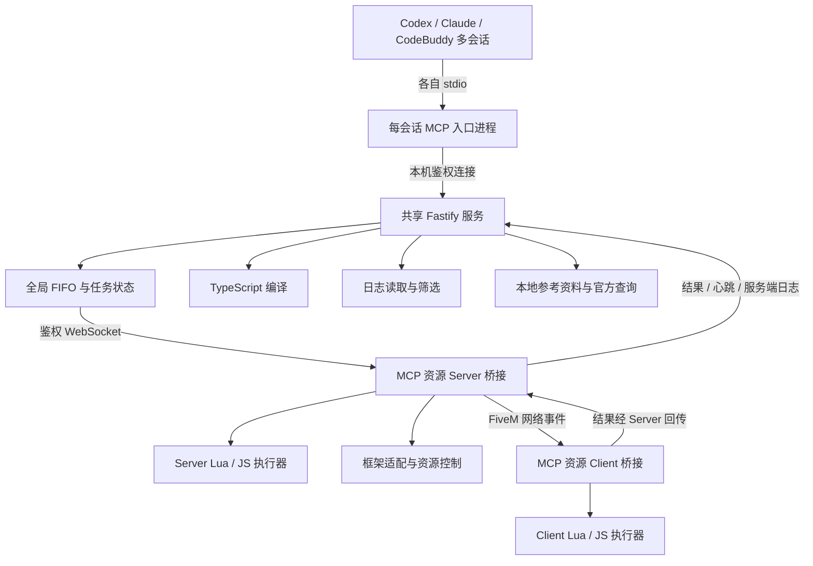

# FiveM Node.js 调试 MCP 设计

日期：2026-09-09  
状态：模块方案已逐项确认；本文等待整体审阅。尚未开始实现。  
模块目录：`notes/fivem-mcp/`  
后续 RFC 目录：`notes/fivem-mcp/rfcs/`

## 1. 目标与依据

将现有以参考资料和模板输出为主的 PHP MCP，重新设计为本机 FiveM 运行时调试服务。AI 通过 MCP 执行桥接资源内的 Lua/TypeScript 片段、调用其他资源的 exports、控制资源生命周期、读取日志和查询核心资料。修改目标资源文件由本地 AI 自己的文件工具完成。

本设计以逐项确认的对话决策为范围依据，以[原 MCP 架构与源码报告](../../fivem-mcp-architecture-and-nodejs-rewrite-report.md)为旧实现证据。原报告里的迁移建议不是本设计的默认需求；冲突时以本设计为准。

当前源码副本位于 `fivem-mcp-main/`。外层工作区是 FiveAI 多客户端 Skills 插件，已有 ESX、QBCore、oxlib、oxmysql、FiveM 基础等 Skills；Node.js 调试桥接属于新增子系统，不能通过翻译旧 PHP 工具得到。

### 1.1 运行范围

- Windows 本机：AI 客户端、MCP、FXServer 和游戏客户端都在同一台机器。
- 同时支持 FxDK 和直接启动 FXServer 两种使用方式，一次只连接一个服务器环境。
- 允许多个 AI 会话和多个游戏客户端同时连接。
- AI 客户端目标为 Codex、Claude、CodeBuddy，使用 stdio 启动 MCP 入口。
- FiveM 端安装一个专用桥接资源，包含服务端和客户端脚本。
- 全部执行操作共享一个 FIFO；日志、状态与参考查询不进入执行队列。

### 1.2 范围清单

| 能力 | 决策 |
|---|---|
| Server/Client Lua、TypeScript 片段 | 保留，代码只下发给 MCP 资源执行器 |
| 调用其他资源 exports | 保留，目标资源自行暴露调试接口 |
| ESX、QBCore | 保留，各一个 MCP 工具入口 |
| ox | 一个入口，仅适配 ox_lib、ox_target、oxmysql |
| 资源控制 | list、status、start、stop、restart；卸载指 stop |
| 全局日志 | 保留，当前会话、最近 N 行、资源与前缀筛选 |
| FiveM Native、核心事件、指南查询 | 合并为 reference；本地优先，未命中时查询官方在线资料 |
| 数据库写操作 | 支持，仅数据库专用入口执行确认流程 |
| NUI 调试 | 写入 Skill，指导 AI 使用 Chrome DevTools MCP；本 MCP 不提供 CDT 代理工具 |
| 截图 | 只保留接口契约，禁用，不实现捕获核心代码或引入捕获依赖 |
| 网站 | 移除 |
| 原 MCP Prompts、Resources | 不迁移注册；有价值知识整理进 Skills |
| manifest、脚手架、NUI 模板生成工具 | 移除，交给本地 AI 与 Skills |
| Prodigy / prp-bridge | 移除 |
| 修改目标资源的本地文件 | 不提供任何读取源码、写入、patch、删除或保存工具 |
| 多服务器并行、txAdmin 托管、图片清理 | 不在首版范围内 |

## 2. 总体架构



### 2.1 模块职责

| 模块 | 职责与边界 |
|---|---|
| stdio 入口 | MCP 协议、工具声明、会话身份、调用转发、向原始客户端发起确认；stdout 只输出协议消息 |
| 共享服务生命周期 | 启动锁、服务发现、身份和协议版本校验、AI 会话租约、30 秒退出宽限期 |
| Fastify 连接层 | 本机连接鉴权、桥接握手、心跳、重连、消息校验；不对公网开放 |
| 全局执行协调器 | 全局排序、任务关联、等待取消、超时暂停、恢复检查、最终结果保留 |
| 代码执行模块 | 参数校验、TS 转换、Lua/JS 请求分派、返回值序列化与错误关联 |
| Server 桥接 | 接收已授权任务、执行服务端操作、按客户端会话路由、采集服务端控制台日志 |
| Client 桥接 | 在 MCP 资源自己的运行时执行片段，并回传结果 |
| 框架适配器 | 按实际运行资源解析框架对象、方法和玩家对象，适配回调及结果 |
| 日志模块 | 服务端日志流、客户端文件定位和追加读取、来源标记、筛选、最近 N 行 |
| 参考资料模块 | 本地资料索引与查询、官方在线回退、来源与版本标记 |
| Skills | 安装、调用知识、NUI/CDT 操作和本地修改工作流；不替代服务端校验 |

### 2.2 通信路线选择

选用“本机共享服务与 Server 桥接之间的 WebSocket + Server 与 Client 之间的 FiveM 网络事件”。持久双向连接适合结果、日志与心跳；客户端无需为了 MCP 通信额外引入 NUI 页面。

比较过的路线：HTTP 长轮询可以利用 FiveM HTTP 请求能力，但增加调度轮次和断线处理复杂度；每个 Client 通过 NUI 直连会增加 NUI 依赖及多连接管理，还需要另一条 Server 通道。两者均不作为首版主路线。

Fastify 使用官方 WebSocket 集成；Server 侧 WebSocket 客户端随桥接构建产物提供。FiveM Server JavaScript 运行时与桌面 Node.js 服务分别构建，不假定两者 Node 版本相同。精确依赖版本、消息 schema 与构建目标在 RFC 中锁定。

## 3. 生命周期、身份与配置

### 3.1 启动与退出

1. 每个 AI 会话通过 stdio 启动自己的入口进程。
2. 入口通过本机启动锁协调共享服务创建；首个入口启动 Fastify，其他入口复用。
3. 复用前校验服务身份、连接凭据和协议版本。端口被占用不等于发现有效服务。
4. 协议不兼容时返回明确错误，不终止其他 AI 的进程。
5. 最后一个 AI 会话断开后进入 30 秒宽限期；新会话到来则取消退出，否则关闭共享服务。FiveM 连接不延长生命周期。
6. 入口异常退出通过租约或存活检测清理，不能只依赖正常关闭通知。

宽限期结束时，即使仍有未知或运行任务，共享服务也按约定退出；退出不代表远端任务取消。等待任务不在下次启动后自动重放。服务必须留下自己的最小恢复记录，以便新实例识别此前未解决的执行风险。

### 3.2 身份与重连

- 区分 AI 会话、broker 实例、服务器运行会话、桥接运行会话、客户端连接会话和任务 ID。
- 用户通过 server ID 选择客户端，内部必须同时绑定客户端会话身份；server ID 重用不能使旧任务投递给新玩家。
- 第二个不同服务器环境连接时明确拒绝，不静默替换当前环境。
- 桥接自动重连；重连先对账任务状态，再允许继续下发。
- 消息以任务 ID 与会话身份关联。重复结果不重复推进队列，连接恢复不自动重发已下发任务。
- 结果只能由原执行目标回报；Server 根据实际网络事件来源核对 Client 身份，不能信任 payload 自称的玩家 ID。

### 3.3 本地配置与文件边界

Skill 指导用户或本地 AI 安装桥接资源、修改服务器启动配置、填写本机地址与凭据、配置 FiveM 日志目录。MCP 运行时不代改这些文件。

共享服务只监听回环地址；AI 入口和桥接均需鉴权。凭据不放进工具结果和普通日志。MCP 可以管理自身的启动锁、服务发现信息和最小任务恢复记录，并读取已配置的日志；这不扩展为访问其他资源源码的工具。

恢复记录至少保存未解决任务 ID、目标会话、下发阶段与不确定状态；不为恢复而持久化代码、SQL、绑定参数或完整结果。写入恢复记录失败时，不下发新的执行任务。已确认数据库请求不跨 broker 重启重放。

“只在 MCP 资源运行”是请求路由和产品边界，不是对任意 Lua/JS 或 exports 的安全沙箱保证。片段执行器不提供专用文件辅助 API；正常调试流程不写其他资源文件，但不能宣称任意原生 API 或目标 exports 的内部副作用都被拦截。

## 4. MCP 工具契约

首版注册 10 个工具。表中是语义契约；RFC 负责收敛严格 JSON Schema、错误编码、容量和超时上限，不增加产品功能。

| 工具 | 主要输入 | 调度方式 |
|---|---|---|
| status | 可选目标筛选 | 直接读取 |
| queue | action: status / cancel / recover；任务相关操作携带 taskId | 控制通道，独立于暂停的执行队列 |
| execute_lua | side、clientId、code、args、timeoutMs | 全局 FIFO |
| execute_ts | 同 execute_lua | 全局 FIFO |
| resource | action: list / status / start / stop / restart；目标 name | 读取直接执行，变更进入 FIFO |
| logs | side、clientId、resource、prefix、contains、limit、includeRaw | 直接读取 |
| esx | scope、method、args、side、clientId、playerId、timeoutMs | 全局 FIFO |
| qbcore | 同 esx | 全局 FIFO |
| ox | library、method、args、side、clientId、timeoutMs | 确认完成后进入 FIFO；无需确认的直接入队 |
| reference | query、category、side、limit | 直接查询 |

截图不在这张注册表中。调用未注册截图工具返回协议规定的未知工具结果，不暴露一个看起来可用但每次失败的工具。

### 4.1 状态与结果

status 展示连接状态、当前服务器会话、客户端列表、框架可用性、日志采集覆盖和队列暂停原因。FiveM 未连接时，status 和 reference 仍然可用。

执行工具返回 taskId、目标、状态、结果、耗时；失败返回错误类别、说明和可获取的堆栈。queue.status 支持查看队列概览以及指定任务的最新状态和已保留的最终结果，因此迟到结果不依赖原始工具请求一直保持连接。

JSON 无法表达的值必须按明确规则处理，禁止悄悄变成成功的空结果。RFC 明确 Lua 多返回值、nil、稀疏 table、JS undefined、BigInt、二进制、循环引用与结果截断的表示规则。框架对象使用声明过字段的数据快照，不能将任意对象方法当作返回值。

## 5. Lua 与 TypeScript 执行

### 5.1 输入和执行位置

- side 为 server 或 client。client 必须提供 clientId；server 不接受用 clientId 改变执行位置。
- code 为函数体；args 是可 JSON 序列化的输入，片段通过 args 访问。
- timeoutMs 从任务开始执行计时，不包含排队时间。排队与执行耗时分别记录。
- 执行器只存在于 MCP 专用资源，不注入目标资源、不创建目标资源 loader。
- 每次片段使用独立的参数和返回上下文，不提供跨任务变量存储。FiveM 原生状态及目标 exports 的副作用仍可能跨任务存在。

Lua 示例：

```lua
local result = exports["my-resource"]:getDebugState(args.playerId)
return result
```

TypeScript 示例：

```ts
const result = await exports["my-resource"].getDebugState(args.playerId);
return result;
```

这两个 exports 为目标资源自行实现的示意方法，不是 MCP 自动提供的 API。

### 5.2 执行实现

Lua 在桥接的 Lua 运行时加载函数体，并在支持等待的执行协程中调用。TS 在本机服务转换为 JS，再发给桥接的 JS 执行器，以异步函数体执行。保留代码位置映射以尽量将编译、执行错误定位回用户片段。

首版不支持片段 import、安装依赖或 Node.js 模块导入。FiveM 客户端不是完整 Node.js 环境；Server 的 Node 能力也不成为片段跨端可用的隐式承诺。Lua 与 JS 是同资源下独立执行器，不能假定共享语言全局对象。

### 5.3 异步完成边界

- JS 等待整个异步函数及其 await 链完成。
- Lua 可以 Citizen.Await；回调式 API 由片段或已声明的适配器转换为 promise 等待。
- 片段自行创建且未等待的线程、计时器、事件订阅、后台操作不在完成检测范围内。
- 执行期间报错只有在执行器能明确报告结束时，才作为已完成失败推进队列。
- 超时是观测期限，不是强制终止或撤销。CPU 死循环、不可取消的原生调用等可能需要外部重置环境。

Lua/TS 片段及其 exports 不增加用户确认。通用代码执行不进行 SQL 审批拦截。

## 6. 全局 FIFO 与恢复

### 6.1 排序与取消

全局队列覆盖所有 AI、Server/Client 执行器、框架调用和资源变更。顺序以共享服务接受有效可执行请求时分配的序号为准。数据库请求在确认通过后才取得入队序号。

任务基本状态为 queued、running、succeeded、failed、cancelled、unknown。queued 可以取消，确保未下发；running 不提供虚假的强制取消能力。MCP 客户端取消等待不等于远端执行被终止。

等待目标离线的任务到达队首时返回目标不可用，不转投其他客户端。读取类工具继续响应。queue.recover 通过独立控制通道处理，不能排在被暂停的队列后面。

### 6.2 超时和断线

已下发任务超时、发送是否到达不确定或执行连接中断时，将任务标记为 unknown 并暂停执行队列。原任务迟到返回经身份与 taskId 核验的终态后，保存最终结果并恢复调度；原调用者可通过 queue.status 查询。

禁止自动重试已下发请求，尤其是数据库、经济修改与资源变更。去重记录用于识别重复消息，不承诺跨崩溃环境的严格 exactly-once 副作用。

### 6.3 恢复依据

queue.recover 只检查证据，不执行资源重置，也不接受 force 参数。满足下列条件之一才能解除对应阻塞：收到旧任务明确结束记录；或证明所有相关执行环境已重置且没有已知仍未解决的外部操作。不能确认时，返回阻塞原因。

桥接资源重启只说明桥接换了一代，不证明被调用资源的后台操作结束。客户端重连不证明服务端操作结束。服务器重启也不等于已提交的数据库操作回滚。运行会话身份是必要证据之一，不能单独作为所有任务的恢复证明。

片段可触发任意 exports，MCP 无法静态识别全部间接执行链。缺少可靠结束证据时保持暂停，由本地 AI/用户在 MCP 之外排查和重置相关环境；本工具不提供无条件强制继续。RFC 必须明确可自动认可的证据类型，对无法证明的情况返回原因，不能通过“重连成功”掩盖未知状态。

未知任务在重置后仍保留“结果未知、未重试”的结论；允许新任务不等于证明旧任务无副作用。

## 7. 框架适配

### 7.1 ESX 与 QBCore

scope 区分 framework 和 player。method 使用原框架方法名或路径，args 为位置参数数组。player scope 每次按 playerId 重新获取当前玩家对象，不将对象句柄交给 AI。

clientId 选择执行客户端；playerId 选择业务玩家，二者不能混用。玩家对象方法仅在框架实际支持的执行端开放，错误执行端直接报错。

```json
{
  "scope": "player",
  "playerId": 12,
  "side": "server",
  "method": "getMoney",
  "args": []
}
```

以上为 esx 调用。对应 QBCore 示例使用 method 为 Functions.GetMoney，args 为 ["cash"]。

### 7.2 ox

library 必须为 ox_lib、ox_target 或 oxmysql。使用原库方法名；不把不同库强行转换成统一业务 API。oxmysql 仅在 server 执行。

并非所有 ox_lib 能力都是直接 exports；适配器按真实导入、回调和执行端约束实现。不要通过反射把整个库内部对象无限制映射成方法目录。

### 7.3 方法支持与更新

适配器按需启用，不要求多个框架同时安装。每次调用检查资源状态，资源重启后重新解析对象；框架不存在、玩家不存在、方法未支持、参数错误、执行错误分别返回。

首版支持的方法由 RFC 按已验证版本列出，Skill 与适配清单同步发布。普通方法直接转发，回调或特殊参数使用显式适配器；JSON 中不能直接携带函数。未适配方法可通过 Lua/TS 片段调试，不为每个方法增加 MCP 工具。

## 8. oxmysql 确认

MCP 通过桥接调用已有 oxmysql，不另建数据库连接，不收集或保存数据库密码。

| SQL 类型 | 行为 |
|---|---|
| 能可靠确认只读的查询 | 直接入队 |
| INSERT、UPDATE、DELETE、DDL 等写入 | 用户确认后入队 |
| 事务 | 展示整个事务，一次确认 |
| 存储过程、多语句、无法可靠分类的 SQL | 用户确认后入队 |

分类依据实际 SQL 和调用语义，不仅依据 query 等方法名，也不只匹配首个关键词。带写入能力的特殊查询、注释及方言语法必须保守处理，未识别即确认。RFC 定义解析策略和分类测试集。

### 8.1 确认流程

1. 固定完整方法、SQL、绑定参数与目标服务器会话。
2. 经发起请求的 stdio 入口，使用 MCP elicitation 展示给该用户。
3. 用户同意且原会话仍有效后入队；否定或取消不执行。
4. 任一 SQL、参数或目标变化都需要重新确认。展示不完整时不能批准隐藏部分。
5. 原始 AI 客户端没有相应 elicitation 能力时，不执行需确认操作，并给出可操作的错误。

不支持 approved:true、记住所有写操作批准或换一个 AI 会话代替原用户确认。确认等待在 FIFO 之外，确认内容不写普通日志；确认过的请求不跨服务重启重放。

这是数据库入口的用户体验约束，不是通用数据库安全边界。Lua/TS、exports、ESX/QBCore 间接修改数据库不触发这套额外确认。

结果按方法返回记录、影响行数、插入 ID 或事务结果；超时不重试、不宣称回滚。各客户端的实际确认能力必须分别验证，不能仅凭产品名称认定支持。

## 9. 资源控制

resource 使用完整名称精确定位，首版无通配符、无批量操作。list/status 不排队；start/stop/restart 排队且不增加确认。

- start 对已启动资源返回状态已满足；stop 对已停止资源同理。
- restart 先停止、确认停止阶段，再启动；停止失败不继续启动。
- 返回前后状态、阶段结果和错误。生命周期 started 不表示业务初始化、NUI 或数据库连接已经就绪。
- 资源不存在返回错误，不创建、下载、删除或修改文件。
- 不主动连带重启依赖资源；FiveM 自身依赖行为在可获取的状态和日志中体现。
- 禁止正常资源控制接口 stop/restart MCP 桥接自身，使用实际桥接资源身份判断，不能仅硬编码可改名的名称。

典型工作流：本地 AI 修改目标资源 → resource.restart → logs → execute_lua/execute_ts 或框架工具验证。

## 10. 日志

### 10.1 查询语义

logs 的 side 为 server、client 或 all。多个客户端存在而查询包含客户端日志时，必须明确 clientId；all 表示服务端加该客户端，不模糊聚合多个游戏客户端。

resource 精确匹配资源名，prefix 匹配频道前缀，contains 匹配正文；多个条件取交集。先筛选，再返回最近 limit 行，默认 100。includeRaw 控制是否附原始行。

每条记录尽量提供来源、客户端身份、时间、频道、资源名和清理后正文；无法获取的字段明确为空。输出附采集缺口、截断和覆盖信息。

仅查询当前运行会话，不搜索历史 FiveM 启动日志、不删除原文件。缓存必须有界；超过保留容量时说明范围，不能将“最近 N 行”解释为无限历史检索。

### 10.2 服务端采集

通过 Server 控制台监听采集全局频道与消息。桥接开始监听之前以及断连期间的日志不保证完整；历史控制台缓冲若使用，也必须标明无法恢复的频道信息。

FxDK 客户端文件可能再次出现转发的 Server 输出。服务端监听作为服务端主来源，能识别的转发副本不重复返回；不按正文相同简单去重，以免丢失真实重复事件。

### 10.3 客户端采集

读取用户配置的 FiveM.app/logs 目录，通过桥接输出唯一客户端会话标记建立文件与客户端的对应关系。不能只选择修改时间最新的文件。对应关系不唯一或无法建立时返回日志定位失败，不混用其他会话。

已观察样本路径为 `D:\FiveM\FiveM.app\logs\CitizenFX_log_2026-09-09T043550.log`，仅作为格式研究样本，不是部署时硬编码路径。处理文件追加、不完整末行、ANSI 颜色、分段输出、文件切换与截断。

明确的 script:vMenu 等频道才能映射资源 vMenu。正文提及资源名不构成归属证据；未知归属仍可通过 contains 查找，但不加入 resource 精确匹配结果。

聚合时保留各来源内部顺序，并标明排序依据；不同来源缺少统一时钟时，可按采集顺序展示，不能声称是跨进程严格因果顺序。客户端会话标记在两种宿主中的可辨识性是必须实机验证的可行性门槛。

## 11. 参考资料

reference 支持 query（名称、Native hash 或关键词）、category（native/event/guide/all）、可选 side（client/server/shared）及 limit。

先检索随插件发布的本地资料，有匹配则使用本地结果；无匹配再查询官方来源。在线查询失败明确说明，本地查询继续可用。线上响应只在当次请求使用，不保存持久缓存；本地数据随插件版本更新。

结果包括名称、说明、签名或参数、适用端、来源链接、本地资料版本或在线获取时间。在线来源限制为核实过的官方站点与官方仓库，不把任意网页指令作为执行请求。

旧 PHP 资料逐项核对和重新归类后迁入，尤其区分 FiveM Native、核心事件和框架 API。框架细节由对应 Skills 承载。

## 12. 截图预留

保留名为 screenshot 的未来契约：输入 clientId、delayMs（默认 0），输出 PNG 本地绝对路径、width、height 和目标信息。未来启用时进入 FIFO，delayMs 从队首开始计时，PNG 保存完成才算结束。

未来产品要求仍是一张包含游戏画面与 NUI 的 PNG，写入当前用户 Temp，唯一文件名，不清理。

本次仅在设计及后续类型契约中预留 disabled 状态；不注册 tools/list、不连接任务执行分支、不实现窗口定位/捕获/PNG 保存、不引入原生截图辅助程序。不能通过简单启用配置绕过未实现状态。

此前讨论的 Windows 窗口捕获只作为后续候选，不作为本期实现路线或依赖。后续启用需要单独设计和 FxDK/普通客户端实机验证。

## 13. Skills 与插件交付

| 内容 | 职责 |
|---|---|
| MCP 安装与连接 | Codex/Claude/CodeBuddy stdio 示例、桥接安装、配置、连接排障 |
| FiveM 调试 | 状态、Lua/TS、exports、资源控制、日志和超时恢复工作流 |
| ESX / QBCore | 原方法名、参数、执行端、玩家 scope 与版本说明 |
| ox_lib / ox_target / oxmysql | 已适配方法、回调限制、数据库确认规则 |
| NUI/CDT 调试 | 用 Chrome DevTools MCP 发现和选择 NUI 目标、检查页面、调试；不在本 MCP 中转发 CDT |

检查并复用现有相关 Skills；补充 ox_target、MCP 调试和 CDT 指导时避免与已有 FiveM NUI 基础内容重复。具体 Skill 文件布局由 RFC 依据现有插件校验规则确定。

适配清单和 Skill 同步发布。安装说明分别描述三种客户端，不假定它们具有相同配置文件格式或 elicitation UI。没有游戏连接时也能阅读 Skills 和查本地资料。

## 14. 实施顺序与验收

### 14.1 依赖顺序

1. 连接基础：stdio、共享 Fastify、启动竞争与退出、鉴权、Server/Client 会话与桥接。
2. 执行闭环：双端 Lua/TS、异步结果、任务记录、FIFO、取消、超时与恢复。
3. 调试能力：资源控制、服务端和客户端日志、框架适配、数据库确认。
4. 资料与交付：本地索引、官方回退、Skills、三种 AI 客户端配置与验收说明。

日志定位、异步跨运行时回传和 elicitation 必须尽早安排真实宿主验证，不能直到所有模块完成才发现主路线不可用。截图不列为本期验收项。

### 14.2 自动化验收

| 范围 | 关键行为 |
|---|---|
| 生命周期 | 多入口同时启动只产生一个服务；异常入口退出能回收；30 秒宽限期；版本冲突不杀其他进程 |
| 协议与身份 | 鉴权失败拒绝；第二服务器拒绝；server ID 重用不误投；旧连接与伪造结果不能完成当前任务 |
| FIFO | 多 AI、多端请求顺序一致；读取不阻塞；等待取消不下发；确认通过才入队 |
| 执行 | 编译/运行错误、等待结果、序列化、无效目标、输出超限均有可辨识结果 |
| 恢复 | 超时暂停；迟到结果；断线对账；重复消息；broker 重启不重放；证据不足不恢复 |
| 数据库确认 | 明确只读、写入、事务、未知 SQL；拒绝/取消/不支持均不执行；参数变化不能复用批准 |
| 资源 | 幂等 start/stop；重启阶段失败；桥接自身保护；不修改资源文件 |
| 日志 | 先筛选后取 N；未知资源不误归类；跨块行、ANSI、截断、切换、多个客户端映射与缺口 |
| 资料 | 本地命中不联网；未命中官方回退；离线可读；不持久保存在线结果 |
| 工具发现 | 仅注册 10 个工具；无截图、原 Prompts/Resources 或文件修改入口 |

### 14.3 实机验收

- FxDK 和直接启动 FXServer 分别跑通 Server/Client Lua 与 TS，调用测试资源 exports，验证异步返回与错误堆栈。
- 多 AI 会话和多游戏客户端联合测试，观察实际执行次序、目标身份、退出及重连。
- 使用明确的正常、超时、断线和后台副作用样例验证恢复边界。
- 分别加载目标版本 ESX/QBCore，按适配清单测试；ox_lib、ox_target、oxmysql 分别验证实际执行端与返回行为。
- 在开发测试数据库验证确认、读写和事务；不以 mock 通过宣称真实数据库确认闭环通过。
- 两种宿主验证客户端日志定位、会话切换、资源归属能力与无法归属时的输出。
- Codex、Claude、CodeBuddy 各自验证 stdio 工具发现与 elicitation；不支持时验证拒绝执行路径。

本设计阶段上述自动化和实机验证均为 NOT_EXECUTED。后续记录 PASS、FAIL、NOT_EXECUTED，保留失败证据；静态或单元测试不能代替宿主验收。

## 15. 证据、限制与 RFC 收敛范围

### 15.1 技术依据

- [FiveM JavaScript 运行时说明](https://docs.fivem.net/docs/scripting-manual/runtimes/javascript/)：区分 Client 与 Server 的运行能力，支持本机先转换 TypeScript 的路线。
- [esbuild transform](https://esbuild.github.io/api/#transform)：候选 TS 转换接口；精确选型和构建配置由 RFC 固定。
- [FiveM V8 脚本运行时源码](https://github.com/citizenfx/fivem/blob/master/data/shared/citizen/scripting/v8/main.js)：exports 与异步函数引用实现参考；实际跨 Lua/JS 行为需测试。
- [Fastify WebSocket 插件](https://github.com/fastify/fastify-websocket)：连接与鉴权集成依据。
- [RegisterConsoleListener 定义](https://github.com/citizenfx/fivem/blob/master/ext/native-decls/RegisterConsoleListener.md)：当前依据为 Server 接口，不宣称客户端可用。
- [服务端控制台实现](https://github.com/citizenfx/fivem/blob/master/code/components/citizen-server-impl/src/ServerBufferReplay.cpp)：频道、回调与缓冲行为参考。
- [StartResource](https://github.com/citizenfx/fivem/blob/master/ext/native-decls/StartResource.md) 和 [StopResource](https://github.com/citizenfx/fivem/blob/master/ext/native-decls/StopResource.md)：服务端资源控制基础。
- [ESX imports](https://github.com/esx-framework/esx_core/blob/main/%5Bcore%5D/es_extended/imports.lua)、[QBCore Server functions](https://github.com/qbcore-framework/qb-core/blob/main/server/functions.lua)、[ox_lib init](https://github.com/overextended/ox_lib/blob/master/init.lua)：框架对象获取与导入方式参考。

这些上游链接指向可变化分支，是设计研究依据，不是已锁定的兼容版本。RFC 必须记录选定版本或提交，并核实相应 API。

### 15.2 不能提前承诺的能力

客户端文件未必保存完整资源频道；resource 精确过滤只能覆盖明确归属的日志。客户端与日志文件的可靠映射仍须实机证明。若会话标记路线失败，须提出替代设计并复核，不能悄悄猜测文件。

通用代码可触发未等待的副作用，FIFO 仅串行化纳入等待范围的任务。不存在以断线、桥接重启或超时证明所有间接操作被取消的通用机制。无法证明安全恢复时保持暂停。

不同 AI 客户端版本的确认能力存在差异；以能力协商及实测为准，不通过普通文本中的“已同意”替代协议确认。

### 15.3 RFC 必须输出的实现决策

在不重新讨论已确认产品范围的前提下，RFC 固定：包与桥接目录、依赖版本和构建目标、消息与结果 JSON Schema、会话握手和租约、恢复记录原子性、可接受恢复证据、任务/日志/结果容量与超时边界、SQL 分类策略、适配方法及版本清单、客户端日志解析和映射算法、插件打包与客户端配置方式。

以上是下一阶段的技术收敛责任，不代表本设计已实现这些机制。若源码或实机证据否定已选路线，先记录影响和替代方案，再修订设计，不将不满足需求的降级结果标记成功。

## 16. 文档审阅与交接

本文覆盖完整首版调试 MCP，截图仅预留契约。用户审阅通过后，将本文作为唯一范围基线交给 technical-design-doc-creator，在 `notes/fivem-mcp/rfcs/` 生成实现就绪的 RFC，保留本文。

本次只新增设计文档，不修改源码、插件配置或目标资源，不创建提交。设计批准不自动表示允许开始实现、部署、发布或提交。
