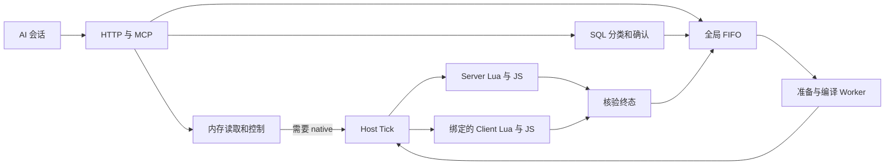
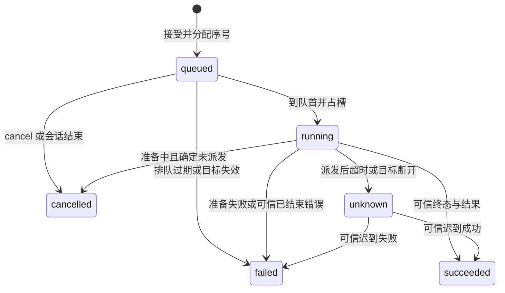

# FiveM 运行时调试 MCP RFC

日期：2026-09-21。状态：待评审；产品设计已确认，RFC 尚未批准。交付范围：文档与契约附件。

设计来源：[已确认设计](../specs/2026-09-21-runtime-debug-mcp-redesign.md)。用户在该文档提交审阅后回复 `y` 确认；保留源文档，不修改其历史正文。本 RFC 独立定义目标系统，不要求继承任何旧 RFC 或执行迁移。

## 1. 决策与完成边界

在单个 `fivem-mcp` 资源内提供同机 Streamable HTTP、完整 10 工具、统一 FIFO 和 Server/Client Lua/JS 执行器。HTTP 默认 `127.0.0.1:30130/mcp`。任务、会话、审批和结果仅驻内存。数据库专用入口按 SQL 分类确认；确认成功才入队。交付目录固定为 `fivem-mcp/artificials/fivem-mcp`，ZIP 为同级 `fivem-mcp.zip`。

本 RFC 选择具体接口与默认预算；这些数值是本方案的容量选择，不是实测性能。当前仓库的 HTTP 入口只提供探针工具，`pack` 仍等于 build；这些是当前事实，不限制新系统范围。构建脚本中的固定虚拟 `__filename` 和先删旧目录的发布方式不能作为本方案的交付契约。

不包含源码迁移、Broker 清理、旧协议兼容、文件编辑工具、截图、NUI 代理或实现工作。无游戏客户端时仍可调用服务端工具。缺少 ESX/QBCore/ox 时仍注册 10 工具，调用相关方法返回依赖错误。

两项技术门槛尚未实机通过：资源内 Worker 编译隔离，以及服务器进程读取本机客户端日志。RFC 可评审、契约可实现，但不能在这两项通过前声称完整方案具备实机可交付性。第 14 节定义验证与失败后的决策点。

## 2. 模块与运行时边界

唯一源码包 `fivem-mcp/`，目标模块位置与责任如下；不规定从当前文件移动到这些路径的步骤。

| 目标目录 | 唯一责任与主要接口 |
| --- | --- |
| src/server | 生命周期、装配、资源身份；start/stop |
| src/http | Node HTTP、MCP SDK、会话与原请求 elicitation；dispatchRpc |
| src/tools | 固定 10 工具定义、Schema、handler；validate/handle |
| src/tasks | 全局排序、取消、结果保留与 unknown；submit/get/cancel/recover/settle |
| src/execution | 不可变执行计划、编译 Worker、Host Tick 调度；prepare/dispatch |
| src/client | JS 客户端绑定、执行和回报；bind/execute/probe |
| src/lua | 两端 Lua 执行、框架适配、特殊值编码；execute/inspect |
| src/adapters | 方法清单、参数和结果投影、依赖代际、SQL 分类 |
| src/logs | 控制台监听、文件映射与有界 ring；query/coverage |
| src/reference | 离线索引、官方网络回退；search |
| src/shared | 纯数据契约、值编码结构；不可依赖 Node/SDK/编译器 |

Server JS 和 Lua、Client JS 和 Lua 各自有独立运行时，不能共享语言全局变量。Server JS 持有唯一任务中心。HTTP 与文件/网络回调只读内存或提交 HostWork；调用 native、exports、Lua 本地事件以及网络事件发送均由 `setTick` 中执行。异步回调每次重新访问宿主前再次跨入 Host Tick，不能只在任务开头切一次线程。[FiveM JavaScript 运行时](https://docs.fivem.net/docs/scripting-manual/runtimes/javascript/)



Host 队列区分控制与执行，单 tick 最多处理 16 项或消耗 2ms 调度预算，先到者停止；控制优先，但连续 8 项控制后允许 1 项准备好的执行。预算不可能抢占一项正在阻塞的 native/片段。单独运行的游戏死循环仍可阻塞宿主，不能承诺此时 HTTP 控制可救回环境。

## 3. 配置、容量和依赖

自身配置路径 `config/config.json`；不存在则使用默认值，非法则启动失败并关闭监听。不从其他资源读取配置，不读取数据库连接凭据。严格配置 Schema 见 [契约附件](runtime-debug-mcp-contracts.json) 的 `$defs.Config`。仅 port、clientLogDirectories、referenceOnline 可配置；其余预算首版固定，修改须修订契约。

```json
{"port":30130,"clientLogDirectories":[],"referenceOnline":true}
```

port 为 1024–65535 整数；host 固定 IPv4 loopback、path 固定 `/mcp`。日志目录最多 4 个 Windows 绝对目录，无默认猜测；安装文档指导配置。配置文件最大 16KiB。目录展开、规范化和权限错误在 status 显示，不能使 server-only 功能离线。

| 项目 | 首版默认值/硬上限 | 超限行为 |
| --- | --- | --- |
| HTTP body / header | 256KiB / 16KiB；请求体读取 5s | 413 / 431 / 408；不创建任务 |
| 并发会话 / 活跃 HTTP 请求 | 8 / 64；每会话 16 | 429；保留现有工作 |
| 入站连接 / 每秒新请求 | 64 / 全局 100、每会话 30，令牌桶突发同额度 | 503 / 429；不延长过期会话 |
| 会话空闲期限 | 30min；未初始化完成 10s | 清理会话；第 4 节规则 |
| 等待确认 | 全局 8、每会话 2；120s | CONFIRMATION_LIMIT / CONFIRMATION_EXPIRED |
| queued / 活动执行槽 | 全局 128、每会话 32 / 1 | QUEUE_FULL；无隐式逐出 |
| 排队最长驻留 | 10min，包括 unknown 暂停期间 | failed，QUEUE_EXPIRED，未派发 |
| 代码 / args | UTF-8 64KiB / JSON 64KiB | INPUT_TOO_LARGE |
| JSON 结构 | 深度 32、节点数 10000、单容器 1024 项 | INPUT_TOO_COMPLEX；解析前先做词法深度检查 |
| 编译准备 / 执行期限 | 5s / 默认 10000ms，范围 100–60000ms | 准备失败或派发后 unknown |
| 普通工具响应等待 | 入队后最多 1000ms | 返回任务快照，后续 queue.status 查询 |
| Host 控制等待 / recover 查询 | 2s / 2s | HOST_UNAVAILABLE / RECOVERY_UNPROVEN |
| 结果 / 内部事件帧 | 编码 JSON 256KiB / 384KiB | 确定已结束则 RESULT_TOO_LARGE |
| 终态结果保留 | 最长 10min、最多 256 项、总计 16MiB | 按最旧终态淘汰；活动与 unknown 不淘汰 |
| 日志 ring | 总计 16MiB、最多 10000 行；每行 16KiB | 最旧行淘汰，计入 dropped；超长行截断标记 |
| 日志查询 | 默认 100、上限 500 行；响应 data 256KiB | 取可容纳的最近行并标 truncated |
| reference | 默认 5、上限 20 项；并发 2、单次 5s、每响应体 4MiB、每调用合计 8MiB | REFERENCE_UNAVAILABLE；不影响 FIFO |
| 最大工具响应 | 序列化后的完整 MCP result 1MiB | 预留封装空间；不得截断 JSON |

排队任务保存代码/参数，终态只保留摘要、结果和定位所需片段映射，不保留原始代码/SQL/确认正文。准备完成且派发后尽早释放编译输入。容量统计包含 UTF-8 缓冲区，不仅按对象个数计算。

依赖选择：Server 使用工作区锁定的 `@modelcontextprotocol/sdk 1.30.0`、`zod 4.5.4`；编译 Worker 使用 `typescript 5.9.3`；构建 `esbuild 0.28.2`。版本来自本次读取的 package.json，正式实现必须验证锁文件一致性；不引入 Fastify、WebSocket 或桌面 Node 服务作为运行依赖。fxmanifest 指定 `node_version '22'`、`fx_version 'cerulean'`、`game 'gta5'`，Lua 5.4。宿主版本以实测 artifact ID 记录，不能从桌面 Node 版本推断支持。

## 4. HTTP、MCP 与会话

首版协议锁定 `2025-11-25`。initialize 对其他版本返回本端支持版本，由客户端按 MCP 协商决定是否继续；后续 header 显式不兼容则 400。缺 header 但 session 已协商时用会话版本。仅声明 tools 能力，`listChanged:false`；无 prompts/resources/MCP tasks 扩展。这里的 taskId 是工具业务 ID。

Host 只允许 `127.0.0.1:<配置端口>` 与 `localhost:<配置端口>`；Origin 缺省允许，存在时仅允许这两个精确 `http://` origin；`null`、多值、其他主机、userinfo、转发头均不扩大白名单。无 Token，是用户批准的同机信任模型，session 不是用户认证。SDK 自动设置不能替代入口检查。

POST 接收单个 UTF-8 JSON-RPC 消息，拒绝 batch。工具请求可返回 JSON 或 SSE；通知及服务端请求的响应被接受后返回 202。GET 首版返回 405，不提供独立订阅或 Last-Event-ID 重放；所有 elicitation 都在原 tools/call POST 的 SSE 上发送。DELETE 删除当前会话并返回 204；未知会话返回 404。缺 session 的非 initialize 请求返回 400，未收到 initialized 通知不能执行工具。其他路径 404；不启用浏览器跨域访问。[Streamable HTTP](https://modelcontextprotocol.io/specification/2025-11-25/basic/transports)

每次启动创建随机 UUID resourceEpoch；每次 initialize 创建随机 UUID sessionId。活动请求存在时不按空闲 TTL 清理，但确认仍受 120s 限制。连接中断不删除会话，不取消已排队任务。客户端 `notifications/cancelled` 结束原请求等待；若处于确认阶段同时作废确认。已创建任务只能通过 queue.cancel 或会话终止取消未派发部分。

会话 DELETE/过期时作废确认，取消未派发任务；派发后继续占槽直到终态/unknown。多个同机会话可按 taskId 查询、取消未派发任务或核验恢复证据；不暗示会话间安全隔离。

SQL 确认期间 SSE 断开即作废该确认，迟到 accept 不入队。没有重放机制，重连后重新发起调用会得到新确认。入队后断开通过 queue.status 概览找任务，禁止自动重试原 tools/call。JSON-RPC request ID 不提供跨请求幂等键。

## 5. 规范性 Schema 与返回约定

[runtime-debug-mcp-contracts.json](runtime-debug-mcp-contracts.json) 是 JSON Schema 2020-12 附件，`$defs.<tool>Input` 为输入，`$defs.<tool>Output` 为 structuredContent。生成 tools/list 时每个 inputSchema/outputSchema 必须复制所需 `$defs`，根 ref 必须在生成后的独立 Schema 内可解析；不得发布依赖工作区外部文件的 ref。

所有对象默认拒绝未知字段；无字符串到数字强制转换。`default` 是契约归一化规则，JSON Schema 校验器不会自行填值；实现须显式填入并测试。UTF-8 字节数、深度、目标身份、方法语义等非 Schema 约束由正文规定，校验发生在入队前与派发前。

工具结果采用以下封装，text 是同一 structuredContent 的 JSON 序列化，确保无结构化展示能力的客户端可读取：

```text
CallToolResult = {isError: boolean,
  structuredContent: ToolOutput,
  content: [{type: "text", text: JSON.stringify(ToolOutput)}]}
ToolOutput = {ok: true, data: ToolData} | {ok: false, error: Error, task?: Task}
```

`isError = !ok`。Task 快照为 queued/running/succeeded 时 ok=true；failed/cancelled/unknown 时 ok=false 且携带 task。queue.status 是查询行为，即使查到 failed/unknown，也以 ok=true 返回该 Task；查不到才失败。queue.cancel/recover 失败带最新 task。协议级非法 JSON/消息/方法用 JSON-RPC 标准 -32700/-32600/-32601；未知工具和参数 Schema 错误用 -32602。运行期业务失败使用工具错误封装。

### 5.1 10 工具语义

| 工具 | 输入与结果要点 |
| --- | --- |
| status | `{clientId?}`；返回 service、resourceEpoch、buildId、运行时、连接的客户端、依赖与方法状态、日志覆盖、队列概览；筛选只作用于客户端列表 |
| queue | status 无 taskId 返回概览，有 taskId 返回 Task；cancel/recover 必须 taskId；无 force/重试动作 |
| execute_lua / execute_ts | side 必填；client 必填 clientId，server 禁止该字段；code 函数体，args 默认 `{}`，timeoutMs 默认 10000；返回 Task |
| resource | list 禁止 name；status/start/stop/restart 必填精确 name；读取返回 ResourceRead，变更返回 Task，其 result 为 ResourceChange |
| logs | side 默认 all；server 禁止 clientId；client/all 在多个客户端时必须 clientId，恰一客户端可确定性补齐，零客户端时 all 仅 server、client 报 TARGET_UNAVAILABLE；返回行和各来源 coverage |
| esx / qbcore | scope、side、method 必填；无参数方法 args 可省略并默认 `[]`，其他方法必填；server/player 必填 playerId；client 仅 framework scope，必填 clientId，禁止 playerId；返回 Task |
| ox | library、side、method 必填；无参数方法 args 默认 `[]`，其他必填；client 必填 clientId；库和端组合见第 9 节；返回 Task |
| reference | query 必填且 trim 后非空，category 默认 all、side 默认 all、limit 默认 5；返回命中项、来源、截断与在线回退状态 |

正向最小调用：`execute_ts({side:"server",code:"return args.value + 1;",args:{value:41}})`。返回 `Task.result={kind:"values",values:[42]}`；Lua `return 42,nil` 对应 `[42,{"$mcp":"nil"}]`。无任务的拒绝不编造 taskId。

### 5.2 错误与 Task

Error 固定 code、message、phase、retryable、execution；可选 stack 与 details。execution 为 `not_dispatched/ended/unknown/not_applicable`。retryable 仅表示可在修正条件后人工重新调用，不指令自动重试；有可能产生副作用的一律 false。stack 最多 8KiB，路径只保留用户片段位置/资源相对路径。

Task 固定 taskId、sequence、tool、state、phase、target、createdAt、queueMs、executionMs、execution；可选 dispatchedAt、endedAt、result、error。UTC 时间用于显示；超时用单调时钟。sequence 是当前 epoch 十进制字符串，禁止跨 epoch 比大小。taskId 采用 `<resourceEpoch>:<递增序号>`。queued、preparing、waiting_host 的执行时间为 0，派发后从 dispatch 时刻计算。

队列概览的 queued/recent 使用 TaskSummary，不附完整结果和堆栈；active 返回当前完整 Task。recent 为最近 32 条终态，不代表完整保留集合，retainedCount/evictedCount 明确保留情况。每条结果必须按 taskId 单独查询，避免多个大结果使控制查询超限。派发后尚未结束的 running.execution=unknown，表示结果未定；只有 state=unknown 才暂停队列。

错误清单和 phase/结果结构在附件中枚举。目标失效、超限、确认拒绝均需清楚指明是否派发；不能用普通 timeout 模糊替代 unknown。

## 6. FIFO 与取消恢复状态机



running 内部阶段为 preparing、waiting_host、dispatched；unknown 不是可淘汰终态。不可从展示用 recent 列表调度；独立 deque 保存全部 queued。入队校验与序号分配在任务中心单次同步操作中完成。确认等待不占位置，确认通过后也可能 QUEUE_FULL。

执行槽从队首准备开始占用。取消与派发以任务中心的 `dispatchCommitted` 为线性化点：HostWork 取出后再次验证任务状态和身份，先置 committed、记录时钟，再调用执行器。cancel 在此之前胜出则 HostWork 必须空操作；此后返回 TASK_NOT_CANCELLABLE。底层 send 抛错也不能凭异常断言未执行：只有适配器能证明尚未调用底层发送时才 failed，否则 unknown。

执行计时结束仅凭匹配终态，不能凭资源返回值 true、连接恢复或 ack。unknown 时暂停所有执行型工具；status、logs、reference、resource 读取及 queue 控制继续工作。queued 按 10min 过期处理，不自动延长。

queue.cancel 对已 cancelled 幂等返回快照；其他终态返回 TASK_ALREADY_FINISHED；unknown 不可取消。queue.recover 对 unknown 发只读终态查询，绝不重新发送 execute；2s 内无证据返回 RECOVERY_UNPROVEN。若 task 已是终态，recover 幂等返回该终态与当前 paused 状态。若 task 尚未 unknown，则返回 TASK_NOT_UNKNOWN。

迟到结果与 recover 返回都经同一个 settle；重复终态只接受第一次，冲突终态记录协议故障但不覆盖。原任务终态返回后解除其阻塞。外部资源重启、玩家重连、MCP 重启均不作为结束证据。MCP 重启确实开始新空队列，这是已批准的内存边界，可能与旧外部副作用重叠。

## 7. 目标身份、内部消息和终态缓存

Client 选择用 server ID；绑定为 `{resourceEpoch,clientId,connectionId,clientEpoch}`。connectionId 是 Server 为本次游戏连接分配的随机 UUID，clientEpoch 是客户端资源启动生成的 UUID。任务中心记录框架资源代际，player scope 另绑定 playerId 的 connectionId；避免 queued 期间玩家 ID 复用。

客户端 hello 只报告 clientEpoch 和语言能力；Server 从实际事件 source 生成 connectionId、返回 bind，其中带当前 resourceEpoch 与 128bit 随机 logMarker。客户端 JS 收到服务端 bind 后将绑定通过仅本地事件交给 Lua。双方语言就绪才标 ready。每 5s heartbeat，15s 无有效心跳视为绑定不可用；未派发任务失败，已派发任务 unknown。服务器资源重启后 hello 每 2s 重发至绑定成功，不重发任何任务。

事件命名空间：`<实际资源名>:mcp:v1:{hello,bind,heartbeat,execute,terminal,terminalAck,probe,probeResult}`。execute/terminalAck/probe 仅 Server→Client；terminal/probeResult 仅 Client→Server；服务端执行 Lua 使用独立 `:local:` 事件，禁止 RegisterNetEvent 暴露。实际 source 在进入 handler 时复制到局部变量，再做异步处理。[事件来源生命周期](https://docs.fivem.net/docs/scripting-manual/working-with-events/listening-for-events/)

内部事件只传一个 JSON 字符串，外层 `{v:1,type,binding,taskId?,payload}`；hello 尚未绑定，单独使用 `{v:1,type:"hello",payload}`。不让 msgpack 自动编码用户值。binding 含完整客户端绑定。execute.payload 为 `{kind,code?,args,adapter?,method?,timeoutMs,planHash}`；正常 terminal.payload 为 `{execution:"ended",result?,error?}`，result/error 必须二选一；执行器明确拒绝且尚未进入用户代码时使用 `{execution:"not_dispatched",error}`，用于 EXECUTOR_FULL/身份拒绝等确定未执行证据。probeResult.payload 为 `{known:boolean,terminal?}`。精确分支见附件 InternalMessage；v 不兼容拒绝。Server 本地终态也走相同 Task settle 校验。发送前按编码后的完整帧计量，超限在 dispatchCommitted 前拒绝；code 编译膨胀也不能越过帧预算。

服务端对 client 网络消息先核对真实 source、当前 binding、task 的原目标、大小和状态。客户端只接受来自服务端的网络消息，不能仅凭同名本地事件执行；Lua 网络 source 校验 `65535`，JS 的等价来源值须在实机测试中核对。[事件安全](https://docs.fivem.net/docs/developers/server-security/)

每个执行器在执行完成时先保存终态、再回报。单目标仍未获 Server ack 的终态保留至 ack 或资源停止；Server settle 后发 terminalAck，payload 为 `{}`。已 ack 的终态最多 32 条/5min/8MiB，供重复 probe 查询。因 ack 丢失后 Server 可能已开始下一任务，未 ack 终态最多 32 条/8MiB；满时执行器拒绝新的 execute 并回报确定未执行证据，Server 按相应错误结算，不可逐出旧记录。terminal 每 2s 重发直到 ack，Server 对已结算任务仍回 ack。收到重复 execute：相同 taskId/planHash 不再执行，已结束则再回终态；不同 hash 拒绝。新任务的递增序号必须大于本绑定已接受高水位，缓存淘汰后也拒绝旧 execute。

容量拒绝使用独立一个小型拒绝记录槽（最大 8KiB），也记录接受高水位；该拒绝未被 ack 前不得接受更高序号。Server 的工具结果已淘汰时仍可核对当前完整 binding、epoch 和已结算序号高水位后确认旧 terminal；这种 ack 不恢复工具结果，也不能解除当前 unknown。未知 taskId、旧 binding 或未来序号不 ack。客户端持续重复 hello 同一 clientEpoch 不得重置 connectionId 或高水位。

单 source 每秒最多 20 条内部控制消息，超限丢弃并计数；合法 terminal 仍应有独立的每秒 2 条配额，避免心跳洪水挤掉结算。网络结果依赖可信开发客户端，不承诺抵御完全被控制的目标客户端伪造自己的结果。

## 8. Lua、TS 编译与值编码

Lua 用 `load` 构造接收 args 的函数，在可等待协程中通过 xpcall 执行；`table.pack` 保留多返回值和 nil。提供每调用独立环境，允许 FiveM API 和 exports，未声明变量不成为后续任务变量；不得声称这是对 native 副作用的安全隔离。

TS Worker 在编译前把函数体包进 async 函数，以允许顶层 await/return；typescript.transpileModule 使用 ES2022 目标、无模块导入，收集语法诊断与 source map。拒绝 AST 中 import/export 声明、ImportExpression、ImportEquals 与显式 require 调用；类型注解只擦除，不做项目类型检查。不是对任意计算绕过的安全沙箱。JS 执行器 `await` 包装函数完成，Lua Citizen.Await 按原语义运行；未 await 的副作用不计入完成边界。

### 8.1 编译隔离方案与门槛

选择单个 Node worker_threads Worker，启动时预热编译器，运行时不在 HTTP/Host 线程编译。静态导入或 CJS require 加载 Node builtin；Worker 从 `GetResourcePath(实际资源名)` 在 Host Tick 获取的绝对路径加载 `dist/compiler.cjs`。不使用依赖动态 import 回调的加载方式，不使用硬编码 `/fivem-mcp` 当文件系统位置。

Worker 输入 `{requestId,code}`，输出 `{requestId,js,map,diagnostics}`，只处理当前队首的一个请求。5s 超时 terminate 并等待退出，当前未派发任务 failed；下一任务前重新启动预热。若 Worker 无法退出/重建，编译能力 faulted，新的 execute_ts 返回 COMPILER_UNAVAILABLE；已有 Lua 能继续。此状态必须可观测，不能据此宣称完整发布验收通过。

Server bundle 不包含 TypeScript，Worker 自身是 CJS 文件、拥有真实 Node 文件作用域。必须以资源脚本缺少 CommonJS wrapper 的实际环境验证 Server SDK 依赖是否仍访问 __filename/__dirname；有需要时使用 bootstrap 传入真实路径或定点兼容，禁止掩盖任意动态依赖。资源停止时立即拒绝新任务、close HTTP、终止 Worker；停止后 2s 内端口释放且无残留 Worker 是实机验收目标，非当前事实。

### 8.2 WireValue

普通 null、boolean、有限 number、string、JSON array/object 保留；所有出现保留键 `$mcp` 的用户对象必须转义，防止误解。附件包含递归 WireValue Schema：

| 原值 | 表示 |
| --- | --- |
| Lua nil / JS undefined | `{"$mcp":"nil"}` / `{"$mcp":"undefined"}` |
| NaN/正负无穷 | `{"$mcp":"number","value":"NaN|Infinity|-Infinity"}` |
| BigInt 或超过 JS 安全整数范围的 Lua integer | `{"$mcp":"integer","value":"十进制字符串"}` |
| 二进制 | `{"$mcp":"bytes","base64":"..."}` |
| vector2/3/4 | `{"$mcp":"vector","values":[...]}` |
| Lua 非连续整数键/混合键 table | `{"$mcp":"table","entries":[[key,value],...]}`；key 仅 string/boolean/有限 number |
| 带 `$mcp` 的普通对象 | `{"$mcp":"object","entries":[[string,value],...]}` |

Lua 连续 1..n 且无其他键的 table 编码数组；空 table 编码 `{}`；字符串键 table 编码对象，其余按 entries。Lua JSON args 的 null 以专用 sentinel 保留，不能默默变 nil 丢键；该 sentinel 回传为 JSON null。JS 普通对象只接受 plain object/null prototype；Date、函数、userdata、metatable 对象（已支持 vector 除外）、循环引用、访问器与 Symbol 返回 RESULT_UNSUPPORTED，不调用 toJSON/getter 来取得隐式副作用。

遍历深度 32、节点 10000，边遍历边计量，不先完整构建无限输出。超大结果失败而非返回成功前缀；最小终态错误必须仍可发送。语言执行已结束但编码失败的 task 为 failed、execution=ended，释放 FIFO。普通 false/nil 结果按原语义返回，不擅自变异常。

## 9. 框架方法契约

本节及附件的 method/args 分支是首版完整清单；未列方法返回 METHOD_UNSUPPORTED，可改用片段。方法列表不是任意路径解析器。各方法在每次派发重新获取框架对象，保留调用的 this/self 语义。无 framework 依赖时不静态加载 `@ox_lib/init.lua` 或 `@oxmysql/lib/MySQL.lua`，避免缺库导致整个 MCP 起不来。

### 9.1 固定源码基线

以下 commit 经 `git ls-remote` 解析并读取固定源码核对；版本号是源码标注，不代表已经在用户宿主上验收，也不表示同版本分叉都兼容。

| 框架 | 版本 / commit | 原始源码 |
| --- | --- | --- |
| ESX | 1.15.2 / fe59ca0bd6da59e2ec6eb4a8d06ece312e96ae7a | [server/functions](https://github.com/esx-framework/esx_core/blob/fe59ca0bd6da59e2ec6eb4a8d06ece312e96ae7a/%5Bcore%5D/es_extended/server/functions.lua)、[player](https://github.com/esx-framework/esx_core/blob/fe59ca0bd6da59e2ec6eb4a8d06ece312e96ae7a/%5Bcore%5D/es_extended/server/classes/player.lua)、[client/functions](https://github.com/esx-framework/esx_core/blob/fe59ca0bd6da59e2ec6eb4a8d06ece312e96ae7a/%5Bcore%5D/es_extended/client/functions.lua) |
| QBCore | 1.3.0 / 9b3cddcce93e5e12cbcf6b47b866b687d32ac7bf | [server/functions](https://github.com/qbcore-framework/qb-core/blob/9b3cddcce93e5e12cbcf6b47b866b687d32ac7bf/server/functions.lua)、[player](https://github.com/qbcore-framework/qb-core/blob/9b3cddcce93e5e12cbcf6b47b866b687d32ac7bf/server/player.lua)、[client](https://github.com/qbcore-framework/qb-core/blob/9b3cddcce93e5e12cbcf6b47b866b687d32ac7bf/client/functions.lua) |
| ox_lib | 3.39.0 / b8f5a04351b1d427e0e112150d36094e9889ec7b | [export 注册](https://github.com/overextended/ox_lib/blob/b8f5a04351b1d427e0e112150d36094e9889ec7b/resource/init.lua)、[notify](https://github.com/overextended/ox_lib/blob/b8f5a04351b1d427e0e112150d36094e9889ec7b/resource/interface/client/notify.lua)、[textui](https://github.com/overextended/ox_lib/blob/b8f5a04351b1d427e0e112150d36094e9889ec7b/resource/interface/client/textui.lua) |
| ox_target | 1.18.1 / bf03d52c09cb5f677ac063531740fddcb51ca7cf | [client/api](https://github.com/overextended/ox_target/blob/bf03d52c09cb5f677ac063531740fddcb51ca7cf/client/api.lua) |
| oxmysql | 2.14.1 / 030d3bda11098fc4a78f1940545b674c374daa45 | [exports](https://github.com/overextended/oxmysql/blob/030d3bda11098fc4a78f1940545b674c374daa45/src/index.ts)、[Lua await](https://github.com/overextended/oxmysql/blob/030d3bda11098fc4a78f1940545b674c374daa45/lib/MySQL.lua) |

运行时检查资源 started、metadata version 与指定方法可调用性；相同版本但未运行验收只显示 `detected`，不能显示 `verified`。版本不匹配返回 DEPENDENCY_VERSION_UNSUPPORTED，避免静默误调用；支持其他版本需新增适配清单与行为测试。玩家源查找始终核对提交时的 connectionId。

### 9.2 ESX / QBCore

下表 `[]` 为位置参数；`?` 为尾部可选。字符串默认上限 128 字符，正文/通知 4096，reason 256。金额为有限非负数且不超过 1e12；grade 为 0–1000 整数。

| 工具 / side / scope | method | args | 返回 |
| --- | --- | --- | --- |
| esx/server/framework | GetPlayerFromId | `[playerId]` | 玩家快照或 nil |
| esx/server/player | getMoney / getJob | `[]` | number / Job 快照 |
| esx/server/player | getAccount | `[accountName]` | Account 快照或 nil |
| esx/server/player | addMoney / removeMoney | `[amount,reason?]` | 原值 |
| esx/server/player | setJob | `[name,grade,onDuty?]` | 原值 |
| esx/client/framework | GetPlayerData | `[]` | 玩家快照 |
| esx/client/framework | ShowNotification | `[message,type?,length?]` | 原值；length 为 1–60000ms |
| qbcore/server/framework | Functions.GetPlayers | `[]` | server ID 数组 |
| qbcore/server/framework | Functions.GetPlayer | `[playerId]` | 玩家快照或 nil |
| qbcore/server/player | Functions.GetMoney | `[moneytype]` | 原值 |
| qbcore/server/player | Functions.AddMoney / Functions.RemoveMoney | `[moneytype,amount,reason?]` | 原值 |
| qbcore/server/player | Functions.SetJob | `[name,grade]` | 原值 |
| qbcore/server/player | Functions.SetJobDuty | `[onDuty]` | 原值 |
| qbcore/client/framework | Functions.GetPlayerData | `[]` | 玩家快照 |
| qbcore/client/framework | Functions.Notify | `[text,type?,length?]` | 原值 |

ESX 从 `exports.es_extended:getSharedObject()` 获取；QBCore 从 `exports['qb-core']:GetCoreObject()` 获取。服务端 player scope 分别通过 GetPlayerFromId / Functions.GetPlayer 查当前对象。framework 的 GetPlayerFromId/GetPlayer 参数同样绑定该玩家连接，不因“framework scope”漏掉 ID 复用检查。

ESX 玩家投影仅 `{source,name,job,accounts}`；Job 仅 `{name,label,grade,grade_name,onDuty}`；Account 仅 `{name,label,money}`。QBCore 玩家投影仅 `{source,citizenid,name,money,job,gang}`，job/gang 仅 `{name,label,grade,onduty,isboss}`，grade 仅 `{name,level}`。不存在的字段省略；不附加 methods、license、tokens、任意 metadata/inventory。金额 map 的键和值限定 string→finite number。投影后进入 WireValue 编码。

### 9.3 ox

| library / side | method | args | 返回/适配 |
| --- | --- | --- | --- |
| ox_lib/client | notify | `[{title?,description?,type?,duration?}]` | title/description 至少一项；type 为 inform/error/success/warning；直接调用对应 export |
| ox_lib/client | showTextUI | `[text]` | 直接 export；首版不暴露 options 中函数/样式对象 |
| ox_lib/client | hideTextUI / isTextUIOpen | `[]` | 原值，isTextUIOpen 保留多返回值 |
| ox_target/client | isActive | `[]` | boolean |
| ox_target/client | disableTargeting | `[boolean]` | 原值 |
| ox_target/client | zoneExists | `[positiveInteger或stringName]` | boolean |
| ox_target/client | removeZone | `[id或name,suppressWarning?]` | 原值；不提供批量删区 |
| oxmysql/server | query / single / scalar / insert / update | `[sql,parameters?]` | 以对应 `*_async` export 等待终态 |
| oxmysql/server | transaction | `[[{query,values?},...]]` | 1–32 条，布尔提交结果；全部先确认 |

SQL 参数仅位置标量数组（null/string/boolean/finite number，最多 1024 项），不接受数字形式的 query store ID、函数、隐式回调、命名参数别名。不暴露 prepare/rawExecute/startTransaction，以避免未定义的批次和交互事务语义。所有 SQL method 名保留 oxmysql 原名，内部 async export 只是等待实现。oxmysql 返回的数据库错误是 execution=ended；回调失联/执行期限到期仍按 unknown，不自动重试事务。

## 10. 数据库分类与原会话确认

首版只将一个保守 SELECT 子集判断为明确只读；其余 SQL 不是禁止执行，而是必须确认。分类器是有界词法器，不做正则前缀判断。支持 ASCII 标识符、反引号标识符（双反引号转义）、SQL 单引号字符串（双单引号转义）、数字、`?`、标点。反斜线、双引号、注释（包含 `/*! */`）、未知词法形式均归为需确认，不依赖 sql_mode 猜测。

自动只读的条件全部满足：method 为 query/single/scalar；首 token SELECT；仅一个语句（允许一个尾分号）；无 WITH/UNION/嵌套 SELECT/INTO/FOR/LOCK/OUTFILE/DUMPFILE/PROCEDURE/变量 @/赋值 :=；无函数调用，唯一允许函数为无 schema 限定的 COUNT 且参数仅 `*` 或单列标识符；FROM 可省略或为单表，可用 WHERE/ORDER BY/LIMIT/OFFSET 及 AND/OR/IS/NOT/NULL/LIKE/IN/BETWEEN 运算；括号只用于 WHERE 分组、IN 常量列表与 COUNT。未在此语法定义的 SELECT 一律需确认。绑定值不拼接回 SQL。

最低分类样例：`SELECT 1`、`SELECT * FROM users WHERE id = ? LIMIT 10`、`SELECT COUNT(*) FROM users` 自动只读；`SELECT sleep(1)`、`SELECT custom_func()`、`SELECT ... INTO OUTFILE`、`SELECT ... FOR UPDATE`、CTE、任何注释、多语句、INSERT/UPDATE/DELETE/DDL/CALL/事务全部需确认。字符串中的分号不算分隔符；未闭合字符串归需确认并由数据库报错，不能错误归为只读。

确认记录在内存绑定 `{approvalId,sessionId,rpcId,resourceEpoch,dependencyEpoch,canonicalRequestHash,expiresAt}`。message 完整展示方法、SQL、参数和目标，JSON 字符串转义控制字符，按输入顺序保留数组；对象键规范排序计算 SHA-256。message 加表单总计最多 32KiB，超出返回 CONFIRMATION_TOO_LARGE，不截短后请求批准。

请求使用 `elicitation/create`，`mode:"form"`，requestedSchema 仅含必填 boolean `approve`，default=false；接收 `action:"accept"` 且 `content.approve===true` 才算批准。能力接受 `{elicitation:{form:{}}}` 或兼容的空 `{elicitation:{}}`；只有 url 或无 elicitation 时返回 CONFIRMATION_UNSUPPORTED。普通 tools/call 不接受 approved 字段。[MCP elicitation](https://modelcontextprotocol.io/specification/2025-11-25/client/elicitation)

批准后重验 session、全部内容 hash、依赖代际、容量，再原子创建任务。派发前依赖代际变化则 TARGET_CHANGED 并要求新调用重新确认，不自动弹第二次表单、不替换目标。确认使用一次即销毁；重复/迟到响应忽略。这个机制不检查通用 Lua/TS/exports 内的 SQL，也不收集密码。

## 11. 资源、日志与资料

### 11.1 resource

资源名 1–128 字符，来自枚举结果精确匹配；不解释类别 `[x]`、通配符或命令串。用 GetNumResources/GetResourceByFindIndex/GetResourceState 读取，用 StartResource/StopResource native 控制，不拼接 ExecuteCommand。状态允许 missing/uninitialized/starting/started/stopping/stopped/unknown。资源清单超过响应预算返回 RESULT_TOO_LARGE，不能返回未标注的不完整清单。[StartResource 声明](https://github.com/citizenfx/fivem/blob/master/ext/native-decls/StartResource.md)

start 已 started、stop 已 stopped 幂等成功；restart 对 stopped 等价 start，对 started 先 stop 后 start；starting/stopping 返回 RESOURCE_BUSY。missing 返回 RESOURCE_NOT_FOUND。单次变更总执行期限 30s，100ms 轮询并结合生命周期事件观察；返回 true 不等于已达终态。超时按 unknown，后续只能依据这次操作的同代观察器给出结束证据。外部并发控制造成代际冲突则 unknown，不把任意外部 started 当本任务成功。

ResourceChange 为 `{name,before,after,stages:[{action,before,after,ok,error?}]}`；停止明确失败不继续 start。MCP 自身按实际运行资源名禁止 stop/restart；start 自身只返回幂等已有状态。依赖停止可能造成原生依赖连带效应：本工具不主动连带操作，但必须报告观察到的状态，不能保证宿主从不传播依赖影响。

### 11.2 logs

Server 使用 RegisterConsoleListener 的 channel/message；监听回调只入有界缓冲，不在回调内 console.log，以免递归。明确 `script:<resource>` 才赋资源名，其他频道归属 null。不存在全局监听能力时 coverage unavailable，不能以 MCP 自己的 console wrapper 代替全局日志。[官方声明](https://github.com/citizenfx/fivem/blob/master/ext/native-decls/RegisterConsoleListener.md)

Client 在收到 bind 后打印一次 `FIVEM_MCP_BIND:<resourceEpoch>:<connectionId>:<clientEpoch>:<logMarker>`；服务端文件读取器只在配置目录的 `CitizenFX*.log` 常规文件中查找完整标记。每目录最多扫描 32 文件、每文件尾部最多 4MiB、总扫描 32MiB；超限保留缺口而不无限扫描。恰一个当前标记命中才绑定文件；零命中 unlocated、多文件命中 ambiguous。同名 server ID 不替代标记。

200ms 轮询已绑定文件，每轮每文件最多读取 256KiB，总读取并发 2；用文件身份和 offset 跟踪追加，增量 UTF-8 decoder 保留末尾半字符/半行。文件被替换、截断或读权限失败时暂停归属、重新定位并标 gap。连续丢失读取不清空已有行，但 coverage 必须是 partial/unavailable。禁止把旧 epoch 标记前的历史归为当前日志。

标准化去 ANSI/FiveM 颜色码后保留 message；includeRaw=true 才附原始行。prefix 是频道字面前缀，resource 精确匹配，contains 大小写敏感字面子串，过滤取交集后从当前 ring 取最近 N 行。返回按采集递增序号正序显示。已识别转发副本标 `forwarded:true`，不混作本地资源；首版保留副本并说明来源，不按正文去重。

文件失去唯一归属时不得继续读取到该 clientId；server-only 仍可成功。all 查询在 client 缺口时返回已有 server 行与 coverage，不隐藏缺口。配置为空时 client 日志 coverage=unconfigured；单独 client 查询返回 LOG_SOURCE_UNAVAILABLE。官方 sandbox 文档明确存在目录外访问限制，不能据此推断任意 Node 版本的 fs 权限；本方案需要在目标 artifact 单独验证，失败不得添加绕过 sandbox 的代码。[Sandbox](https://docs.fivem.net/docs/developers/sandbox/)

### 11.3 reference 与 Skills

category 为 native/event/guide/all，side 为 server/client/all。构建随包发布固定资料 manifest：来自 citizenfx/natives 的 GTA natives、citizenfx/fivem/ext/native-decls 的 CFX natives，以及 citizenfx/fivem-docs 的核心事件和 scripting-manual 指南。每项保存 sourceUrl、revision、contentHash、side、category、name、signature?、summary；发布时记录精确 commit 与许可归属，不声称是运行时最新资料。

查找顺序为标准化 hash/name 精确匹配、name 前缀、name/summary 字面子串；同档按 name/sourceUrl 稳定排序。Native hash 标准化为大写 0x 十六进制；不得用用户 query 拼任意 URL。

离线零命中且 referenceOnline=true 时，Native 回退固定请求 [GTA native JSON](https://runtime.fivem.net/doc/natives.json) 与 [CFX native JSON](https://runtime.fivem.net/doc/natives_cfx.json)，按 namespace/hash/name/params/returns/description 归一化后使用同一匹配算法；api_set 缺失时 GTA 条目标 client，CFX 缺失标 shared。本轮两个 URL 实际 HTTP 200，响应约 2.64MiB 与 0.51MiB，故 2MiB 上限不足，本 RFC 选择每响应 4MiB。

event/guide 在线回退仅覆盖随包 online-sources manifest 固定的四个页面：`https://docs.fivem.net/docs/scripting-reference/events/`、`https://docs.fivem.net/docs/scripting-manual/runtimes/javascript/`、`https://docs.fivem.net/docs/scripting-manual/working-with-events/listening-for-events/`、`https://docs.fivem.net/docs/scripting-manual/introduction/introduction-to-resources/`。读取 main/article 正文及标题，按段落匹配 query；不会遍历用户输入或页面发现的任意链接。覆盖局限在这些页，命中不存在时返回空结果，不声称搜索整个互联网。

allowlist 精确包含上述六个 URL，每跳验证 HTTPS/主机/路径，最多 1 次同 allowlist 重定向，拒绝私网/回环/用户信息 URL。所有响应解压后大小与总请求时间受第 3 节约束，concurrency=2，共用 5s 调用期限。内存网络缓存最多 8MiB/60s，不持久化；revision 使用响应 ETag，没有则使用 contentHash，fetchedAt 必填。若至少有匹配结果，部分来源失败则在 warnings 记录并返回已有结果；零匹配且任何应查询来源失败则 REFERENCE_UNAVAILABLE；全部成功且零匹配才返回空数组。

Skills 提供安装/连接、工具示例、状态和结果解释、框架清单、NUI/CDT 外部工作流。工具端不因 Skill 存在而跳过校验。Codex、Claude Code、CodeBuddy 分别执行 HTTP 初始化及确认验收，不把产品名称当能力判断。

## 12. 产物与交付

发布资源目录内容：fxmanifest.lua、README.md、dist/server.js、dist/client.js、dist/compiler.cjs、lua/server.lua、lua/client.lua、config/config.example.json、data/ 与 LICENSE/NOTICE。配置可选 config/config.json。manifest 客户端下载白名单只有 client.js、lua/client.lua 及必要纯数据；Server SDK、编译器、日志路径配置不能随客户端下载。

`build` 完整检查类型、构建与产物契约后生成目录；`pack` 调用同一构建流程并生成单根 `fivem-mcp/` ZIP。默认目标固定 artificials；测试只能使用临时 fixture 输出，不能运行默认 build 覆盖已挂载目录。buildId 为源码、默认配置、资料 manifest、锁文件、构建器版本和选项的确定性 SHA-256，不用当前时间冒充代码身份。ZIP 内 manifest 包含每个受管文件 SHA-256。

发布先写 artificials 下唯一 staging，检查所有受管文件与 ZIP 后，持独占发布锁：保留已有 config/config.json 与非受管 config 文件，旧目录 rename 至 backup，staging rename 至正式目录；第二步失败立即恢复 backup。Windows 不承诺两次 rename 是原子事务，恢复日志仅供构建工具处理，不是运行时任务持久化。跨进程中断时下一次 build 检测 backup/staging 并先恢复唯一已验证产物，再允许发布。路径必须解析并确认在 artificials 内；遇目录锁/权限失败保留上次目录，不先 rm 正式产物。

构建不重启宿主、不改链接。实际切换运行产物应在资源停止后完成；ZIP 解压后的无 node_modules 环境须可启动。回退只替换上次已验证产物并重启资源，不回滚数据库/经济状态，也不恢复旧 task/session。本 RFC 不执行这些部署动作。

## 13. 验证矩阵与实施顺序

| 层次 | 必须验证的行为 | 通过标准 |
| --- | --- | --- |
| 契约静态 | 10 input/output Schema、未知字段、端/ID组合、方法参数、WireValue | 正反例均符合，tools/list 无探针/占位工具 |
| 确定性单元 | 派发/取消竞争、128队列、容量、TTL、终态淘汰、unknown恢复 | 无重复派发，无错误推进，无活动任务逐出 |
| 传输集成 | 初始化、202、SSE elicitation、DELETE、断流、迟到批准、Origin | 同会话路由；断流后不执行已作废确认 |
| 编译实机 | Worker CJS 路径、预热、语法错误、负载期间 status、重建/退出 | 5s准备期限有效；停止释放 Worker；双端 TS 返回正确 |
| 双端执行 | Lua/TS await、exports、nil/稀疏表/大整数/循环/大结果 | 最终结果与 execution 标记准确 |
| 多客户端 | source 伪造、ID重用、Lua/JS就绪差异、断线迟到结果 | 只投递原目标，不因重连重放 |
| 框架实机 | 每个固定版本的方法正向、缺依赖、换代与原值 false | 清单全覆盖；ESX 与 QB 独立测试环境 |
| 数据库实机 | SELECT分类、写入/事务确认、拒绝/过期/断流、事务错误 | 专用测试库与可核对副作用；不自动重试 |
| 日志实机 | FxDK/直接服务器、两客户端、标记、轮转、权限、转发 | 归属唯一，缺口可见，无跨客户端混入 |
| 资料 | 离线命中不联网、在线零命中/超时/跳转/大响应 | 来源可追踪，全部请求有界 |
| 包装 | 单根ZIP、重命名资源、无工作区依赖、失败发布与配置保留 | buildId匹配、旧产物可恢复、客户端不下载服务端数据 |
| AI客户端 | Codex/Claude Code/CodeBuddy 分别初始化、10工具发现、确认 | 记录版本；不支持确认时明确拒绝而非跳过 |

实施顺序是依赖关系，不是本次执行计划：先通过第 14 节宿主门槛 → 纯契约/任务中心 → HTTP/双向确认与双端绑定 → Lua/TS 执行 → 资源/框架/日志/reference → 独立打包与全矩阵验收。每一步可作局部验证，但首版交付必须完整 10 工具，不能将依赖缺失测试当真实方法成功。

实测报告每项标 PASS/FAIL/NOT_EXECUTED，并附 artifact ID、Windows/FiveM版本、依赖 commit、buildId、客户端版本及脱敏结果。当前 RFC 工作只完成文档、源码核对与 Schema 静态验证；本轮不执行宿主测试。

## 14. 风险、未决证据与决策点

| 风险/未决证据 | 影响与处理 | 决策点 |
| --- | --- | --- |
| Worker 创建、模块加载与资源停止尚未实测 | 不能保证 TS 不阻塞控制；当前 dynamic import 失败不能证明 Worker 不支持 | 执行实现前，由实施者在独立测试资源验证；失败返回设计评审，不能同步编译替代 |
| Node fs 访问本机客户端日志可能受 sandbox 限制 | 可能无法满足 client 日志；配置路径不等于授权成功 | 执行日志实现前在目标 artifact 验证；若受限且无官方可用配置，返回设计评审，禁止暗加桌面代理 |
| HTTP SDK 在资源 runtime 的兼容性 | 普通 Node测试不足；需要真实包加载、SSE、停止验证 | HTTP集成阶段未通过不得进行完整交付 |
| arbitrary exports 的隐藏后台副作用 | 结束仅覆盖 await链；unknown可能永久暂停；重启后仍可能有外部操作 | 已批准边界；返回 execution 与禁止自动重试 |
| 框架同版本分叉/资源启动顺序 | 版本字符串不足以证明兼容 | 发布验收记录 commit，方法检测与真实行为测试并用 |
| UI成功不代表玩家看见通知/文本 | export结束只代表调用完成 | 文档明示；UI展示另由人工宿主验收 |
| Windows发布中断/文件锁 | 无法保证目录无间隙切换 | 停资源后发布、备份恢复；失败不删除上一产物 |

无待用户决定的产品问题；两个核心宿主能力仍是未决证据，不能隐藏为一般 TODO。用户批准 RFC 也不等于这些测试通过。保留已确认设计；出现能力冲突时以具体失败证据提出设计修订。

## 15. 本次文档验证记录

2026-09-21：JSON Schema 2020-12 元 Schema 校验 PASS；45 个工具输入分支的正例、未知字段与必填字段反例 PASS（logs.side 可按契约省略）；10 个工具错误输出例、8 类内部消息和目标/force/特殊值边界检查 PASS。相对链接与代码围栏检查 PASS，状态流和模块关系图已按语法人工核对。

源码核对采用第 9.1 节固定 commit；目录外日志权限与 Worker 仅记录依据和验证门槛，实机验证为 NOT_EXECUTED。本轮未运行 build、部署、资源启停、数据库调用或正式 MCP 工具验收。文档验证不能代替这些结果。
