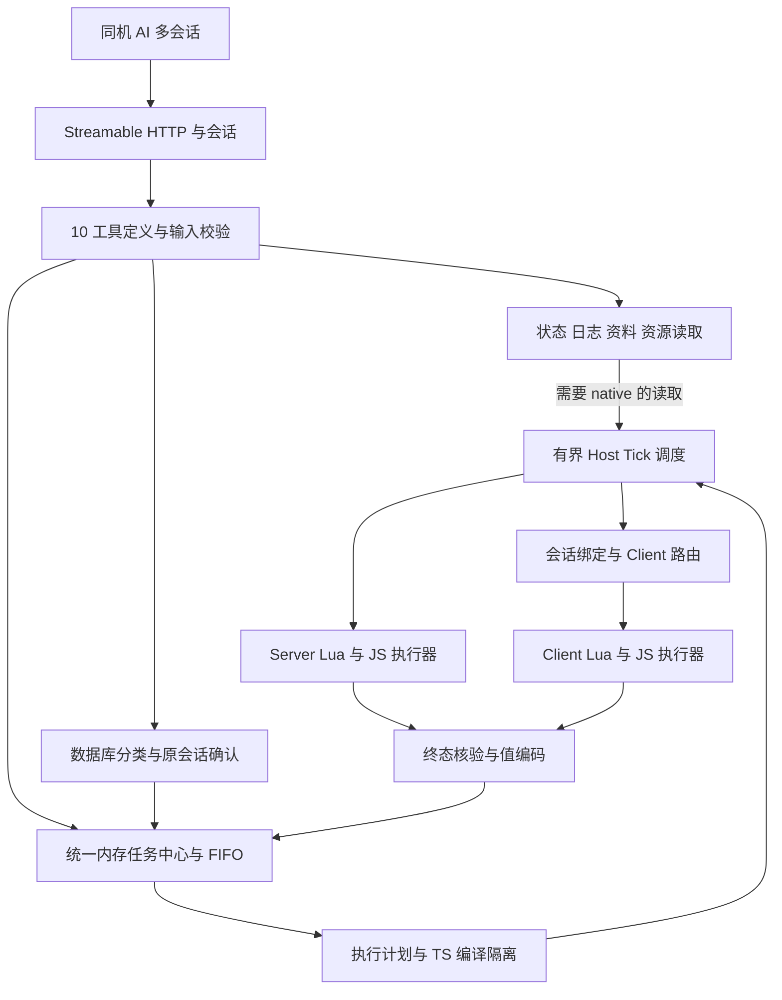

# FiveM 运行时调试 MCP 重新设计

日期：2026-09-21
状态：设计草案，等待整体审阅。
模块根：`.notes/fivem-mcp-http/`；后续 RFC：该目录下的 `rfcs/`。
交付范围：产品与架构设计及后续 RFC；本文件不授权实现、构建、部署或提交。

## 1. 设计依据与决策状态

以 [2026-09-09 原始需求](../../archive/fivem-mcp/specs/2026-09-09-nodejs-debug-mcp-design.md) 为产品需求来源，重新设计完整的本机调试 MCP。本文直接描述目标系统，不要求开发者沿用旧实现、对接旧 Broker 或按旧迁移步骤施工。原文及历史 RFC 保留作为记录；本方案批准后，新 RFC 必须独立写全实现契约，不能通过“继承旧 RFC 非冲突部分”代替定义。

### 1.1 本轮明确确认

| 决策 | 用户确认内容 |
| --- | --- |
| 设计方式 | 参考原始需求重新设计；本次不进行迁移或实现 |
| 运行结构 | 单个资源、内部模块化、统一执行链路 |
| 状态寿命 | 任务、结果、确认和会话只存内存，资源重启丢弃，不持久化、不自动重放 |
| 超时 | 已派发任务结果不明则暂停执行队列；可信终态解除阻塞；无 force 跳过 |
| 数据库确认 | oxmysql 专用入口的写入、事务和无法可靠判断的 SQL 先确认再入队；其他片段与框架调用不额外确认 |

### 1.2 已有方向与本草案的边界

已有方向为同机 Streamable HTTP、默认 `127.0.0.1:30130/mcp`、资源与 HTTP 同生命周期、无外部桌面 Broker、单包 `fivem-mcp`，构建与打包输出统一落在 `fivem-mcp/artificials`。

沿用此前确认的可信开发机范围：IPv4 loopback、Host/Origin 检查、无 Token。MCP 会话 ID 只用于请求关联和业务归属，不构成身份认证或租户隔离。代码执行不提供强安全沙箱保证。

下文的模块接口、编译隔离路线、会话结束策略及交付细节属于本次整体待审设计；数值预算、严格 Schema 和框架方法版本由后续 RFC 明确。

## 2. 产品目标与范围

用户的完整工作流是：本地 AI 修改业务资源文件 → MCP 精确重启该资源 → 查询日志 → 执行 Server/Client Lua 或 TypeScript 片段、调用框架方法 → 读取最终结果并继续调试。

同时支持 Windows 上的 FxDK 和直接启动 FXServer；一次针对一个服务器环境，支持多个 AI 会话和多个游戏客户端。资源未运行时所有 MCP 工具均不可访问；游戏客户端未连接时服务端工具、状态和资料查询仍可工作。

首版提供且仅提供 10 个 MCP 工具。NUI/CDT 工作流通过 Skills 指导，不代理浏览器；不提供目标资源源码读写、脚手架、模板、网站、远程托管或多服务器聚合。截图只保留未来禁用契约，不注册工具、不引入捕获依赖。现有 `native_read`、`compile_ts` 不是正式公共接口。

## 3. 架构选择

| 方案 | 取舍 | 决策 |
| --- | --- | --- |
| 单资源，内部模块化 | 安装入口统一，可集中控制身份、队列和结果；需严格划分运行时边界 | 已确认采用 |
| 多资源拆分控制、执行、适配 | 可独立重启，但增加资源依赖、连接身份和部署协调 | 当前范围不采用 |
| 每工具自建完整链路 | 初期简单，但重复队列、确认、错误和目标校验 | 不采用 |



Server JS、Server Lua、Client JS、Client Lua 属于一个资源的独立运行时。HTTP、会话及任务中心在服务端；网络事件只承担服务端至已绑定客户端的分派与回报。HTTP 回调不直接执行 native、exports 或 Lua 派发，统一跨入 Host Tick。

“直接读取”指不进入执行 FIFO。纯内存状态和日志读取走控制路径；需要 native 的读取仍经过有界 Host Tick 调度，不插进执行队列。FIFO 暂停不阻止控制请求，但宿主线程死循环时不能承诺 native 查询或远端取消仍可执行。

### 3.1 模块责任

| 模块 | 责任 | 不承担的责任 |
| --- | --- | --- |
| HTTP 与会话 | 协议协商、连接边界、通知、会话清理、elicitation 路由 | 游戏执行与业务调度 |
| 工具目录 | 一个定义同时关联名称、输入输出 Schema 和真实 handler | 占位 handler、隐式动态工具扩展 |
| 任务中心 | 入队序号、活动任务、终态查询、取消与 unknown 阻塞 | 游戏状态回滚、磁盘恢复 |
| 执行计划 | 固定语言、目标、参数、编译输出与错误位置映射 | 目标资源文件修改 |
| Host 调度与目标绑定 | 宿主线程切换、目标代际、Client 来源核验 | 从 payload 信任玩家身份 |
| Lua/JS 执行器 | 同资源函数体执行、await、错误与值返回 | 注入业务资源、跨任务变量存储 |
| 框架适配与确认 | 明确方法清单、异步适配、数据快照、SQL 确认 | 无限制对象反射、通用 SQL 安全沙箱 |
| 日志与资料 | 有界采集、可靠归属、离线索引及官方回退 | 历史无限扫描、任意 URL 抓取 |

## 4. 完整工具契约

| 工具 | 主要输入 | 行为与调度 |
| --- | --- | --- |
| status | 可选 clientId | 当前资源、HTTP、客户端、框架、编译、日志覆盖和队列状态；直接读取 |
| queue | action: status/cancel/recover；可选或必需 taskId 按 action 定义 | 概览、指定任务及保留终态；取消未派发任务；核对恢复证据；独立控制路径 |
| execute_lua | side、clientId、code、args、timeoutMs | 全局 FIFO；Server/Client Lua 函数体与异步完成 |
| execute_ts | 同 execute_lua | 全局 FIFO；准备阶段转换 TypeScript，再由对应端 JS 执行 |
| resource | action: list/status/start/stop/restart、name | 精确读取直达 Host Tick；变更进入 FIFO，返回阶段状态 |
| logs | side、clientId、resource、prefix、contains、limit、includeRaw | 当前运行会话日志；先过滤后取最近 N 行；返回缺口和覆盖 |
| esx | scope、method、args、side、clientId、playerId、timeoutMs | 已支持方法的框架或玩家调用；进入 FIFO |
| qbcore | 同 esx | 保留框架原方法命名和语义；进入 FIFO |
| ox | library、method、args、side、clientId、timeoutMs | ox_lib、ox_target、oxmysql；需确认者确认完成后入队 |
| reference | query、category、side、limit | 本地资料优先；零命中时受限官方回退；不进入 FIFO |

工具列表始终包含这 10 个工具；环境缺少 ESX 等依赖时返回明确业务错误。装配阶段缺 handler 是实现缺陷，不能用“未连接”占位响应视作完成。输入 Schema、输出 Schema、实际处理逻辑与测试必须对应。

## 5. 运行生命周期与目标身份

每次资源启动创建新的 resourceEpoch，拥有唯一任务中心、HTTP 会话集合和 Client 绑定表。读取自身配置并完成必需运行组件初始化后开放服务；资源停止释放 HTTP/SSE、事件监听、定时器、编译资源和内存记录。没有 AI 会话时资源也继续运行。

客户端由游戏网络事件实际 source 识别，clientId 只用作用户选择。执行绑定同时包含 resourceEpoch、该客户端连接/资源代际以及 taskId；提交时固定目标，派发前复核。server ID 被复用、客户端重连或资源换代均不能把旧任务投递给新目标。

结果验证真实来源和完整绑定，再接受完成；重复结果只结算一次。客户端接收的网络事件必须验证服务端来源。内部关联值不作为玩家权限或强身份凭据。

HTTP 短连接断开不等于会话终止。MCP 请求取消只取消等待，不能宣称终止游戏执行。显式关闭或过期会话时，作废未完成确认、取消尚未派发的该会话任务；已派发任务继续等待终态并占执行槽。保留任务结果允许其他同机调试会话查询，不把无鉴权服务描述成隔离系统。

## 6. 统一 FIFO、超时和恢复

有效可执行请求在接受时分配全局序号；数据库确认完成前不获得序号。Server/Client 两端、框架调用和资源变更共用一个执行槽。排队结构独立于有界终态历史，不能从截断后的展示列表寻找下一任务。

任务具有 queued、running、succeeded、failed、cancelled、unknown 状态，另记录准备、派发和等待结果等内部阶段。终态、错误、目标、排队与执行耗时可通过 taskId 查询。

TS 编译在队首准备阶段完成，未派发前可取消，编译失败不产生游戏执行。编译有独立准备预算；timeoutMs 从执行派发边界开始，不包含排队和编译等待。失败只有在能证明未派发，或收到可信的执行已结束证据时，才可以释放执行槽。

派发后执行超时、执行目标连接断开或送达情况不确定，进入 unknown 并暂停后续执行；AI 的 HTTP 连接断开本身不触发 unknown。收到绑定正确的最终结果后保存并恢复队列。MCP 同步响应等待预算与任务执行期限分别定义，不能把 HTTP 等待超时自动当成游戏执行结束。

queue.recover 只核验证据，不重发任务、不重置资源、无 force 参数。认可的核心证据是同代执行目标提供的匹配终态记录；代际变化或“已重连”本身不证明 exports 后台操作结束。不能证明时保持暂停。

资源重启会产生全新空队列，旧 taskId 无法恢复或查询；返回找不到不能解释为旧操作没有执行。重启后新任务可能与未终止的外部操作重叠，这是用户确认的内存生命周期边界，不称为安全恢复或回滚。

## 7. 片段执行与编译

code 为函数体，args 为 JSON 输入。client 必须显式 clientId，server 不接受 clientId 用于重定向。执行发生在 MCP 资源自己的 Lua/JS 运行时，调用业务资源通过其已有 exports；不创建目标资源 loader。

Lua 使用可等待协程，支持 Citizen.Await；JS 等待异步函数及 await 链。未等待线程、计时器和事件订阅的后续副作用不纳入完成检测。执行器报告已结束的异常才是可推进 FIFO 的 failed；CPU 死循环和不可取消 native 不承诺强制终止。

TypeScript 仅做受约束的语法转换和执行，不承诺完整项目类型检查，不允许片段 import、安装依赖或 Node 模块导入。保留 source map/包装偏移以定位用户片段；Server 支持 Node 不意味着 Client 片段具备 Node API。

### 7.1 编译隔离技术条件

目标是将编译放在资源拥有的隔离 Worker 中，编译线程不访问 native，并随资源关闭；避免每次同步编译直接占用 HTTP 控制通道。Worker 的导入方式、文件加载与停止清理必须在真实 FXServer 验证后由 RFC 锁定。

本会话看到的 `workerThreads.available: false` 来自动态 import 回调缺失；当前代码先 `await import("node:worker_threads")` 再构造 Worker。因此它只能证明该导入路径失败，不能证明 Worker 不可用。下一阶段应验证宿主支持的模块加载路线和随包 Worker 文件。

若真实宿主不能提供满足条件的编译隔离，必须回到本设计评审选择替代方案；不静默改成阻塞编译、不增加外部桌面服务、不将 execute_ts 留成永久不可用而宣称完整交付。

### 7.2 返回值

统一显式编码 Lua 多返回值、nil、稀疏 table、向量以及 JS undefined、BigInt、二进制和非有限数。普通 JSON 值保持可读；无法表示的对象、循环引用和超预算结果给出结构化编码/截断错误，不丢失结果后返回成功空对象。

编码失败与执行失败分开：用户片段可能已执行完且有副作用，只是返回值无法编码；此时记录“执行已结束、结果编码失败”，释放 FIFO，不能误标为“从未执行”。精确编码、深度与大小上限由 RFC 固定。

## 8. 框架与数据库

ESX/QBCore 使用原方法名及位置参数；scope 区分 framework/player。playerId 选择业务玩家，clientId 选择执行端，不能混用。每次调用重新取得当前玩家对象，资源重启后重新解析框架；结果只投影已声明字段。

ox 仅涵盖 ox_lib、ox_target、oxmysql；保留库本身的执行端和异步语义，oxmysql 仅 server。回调和函数参数使用显式适配，未支持方法可通过 Lua/TS 片段调试。新 RFC 必须给出经源码核实的首版方法及版本清单，不机械照搬旧实现目录或无限反射。

数据库访问只经已有 oxmysql，不建立另一个数据库连接，不收集数据库密码。明确只读查询直接入队；写入、事务、存储过程、多语句和无法可靠分类的 SQL 进入确认流程。

确认固定方法、全部 SQL、绑定参数和当前目标代际，通过发起会话的 form elicitation 展示；只有该请求收到明确同意后才入队。拒绝、取消、展示不完整、超时、不支持能力或原会话失效均不执行。参数或目标变化必须重新确认。HTTP 必须支持关联到原始调用的服务端确认消息，不通过普通聊天文本或 approved:true 替代。

确认过程有界且在 FIFO 外；已批准但尚未派发的请求仍要复核目标。确认记录不写日志、不持久化、不跨资源重启复用。通用片段、exports 和框架调用产生的数据库副作用不经过此专用确认流程。

## 9. 资源、日志和参考资料

### 9.1 资源控制

完整资源名精确匹配，无通配符和批量操作；start/stop 幂等，restart 分停止与启动阶段，停止失败不继续。返回原状态、各阶段及最终生命周期状态，不把 started 描述为业务/NUI/数据库就绪。

以实际运行资源身份禁止 stop/restart MCP 自身。不主动连带重启依赖，不创建或修改资源文件；目标换代或状态异常应明确返回可获取的阶段证据。

### 9.2 日志

服务端以全局控制台监听为主来源；客户端读取配置的本机 FiveM 日志目录，通过资源输出的唯一会话标记建立 clientId/代际/文件的对应关系。只保留当前运行会话，标记之前及读取缺口明确展示，不依据最新修改时间猜文件。

side=all 表示 server 与指定 client；涉及多个客户端时要求明确 clientId。resource 精确匹配明确频道归属，prefix 匹配频道，contains 匹配正文，条件取交集，先过滤后取最近 limit 行。归属未知不参与资源精确匹配。

处理追加、不完整末行、ANSI、切换、截断与可识别的服务端转发副本；不按相同正文简单去重。返回覆盖、定位失败、缺口、保留范围与截断信息，空结果不代表采集健康。跨来源以采集顺序表达，不声称严格因果时间。

日志文件读取权限及会话标记在 FxDK/普通 FXServer 均须验证；缺权限或映射不唯一时返回明确不可用，不能把其他客户端日志混入。

### 9.3 参考资料与 Skills

reference 查询 Native 名称/hash、核心事件或指南。随包离线索引命中则不联网；零命中才请求核实过的官方站点/仓库。返回适用端、说明、签名、来源及资料版本或获取时间。在线请求有来源、重定向、大小与时间限制，不持久保存在线响应。

框架使用知识、NUI/CDT 调试及本地修改工作流由 Skills 承载；方法清单与 Skills 同步发布。Codex、Claude Code、CodeBuddy 的 HTTP 和 elicitation 能力分别实测，不由产品名称推断。

## 10. 包与独立交付

唯一源码包为 `fivem-mcp/`。建议按 server、http、tools、tasks、execution、client、lua、adapters、logs、reference、shared 划分内部模块。共享客户端可达代码不导入 Node、HTTP SDK、编译器或服务端配置。

默认资源名、包名和 ZIP 根名均为 fivem-mcp。产物布局：

```text
fivem-mcp/artificials/
  fivem-mcp/
    fxmanifest.lua
    README.md
    dist/                 服务端、客户端及必要 Worker
    lua/                  实际使用的 Lua 运行模块
    config/               自身配置及示例
    data/                 已发布参考资料与适配清单
  fivem-mcp.zip
```

build 生成独立资源目录，pack 生成同一目录内容的单根 ZIP；测试使用隔离 fixture，不改写已挂载给 FxDK 的资源目录。编译或校验失败不破坏上次成功产物；重新构建不得删除用户自行设置的配置文件。

构建依白名单组装，运行无工作区 node_modules 依赖；客户端只下载客户端必需文件。buildId 来源于源码、配置默认值、资料与构建输入，便于核对实机代码。文档明确运行名可改，关联事件和自身保护依实际资源身份。

本文不包含旧安装迁移、旧配置转换、旧 Broker 清理、兼容入口或源码复用任务。

## 11. 错误、容量与可观测性

协议错误与工具业务错误分层。工具失败保留 isError、结构化错误及文本回退；区分参数错误、目标失效、依赖缺失、方法不支持、编译失败、已结束执行失败、结果编码失败、unknown、任务不存在和采集不可用。

HTTP body、会话数、待确认数、queued 数、执行槽、控制请求、日志、终态缓存、代码和结果均有明确预算。拒绝超限不能隐式驱逐活动任务；终态淘汰必须可解释。控制通道优先级不能意味着无限内存或无限 Host Tick 工作量。

结构化运行日志可记录 taskId、阶段、耗时和错误类别，不默认记录 SQL、代码、参数、确认正文或敏感日志原文。资源状态和 buildId 可由 status 查看；调试记录不成为持久任务恢复库。

## 12. 验收与当前证据

| 证据 | 已有观察 | 可支持的结论 |
| --- | --- | --- |
| 本会话 30130 真实请求 | initialize、tools/list、status、native_read 返回 200；ready 与 executedOnHostTick=true | 一次 FXServer 运行中的 HTTP 与只读 Host Tick 链路可用 |
| 当前加载兼容处理 | 原 __filename 错误后新构建成功提供上述服务 | 当前依赖组合可以通过构建兼容处理加载；独立产物仍须回归 |
| Worker 探测 | 动态 import 回调缺失 | 当前探测加载路径失败；Worker 创建能力未证实 |
| 旧/当前普通 Node 测试 | 曾报告构建和模拟宿主测试通过 | 不能证明完整 10 工具、双端执行、数据库确认或真实停止清理 |

以上为本对话已有记录，本轮未重新执行宿主验收，且没有独立归档日志附件。当前真实调用没有验证 compile_ts 正向转换，也没有覆盖正式 execute_ts。不得将新设计标为已实现。

完整验收至少覆盖：

1. 正式 10 工具发现与真实 handler；HTTP 协商、初始化通知、会话关闭及 SQL 确认双向消息。
2. FxDK 与直接 FXServer 下的 Server/Client Lua/TS、await、exports、错误和特殊值编码。
3. 多 AI、多 Client 共用 FIFO；身份复用拒绝、未派发取消、unknown 暂停、迟到终态及证据不足拒绝恢复。
4. 编译隔离的启动、负载期间控制响应、异常和资源停止；不能用 Promise 包装同步编译当隔离证明。
5. ESX/QBCore 各自环境以及 ox 三库的明确方法清单；真实测试数据库中的查询、写入、事务、拒绝和不支持确认。
6. 当前客户端日志唯一映射、源归属与缺口；离线 reference 命中与受限在线回退。
7. 资源停止释放端口，重启后旧会话和旧任务不被接纳；单 ZIP 在无工作区依赖环境运行。

报告分别标注 PASS、FAIL、NOT_EXECUTED。依赖缺失路径通过不能代替安装依赖后的成功调用通过。

## 13. RFC 交接

整体设计批准后，在 `.notes/fivem-mcp-http/rfcs/` 编写一份独立的新 RFC，并配套方法/Schema 附录（若篇幅需要）。RFC 不以旧迁移 RFC 为实现入口。

RFC 必须收敛：配置 Schema 和默认值；MCP 支持版本及客户端能力；会话与网络消息字段；任务、准备、派发、取消和结果状态机；超时与内存预算；所有 10 工具输入输出；Lua/JS 值编码；编译与路径兼容机制；框架方法及版本证据；SQL 分类测试集；日志定位算法；官方资料集与来源；独立打包和真实宿主验收矩阵。

若技术核实否定产品关键路径，记录影响并返回设计评审，不以改名、隐藏工具、永久不可用 handler 或删减验收范围替代解决。

## 14. 外部核对来源

以下来源于 2026-09-21 查阅，精确兼容版本由 RFC 固定：

- [FiveM JavaScript 运行时](https://docs.fivem.net/docs/scripting-manual/runtimes/javascript/)：Server Node 与 Client API 差异，以及宿主线程调用边界。
- [MCP Streamable HTTP](https://modelcontextprotocol.io/specification/2025-11-25/basic/transports)：HTTP/SSE、Origin、会话及消息传输契约。
- [MCP elicitation](https://modelcontextprotocol.io/specification/2025-11-25/client/elicitation)：能力协商、form 确认及响应；产品决定不支持时拒绝数据库确认调用。
