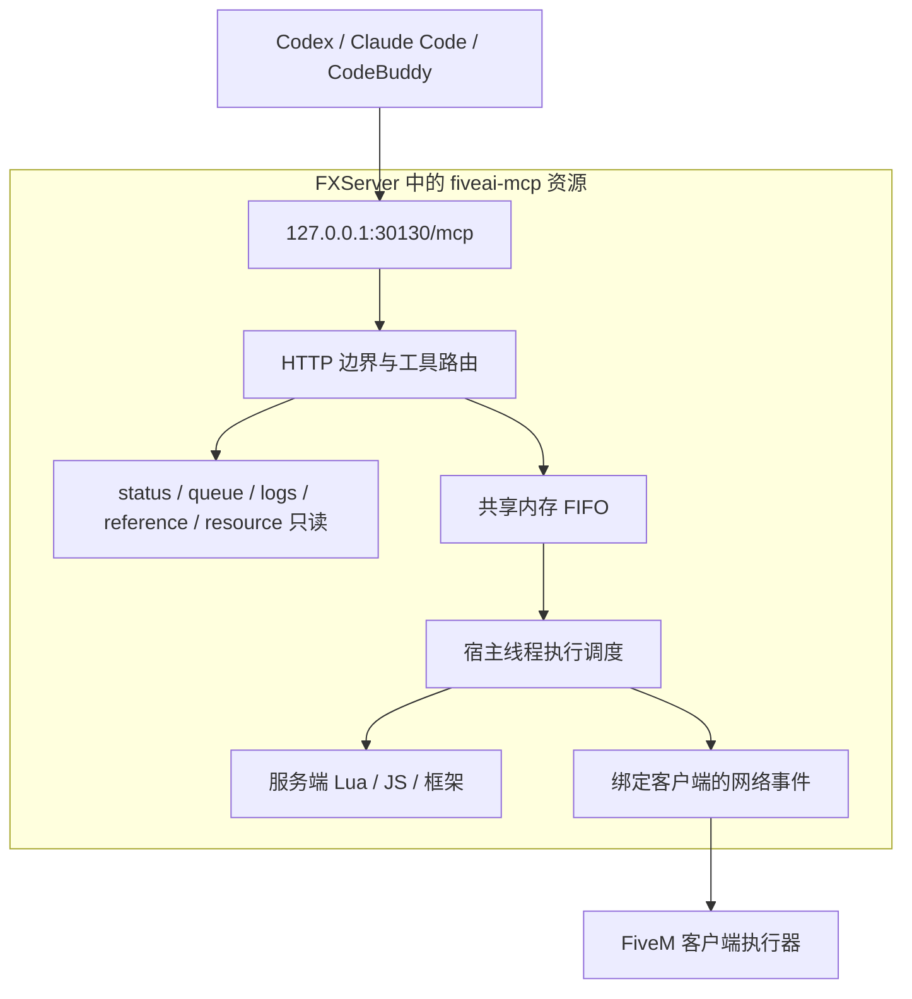

# FiveAI MCP 宿主内 HTTP 迁移方案

日期：2026-09-20。状态：用户已确认产品方向；技术细节待 RFC 评审。本次交付仅为文档，不授权开发、部署、修改客户端配置或启动宿主。

配套：[技术 RFC](../rfcs/fivem-resource-http-mcp-rfc.md)。实现顺序见本文第 5 节，绑定契约以 RFC 为准。

## 1. 目标与已确认决策

将 MCP 服务放进 FiveM 服务端资源：启动 `fiveai-mcp` 就启动 HTTP 端点，AI 客户端直接连接，不再启动外部 Node 入口和 Broker。TypeScript 是开发语言，交付时编译、打包为 FiveM Node 22 可加载的 JavaScript；不是让 FiveM 直接加载 `.ts`。

| 决策 | 已确认内容 |
| --- | --- |
| 连接 | Streamable HTTP；默认 `http://127.0.0.1:30130/mcp`；端口可配置，占用时报错，不自动换端口 |
| 生命周期 | HTTP 与 MCP 资源同生共死；FXServer 停止时 MCP 不可用 |
| 架构 | 删除桌面入口、外部 Broker、SID 命名管道与内部 WebSocket 桥接 |
| 工具范围 | 保留 status、queue、execute_lua、execute_ts、resource、logs、esx、qbcore、ox、reference |
| 任务 | 仅内存队列和历史；重启丢弃，不持久化、不自动重放、不承诺跨重启恢复 |
| 网络边界 | 无 Token、无身份鉴权；只监听 IPv4 loopback，校验 Host/Origin，默认禁止浏览器跨域 |
| 客户端 | Codex、Claude Code、CodeBuddy，均使用同机 HTTP 连接 |

“不保存任务”不等于“不维护任务状态”：资源运行期间仍需 FIFO、取消未执行任务、查询终态和处理不确定结果。配置文件及随包参考资料可以持久保存，但任务、结果、审批和会话记录不写盘。

## 2. 当前事实与迁移动机

源码已有配置、输入 schema、执行值编码、Lua/JS 执行器、客户端绑定及部分调度器。公共执行分派尚未接通，不能把迁移看成只换 transport。

2026-09-20 本会话实测旧架构的新构建 `75f067e20fb5d0f946a10ab015c3cdcdc70aed3a2eb723a99999a718722877c2`：

- MCP 初始化、10 工具发现、status 和客户端 1 发现成功；连接后 17 秒观察期间会话未变化。
- 双端 Lua/TS 调用失败；queue/resource/logs/reference 被 Broker 拒绝。
- 旧桌面 Broker 曾导致 BUILD_MISMATCH；重启工程不会自动替换桌面 Broker。
- 进程启动时间核验相差 653ms；这是旧架构观测，不是新方案的恢复证据。

以上是会话中的实测摘要，不是新 HTTP 架构验收，也没有独立日志附件。源码依据见 RFC 第 2 节。

## 3. 目标结构与取舍

删除跨进程协调能消除一类残留 Broker 问题，但 HTTP、编译和任务管理现在与游戏服务器共用宿主资源。需要有界内存、正确线程切换和可靠停止清理；宿主崩溃后没有离线查询服务。任意同步死循环也不能靠 Promise 超时强行终止。

安全范围是可信开发机：任何能访问该 loopback 端口的本机进程均可调用。Host/Origin 检查限制浏览器来源，不提供用户身份隔离。用户已接受无鉴权，不再引入隐藏 Token、OAuth 或桌面代理。

## 4. 保留与替换

| 保留或重用 | 替换或移除 |
| --- | --- |
| 工具名称、输入约束、值编码和容量限制 | stdio 入口、Broker 子进程、启动锁和生命周期命名管道 |
| Lua/JS 执行器、客户端绑定与结果校验 | entry/bridge WebSocket、role Token、OS 进程恢复证明 |
| 框架白名单、SQL 分类与业务确认 | 磁盘 recovery、任务 write-ahead、跨进程协议 v2 开发任务 |
| 独立 ZIP、白名单构建、buildId | 包内 entry.mjs/broker.mjs/Windows 凭据 helper |
| 多客户端共用一个 FIFO | “每 OS 用户全局”改为“每个资源运行实例共享” |

SQL 写操作确认是既有业务契约，不是新增身份鉴权；无 form elicitation 能力的客户端仍拒绝需确认的数据库调用。全部框架方法继续按旧全量 RFC 的清单验收，不以仅列出工具替代功能。

## 5. 后续实施顺序

以下是未来任务，不表示本轮已执行；未经后续开发指令不得开始。

| 阶段 | 文件责任与工作 | 退出条件 |
| --- | --- | --- |
| P0 宿主可行性 | 临时实验资源；验证 Node HTTP、SDK transport、宿主线程切换、停止清理和 TS 编译隔离 | 真实 FXServer 中 HTTP MCP 初始化与只读 native 调用完成；重启可重绑端口；无外部 Node 进程；失败即回报 RFC 阻塞 |
| P1 契约 | `packages/mcp/src/tools/`、`protocol/`、新 `http/`；配置 v2、输出、内存 epoch/task/session 契约 | schema、错误与生命周期测试；无磁盘任务恢复要求残留 |
| P2 宿主与交付 | `packages/fivem-plugin/server/`、构建脚本、manifest、`scripts/build-unified.mjs` | 独立包内启动 HTTP；清理已登记旧程序文件，保留旧配置和用户数据；不得覆盖运行中的软链接目标 |
| P3 执行闭环 | `scheduler/`、宿主调度、共享执行器及 client | 双端 Lua/TS 正向执行、await、编码、串行、取消、超时和同代结果对账通过 |
| P4 完整工具 | resource 生命周期、logs、reference、框架适配及 SQL 确认 | 10 个工具均有真实 handler；可用与缺依赖错误均有测试；资料和编译依赖随包 |
| P5 删除旧运行架构 | `cli/`、`broker/`、过时 internal 消息、旧进程测试和 README | 无外部进程依赖；旧产物迁移/回退验证；测试重写为 HTTP/资源生命周期测试 |
| P6 验收 | 自动化、ZIP 独立运行、真实 Dev 工程、三客户端 | RFC A/H/C 矩阵有证据；真实宿主未运行的项目必须 NOT_EXECUTED |

P0 是阻塞性技术验证，不是缩减产品范围；其成功只允许继续实现，不代表 10 工具完成。P3 前先修复当前 scheduler 只在最后 1000 条中选择队首的问题，并执行 100 queued 容量限制。

## 6. 验收与交付

交付必须包含无外部桌面依赖的资源目录/ZIP、配置 v2 示例、三客户端 HTTP 配置说明和实测报告。完整流程为：AI 修改普通业务资源 → MCP 重启该资源 → 查询日志 → 双端片段/框架检查 → 获取终态。

初次上线保留旧安装备份，停止旧入口/Broker 和资源后迁移。旧配置、凭据与 state 不自动删除；新运行时不读取旧任务文件。资源/服务器重启后旧 taskId 返回找不到，不声称未执行；已经造成的游戏或数据库副作用不因回退恢复。

## 7. 本轮交付边界

本轮只创建本方案和 RFC，没有实现、构建、部署或修改客户端。产品决策已确认；RFC 新增的配置形状、输出和生命周期细节属于技术提案。P0 宿主兼容性与客户端版本矩阵仍需未来实测，不虚构 PASS。
