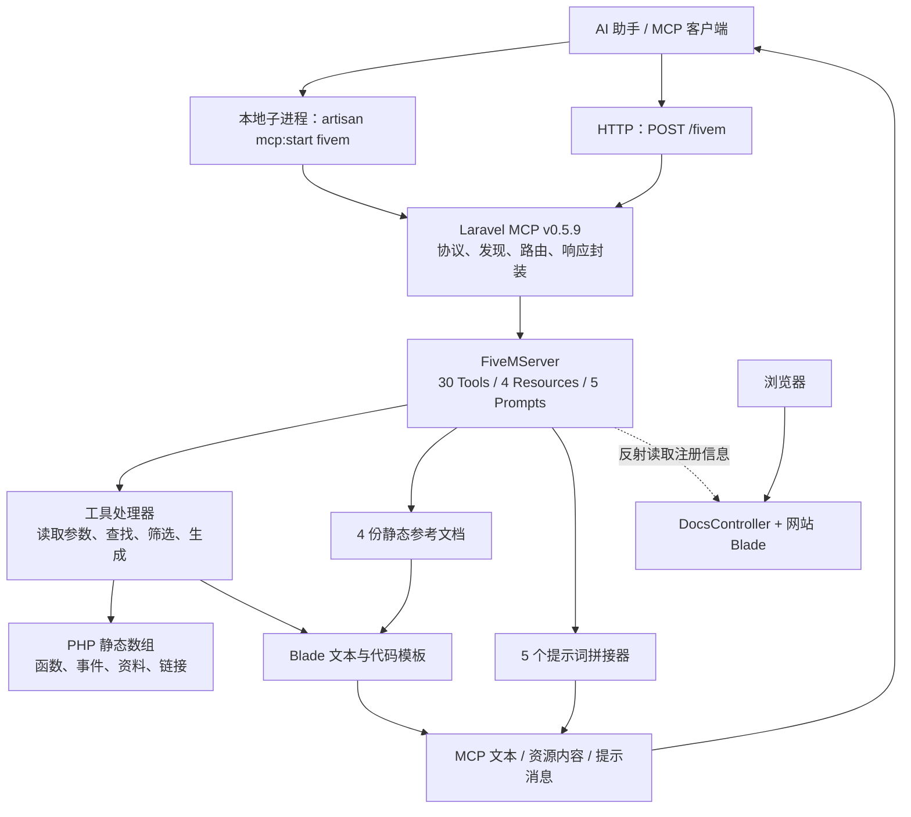
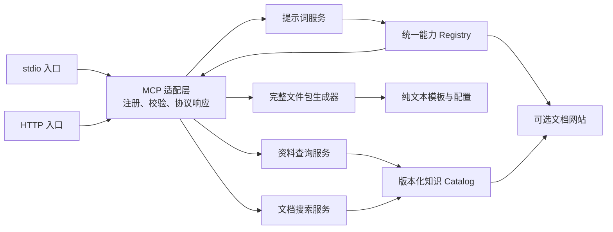

# FiveM MCP 源码、架构与 Node.js 重写调研报告

调研日期：2026-09-09  
调研对象：`D:\Exre\ex-fiveai\fivem-mcp-main`  
报告用途：说明现有项目的真实设计和实现，为后续 Node.js 重写划定功能、兼容性和验证范围。

## 1. 主要结论

这个项目的核心是一个 **FiveM 开发知识与代码模板 MCP 服务**。它把手工维护的函数、事件、框架说明和代码示例包装成 MCP Tools、Resources 和 Prompts，供外部 AI 助手读取。

当前实现可以概括为：

```text
Laravel 应用
  + Laravel MCP 的协议与传输实现
  + 30 个工具处理器
  + 写在 PHP 数组中的静态资料
  + Blade 文本/代码模板
  + 4 份参考资源
  + 5 个提示词生成器
  + 一个介绍和展示这些能力的文档网站
```

对后续重写，最重要的判断有六项：

1. **主要工作是迁移知识数据、查询规则、模板和 MCP 合约。** 当前没有 FiveM 运行时桥接、游戏进程通信、远程执行或复杂任务调度。
2. **Laravel 基础设施明显多于实际业务需求。** 当前 MCP 查询不读取业务数据库，不调用外部文档 API，也不执行队列任务。Node.js 版可以从较小的进程内服务开始。
3. **知识覆盖有限，而且混有不同层级的 API。** 名为 Native 的工具也包含框架函数，QBCore 工具也包含 FiveM 通用函数，不能把工具分类直接视为权威 API 分类。
4. **代码输出的正确性需要重新建立。** 当前存在 HTML 转义、脚手架不包含 manifest、NUI 文件名与语言错误等问题。
5. **MCP 参数和发现合约需要重新核实。** 工具的线上名称由 Laravel 自动转换；5 个 Prompt 使用了与锁定 SDK 不匹配的参数声明方式。
6. **旧测试不足以作为新版本验收标准。** 源码中确实有 181 个测试声明，但大量断言只检查“存在响应/包含字符串”，没有验证完整协议和生成代码在 FiveM 中运行。

建议后续重写采用 **“保留有价值的能力与兼容入口，重新整理知识数据和实现边界”** 的方案。直接逐类翻译 PHP，会把当前的内容错误和协议缺陷一起带过去。

## 2. 调研依据与可信范围

### 2.1 设计材料的实际情况

目录内没有发现独立的产品需求文档、架构 RFC、ADR 或详细技术设计书。可作为设计意图依据的材料主要是：

| 材料 | 实际作用 | 使用方式 |
|---|---|---|
| [README](../fivem-mcp-main/README.md) | 项目定位、工具分组、运行说明、简短 Architecture Notes | 作为设计意图，与源码交叉检查 |
| [文档首页](../fivem-mcp-main/resources/views/docs/index.blade.php)、[快速开始](../fivem-mcp-main/resources/views/docs/quickstart.blade.php)、[完整文档页](../fivem-mcp-main/resources/views/docs/documentation.blade.php) | 对外介绍、客户端配置、动态能力列表 | 检查对外承诺及文档漂移 |
| [CLAUDE.md](../fivem-mcp-main/CLAUDE.md)、[GEMINI.md](../fivem-mcp-main/GEMINI.md) | Laravel Boost 开发规范 | 不是此项目的专用架构设计 |
| `.agents/skills/` | Laravel、MCP、测试和样式开发指导 | 不是功能实现证据 |
| [FiveMServer](../fivem-mcp-main/app/Mcp/Servers/FiveMServer.php) | 真实能力注册表 | 作为暴露能力的主要依据 |
| `app/Mcp/`、`resources/views/mcp/`、`tests/` | 实现、资料、输出模板和测试 | 作为行为和风险判断的主要依据 |

本报告检查了 40 个 MCP PHP 文件的职责、注册、处理路径和资料结构，以及 35 个 MCP Blade 模板，并核对了路由、应用配置、依赖锁、文档控制器和测试范围。完整能力条目索引见附录 A。

### 2.2 证据等级

全文采用以下区分：

- **源码确认**：当前目录或锁定依赖版本的代码可以直接支持的结论。
- **局部复现**：运行了不依赖完整 Laravel 的小范围检查，例如资源名归一化和 JavaScript 语法检查。
- **待运行验证**：需要安装匹配的 PHP/Composer 依赖、真实 MCP 客户端或 FiveM 宿主才能完成的检查。
- **重写建议**：本报告提出的后续方案，不代表现有项目已经实现，也不是已批准的实施设计。

当前目录是源码副本，检查时当前工作区没有可用的 Git 仓库元数据；本报告没有可引用的提交号。协议细节额外读取了锁定的 `laravel/mcp v0.5.9` 上游源码，避免用新版 SDK 的行为倒推旧项目。

当前 PATH 中 PHP 为 **7.4.33**，目标目录不存在 `vendor/autoload.php`。因此本次没有启动 Laravel、运行 Pest、握手本地 MCP 或连接 README 声称的在线服务。也没有进行 FiveM/FxDK 实机验证。

## 3. 现有 MCP 的架构

### 3.1 技术栈

| 层次 | 技术/版本 | 在当前项目中的作用 |
|---|---|---|
| 服务端语言 | Composer 声明 PHP `^8.2` | 实现 MCP 处理器和网站 |
| Web 框架 | `laravel/framework ^12.0`，锁定 `v12.58.0` | 启动、路由、容器、视图、配置、异常处理 |
| MCP SDK | `laravel/mcp ^0.5.9`，锁定 `v0.5.9` | 协议发现、调用、JSON-RPC、stdio、HTTP |
| 输出模板 | Blade | 同时渲染网页、Markdown/纯文本和代码 |
| 网站构建 | Vite `^7.3.2`、Tailwind CSS `^4.0.0` | 文档页面静态资源 |
| 网站交互 | 原生 JavaScript、Axios 配置 | 复制代码、标签切换等；不是 MCP 服务端 |
| 测试 | Pest 锁定 `v4.7.0`、PHPUnit 锁定 `12.5.24` | PHP 测试；这套开发依赖要求 PHP 8.3+ |
| 默认存储配置 | SQLite、数据库 session/cache/queue | Laravel 基础配置，没有 MCP 业务数据模型 |

依据：[composer.json](../fivem-mcp-main/composer.json) 第 11–27、41–56 行，[composer.lock](../fivem-mcp-main/composer.lock)，[package.json](../fivem-mcp-main/package.json)，[.env.example](../fivem-mcp-main/.env.example) 第 23–40 行。

这里要区分三种“JavaScript”：网站的 JavaScript、工具输出的 FiveM JavaScript 示例，以及将来运行 MCP 服务的 Node.js。当前 `package.json` 只负责前端构建，没有 Node.js MCP 服务实现。

### 3.2 总体结构图



图中没有游戏服务器、FiveM 客户端、txAdmin、RCON 或数据库业务服务，因为当前 MCP 的处理路径不依赖这些系统。

### 3.3 接入层：同一个服务，两个传输入口

[routes/ai.php](../fivem-mcp-main/routes/ai.php) 第 6–8 行注册了两个入口：

```php
Mcp::local('fivem', FiveMServer::class);
Mcp::web('fivem', FiveMServer::class)->name('fivem');
```

| 入口 | 运行方式 | 实现职责 |
|---|---|---|
| 本地 `fivem` | AI 客户端启动 `php artisan mcp:start fivem`，通过 stdin/stdout 通信 | SDK 创建 StdioTransport，应用提供能力处理器 |
| Web `/fivem` | 向 Laravel 站点的该路径发送 MCP 请求 | SDK 创建 HttpTransport，应用处理相同能力 |

虽然 [bootstrap/app.php](../fivem-mcp-main/bootstrap/app.php) 没有显式列出 `routes/ai.php`，该文件会由 MCP 包的 ServiceProvider 读取。不能因此判断 MCP 路由没有加载。见锁定版本的 [McpServiceProvider](https://raw.githubusercontent.com/laravel/mcp/v0.5.9/src/Server/McpServiceProvider.php)。

锁定版本的 [Registrar](https://raw.githubusercontent.com/laravel/mcp/v0.5.9/src/Server/Registrar.php) 对 Web 路径注册 POST，并让 GET 返回 405；本项目没有额外的 `/sse` 入口。其 [HttpTransport](https://raw.githubusercontent.com/laravel/mcp/v0.5.9/src/Server/Transport/HttpTransport.php) 支持普通 JSON 响应，也具备流式 SSE 输出路径，但当前业务处理器都返回普通 Response，没有实现业务流式生成。

项目没有为 `/fivem` 添加自定义鉴权或限流，也没有调用 OAuth 路由注册。SDK 中存在相关能力不等于项目已经启用。部署环境是否另有网关鉴权，本次没有证据。

### 3.4 注册与协议层

[FiveMServer](../fivem-mcp-main/app/Mcp/Servers/FiveMServer.php) 第 49–112 行声明：

- 服务名：`FiveM Development Server`。
- 应用版本：`1.0.0`。
- 服务说明：一段静态 instructions。
- `$tools`：30 个类。
- `$resources`：4 个类。
- `$prompts`：5 个类。

这是一个显式注册的模块集合，没有动态扫描插件、按用户授权切换工具、按项目框架自动筛选工具或热更新知识包的实现。

SDK 负责 `initialize`、`tools/list`、`tools/call`、`resources/list`、`resources/read`、`prompts/list`、`prompts/get` 等协议方法。应用没有自己实现 JSON-RPC 编解码。SDK 支持的方法集合也不能全部解读为业务能力，例如当前没有动态 Resource Template。依据：[锁定 SDK Server](https://raw.githubusercontent.com/laravel/mcp/v0.5.9/src/Server.php)。

另外有两项迁移时容易遗漏的 SDK 默认行为：

- 协议协商候选版本为 `2025-11-25`、`2025-06-18`、`2025-03-26`、`2024-11-05`；它们与应用版本 `1.0.0` 是不同概念。
- 列表默认每页 15 项、最大 50 项，`tools/list` 使用游标分页。因此 30 个注册工具不一定出现在第一次列表响应中，客户端需要继续读取 `nextCursor`；新版本验收必须覆盖完整发现。依据：[SDK ListTools](https://raw.githubusercontent.com/laravel/mcp/v0.5.9/src/Server/Methods/ListTools.php)。

### 3.5 业务层与数据层没有分开

大多数工具类同时包含：

1. 自然语言 Description。
2. 输入 `schema()`。
3. `handle()` 参数读取和流程控制。
4. `findFunction()`、`getEventsDatabase()` 等静态数组。
5. 查找/筛选算法。
6. Blade 视图调用或字符串格式化。

例如 [GetNativeClientFunction](../fivem-mcp-main/app/Mcp/Tools/FiveM/Client/GetNativeClientFunction.php) 第 17–31 行处理请求，第 36–188 行存储和查找资料，第 194–199 行格式化，第 207–219 行声明输入。

所谓“database”通常只是方法返回的 PHP 数组。源码没有数据采集任务、文档爬虫、搜索索引构建、向量数据库、Embedding 或定期更新机制。资料随代码发布而更新。

### 3.6 文档网站是另一个展示入口

[routes/web.php](../fivem-mcp-main/routes/web.php) 定义 `/`、`/quickstart`、`/documentation`；`bootstrap/app.php` 另有 `/up` 健康入口。

[DocsController](../fivem-mcp-main/app/Http/Controllers/DocsController.php) 第 32–83 行通过 ReflectionClass 读取 FiveMServer 默认属性，提取类名、Description 和命名空间类别，再交给页面展示。

这种做法能让工具总数跟随注册表变化，但仍有局限：

- 页面没有提取实际输入 schema、默认值和运行示例结果。
- 类别取命名空间最后一段，往往是 `Client`、`Server`，不是完整的“框架/组件/执行侧”。
- 类名转换得到的展示名称不等于可调用的协议名称。
- 网站页面有交互，不代表它提供了一个在线 MCP 调用控制台；实际交互测试说明指向外部 MCP Inspector。

### 3.7 状态、存储与副作用

当前业务请求基本是无业务状态的纯查询或文本生成：没有用户会话资料、任务记录、文件保存、游戏状态修改。

数据库迁移只有 Laravel 默认的 users/session、cache、jobs 等结构；`User` 也是应用基础模型。`composer dev` 启动队列监听只是开发脚本配置，`app/Mcp` 没有派发业务 Job。

重写时可以去掉 MCP 核心对数据库的依赖，但不能简单声称“当前整个 Laravel 应用不需要数据库”：其默认 session/cache 配置仍可能影响网站和部署。

## 4. 支持的功能与真实覆盖范围

### 4.1 先区分“查询某 API”与“执行某 API”

| 名称容易造成的理解 | 实际行为 |
|---|---|
| GetQBCorePlayers 获取在线玩家 | 返回玩家对象结构、字段和方法说明 |
| GetQBCoreConfig 读取服务器配置 | 返回手写的配置结构参考 |
| GetQBCoreSharedData 读取当前 jobs/items | 返回字段结构和示例 |
| GetQBCoreResourceList 扫描已安装资源 | 返回固定的 58 项资源目录 |
| MySQL 工具执行数据库查询 | 返回 MySQL 调用方式和示例文本 |
| GenerateResourceBoilerplate 创建文件 | 返回文件名及内容组成的文本，不落盘 |
| DebugIssues 自动读取日志并修复 | 拼接一段让外部模型分析问题的提示词 |
| ConvertLanguage 执行代码转换 | 返回转换任务的提示消息，不运行模型 |

当前也没有资源启动/停止、服务器状态、游戏截图、控制台日志、Lua/JS 执行、玩家传送或实体操作工具。代码示例中出现这些 API，不代表 MCP 本身可以执行它们。

### 4.2 工具名称：重写时不能仅复制 README

当前工具没有显式 `Name` 属性，SDK 根据类名调用 `Str::kebab()` 生成协议名称。

实际转换规则会拆分连续大写字母，例如：

| PHP 类名 | 协议名称 |
|---|---|
| `SearchFiveMDocs` | `search-five-m-docs` |
| `GetQBCoreServerFunction` | `get-q-b-core-server-function` |
| `GetCOXFunction` | `get-c-o-x-function` |
| `GenerateManifest` | `generate-manifest` |

这是锁定版本的 [Primitive::name](https://raw.githubusercontent.com/laravel/mcp/v0.5.9/src/Server/Primitive.php) 与 [Laravel Str::snake/kebab](https://raw.githubusercontent.com/laravel/framework/v12.58.0/src/Illuminate/Support/Str.php) 的共同结果；本次也局部复现了转换。后续若改成 `get-qbcore-server-function`，属于接口改名，必须显式处理兼容性。

以下清单先使用便于对应源码的 PHP 类名；附录 A 同时列出全部协议名称。

### 4.3 FiveM 核心：7 个工具

| 工具 | 输入 | 当前实现 |
|---|---|---|
| SearchFiveMDocs | 必填 `query`；`category=all` | 从 28 个固定文档条目中按关键词评分，最多返回 5 个链接和摘要 |
| GetNativeClientFunction | 必填 `function_name`；`language=lua` | 12 个内置条目，按名称查找，返回参数、返回值和示例 |
| GetNativeServerFunction | 同上 | 11 个内置条目；包括 FiveM 函数和 2 个框架函数 |
| GetEventClientReference | 可选 `event_name`；`event_type=all`；`language=lua` | 6 个事件；可查详情或按 core/esx/qbcore 列表展示 |
| GetEventServerReference | 同上 | 6 个事件；可查详情或筛选列表 |
| GenerateManifest | 必填 `resource_name`；作者、描述、版本、语言、client/server 开关、framework | 渲染一份 `fxmanifest.lua` 文本 |
| GenerateResourceBoilerplate | 必填 `resource_name`；`framework=standalone`；`script_type=lua`；`include_nui=false` | 默认返回 3 个文件的文本；含 NUI 时为 6 个；没有生成 manifest |

共同语言枚举是 `lua`、`js`。生成工具支持 `standalone`、`esx`、`qbcore`。

搜索类别为 `all`、`scripting`、`natives`、`networking`、`resources`、`qbcore`、`coxdocs`。这里不支持“搜索全部工具内的函数、事件正文”，它只检索自身那 28 个文档条目。

依据：[FiveM 工具目录](../fivem-mcp-main/app/Mcp/Tools/FiveM)。

### 4.4 QBCore：9 个工具

| 工具 | 输入 | 当前覆盖 |
|---|---|---|
| GetQBCoreServerFunction | 必填 `function_name`，`language=lua` | 29 项；玩家查询、物品、货币、职业、帮派、元数据、信誉、保存等调用参考 |
| GetQBCoreClientFunction | 同上 | 14 项；玩家数据、回调、通知，以及混入的通用 FiveM API |
| GetQBCoreServerEventReference | `event_name`，默认空 | 6 项；空值列出全部，详情同时给 Lua/JS 示例 |
| GetQBCoreClientEventReference | 同上 | 6 项；空值列出全部 |
| GetQBCoreSharedData | 必填 `data_type`，`language=lua` | 7 类：Items、Jobs、Gangs、Vehicles、Weapons、StarterItems、Utilities |
| GetQBCoreConfig | 必填 `config_type`，`language=lua` | 6 类：Player、Framework、Database、Callbacks、Features、RepTypes |
| GetQBCorePlayers | 必填 `info_type`，`language=lua` | 5 类：Structure、PlayerData、Methods、Events、Examples |
| GetQBCoreResourceList | 可选 `category` | 58 项静态资源目录，10 个分类 |
| GetQBCoreResourceReference | 必填 `resource_name` | 22 项详细资源资料；详情程度不一，部分只提供描述、features、链接 |

资源分类包括管理、职业、犯罪、住宅、交通、商业、玩家系统、UI、活动和杂项。目录与详情是两份独立数组，58 项目录并不代表 58 项都有详情。

依据：[QBCore 工具目录](../fivem-mcp-main/app/Mcp/Tools/QBCore)。

### 4.5 COX / ox 系列：10 个工具

| 工具 | 输入 | 当前覆盖 |
|---|---|---|
| GetCOXFunction | 必填 `function_name`，`language=lua` | 8 项：query、insert、update、scalar、single、transaction、prepare、rawExecute |
| GetCOXEventReference | 可选 `event_name`；`event_type=all`；`language=lua` | 10 个 `coxMySQL:*` 条目，按 query/connection/transaction/error 分组；其上游有效性需要复核 |
| GetInventoryServerFunction | 必填 `function_name`，`language=lua` | 19 项 ox_inventory 服务端资料 |
| GetInventoryClientFunction | 同上 | 9 项 ox_inventory 客户端资料 |
| GetOxTargetClientFunction | 同上 | 15 项 targeting、全局对象、model/entity、zone 资料 |
| GetOxFuelClientFunction | 同上 | 1 项：setMoneyCheck |
| GetOxFuelServerFunction | 同上 | 1 项：setPaymentMethod |
| GetOxDoorlockClientFunction | 同上 | 3 项：pickClosestDoor、useClosestDoor、getClosestDoor |
| GetOxDoorlockServerFunction | 同上 | 4 项：getDoor、getDoorFromName、editDoor、setDoorState |
| GetOxDoorlockServerEvent | 必填 `event_name`，`language=lua` | 1 项：ox_doorlock:stateChanged |

“COX / ox_libs”是项目的组织命名。这里没有完整的 ox_lib 工具集，不能据此宣称已经覆盖 ox_lib 所有模块。

依据：[COX 工具目录](../fivem-mcp-main/app/Mcp/Tools/COX)。

### 4.6 Prodigy / prp-bridge：4 个工具

| 工具 | 输入 | 当前覆盖 |
|---|---|---|
| GetProdigyClientEventReference | `event_name`，默认空 | 11 项：通知、声音、回调、allowlist、医疗事件 |
| GetProdigyServerEventReference | 同上 | 8 项：玩家生命周期、组成员、医疗、UniQueue |
| GetProdigyClientExport | `export_name`，默认空 | 4 项：IsAllowlisted、PropPlacer、AddPedInteraction、RemovePedInteraction |
| GetProdigyServerExport | 同上 | 29 项：冷却、allowlist、组、队列、party、商店、case |

全部支持空参数列出本地资料，名称匹配使用 `firstWhere('name', ...)`，与大多数函数工具的大小写不敏感匹配不同。

事件详情展示 Lua 和 JavaScript；Export 模板只输出 Lua 示例，没有 `language` 入参。不能把项目描述中的“双语言支持”解释成每一个能力都提供完整双语言实现。

依据：[Prodigy 工具目录](../fivem-mcp-main/app/Mcp/Tools/Prodigy)，[Export 输出模板](../fivem-mcp-main/resources/views/mcp/prodigy/prodigy-export-reference.blade.php) 第 22–25 行。

### 4.7 MCP Resources：4 份只读参考内容

| 类 | URI | 内容 |
|---|---|---|
| CodeSnippets | `fivem://snippets/common` | 距离检查、安全事件、线程清理、数据库回调、NUI callback |
| BestPractices | `fivem://guides/best-practices` | 性能、安全、代码组织、实体清理、调试、框架提示 |
| FrameworkComparison | `fivem://guides/framework-comparison` | Standalone/ESX/QBCore 对比、示例和迁移说明 |
| DatabaseQueries | `fivem://guides/database-queries` | CRUD、预处理、事务、异步、错误处理及查询示例 |

实现均是 `uri()` 返回固定字符串，`handle()` 渲染固定 Blade 文档，没有动态 URI 参数、分页或外部读取。

虽然内容以 Markdown 为主，类中没有显式指定 MIME；锁定 SDK 的默认值是 **`text/plain`**。迁移成 `text/markdown` 可以更清晰，但需要记录为输出元数据调整。依据：[本地 Resources](../fivem-mcp-main/app/Mcp/Resources)，[SDK Resource](https://raw.githubusercontent.com/laravel/mcp/v0.5.9/src/Server/Resource.php)。

### 4.8 MCP Prompts：5 个任务提示生成器

| Prompt | `handle()` 读取的参数和默认值 | 生成的指令 |
|---|---|---|
| CreateNewResource | `resource_name=my-resource`、`framework=standalone`、`language=lua` | 让模型生成 manifest、配置、client/server 和说明 |
| DebugIssues | `issue=''`、`error_message=''` | 让模型分析原因、修复和预防措施 |
| OptimizePerformance | `code=''`、`script_type=client` | 让模型检查循环、等待、缓存、通信等 |
| ConvertLanguage | `code=''`、`from=lua`、`to=js` | 让模型转换语言并解释差异；本地 schema 将 code 标为 required |
| AddFrameworkIntegration | `code=''`、`current_framework=standalone`、`target_framework=esx` | 让模型修改依赖、玩家/货币/物品系统与事件 |

它们使用 `sprintf()`/字符串数组构造文本，最后 `Response::prompt(...)`。没有调用 LLM 服务，也没有代码分析器、转换器或自动工具编排器。

**注意：表格描述的是处理器接受的参数，不是当前一定能从 `prompts/list` 发现的参数。** 参数声明错误见第 6.1 节。

依据：[Prompts 目录](../fivem-mcp-main/app/Mcp/Prompts)。

## 5. 具体实现方案与调用过程

### 5.1 普通函数查询

以查询客户端 `PlayerPedId` 为例，协议调用形态是：

```json
{
  "jsonrpc": "2.0",
  "id": 2,
  "method": "tools/call",
  "params": {
    "name": "get-native-client-function",
    "arguments": {
      "function_name": "PlayerPedId",
      "language": "lua"
    }
  }
}
```

上面是源码推导的请求示例，不是本次抓取的会话。完整连接还需要先执行 MCP 初始化。

调用链为：

```text
SDK tools/call
  → 根据协议 name 查找注册的 Tool
  → 容器注入 Laravel\Mcp\Request
  → GetNativeClientFunction.handle()
  → findNative() 遍历本地数组，比较小写名称
  → formatNativeInfo()
  → mcp.fivem.native-function Blade
  → Response::text()
  → SDK 封装 content 数组与 isError
```

没有命中时仍返回 `Response::text("...not found...")`。因此“未找到条目”通常仍是一次成功的 MCP 工具执行，`isError` 不会因为文本里有 `not found` 自动变成 true。

当前成本主要是启动/请求分派和模板渲染；单个函数查询是对几十条数据的线性扫描。没有必要为了保持当前规模而引入分布式数据库或搜索集群。这里是结构判断，不是性能基准测试。

### 5.2 静态搜索算法

[SearchFiveMDocs](../fivem-mcp-main/app/Mcp/Tools/FiveM/SearchFiveMDocs.php) 第 227–259 行实现：

1. 根据 category 选一组条目，或者合并全部组。
2. 将整个 query 转成小写。
3. 标题包含 query，加 10 分。
4. 每个 keyword 与 query 任一方向存在子串包含，加 5 分。
5. 描述包含 query，加 3 分。
6. 保留得分大于 0 的条目，按分数降序排序。
7. 返回前 5 项。

没有分词、模糊纠错、向量检索、全文抓取、分页或内容重排。搜索范围就是 6 类共 28 项：scripting 4、natives 2、networking 2、resources 2、qbcore 8、coxdocs 10。

实现中的 score 和 keywords 不展示给用户；[search-results 模板](../fivem-mcp-main/resources/views/mcp/shared/search-results.blade.php) 只输出标题、URL 和摘要。

对重写的含义：可以先保留这套行为作为兼容搜索，再新增统一资料索引；不应把迁移需求误判成需要重建一个现有 RAG 系统。

### 5.3 事件查询存在两种实现模式

| 模式 | 适用工具 | 行为 |
|---|---|---|
| 名称查询或类型列表 | FiveM Client/Server、COX MySQL | 指定名称时大小写不敏感；否则按类型筛选、分组 |
| 名称查询或全量列表 | QBCore Client/Server、Prodigy 四项 | `firstWhere` 按名称匹配；否则列出全部 |

第一种模式指定 `event_name` 后直接查详情，不再应用 `event_type`。例如传入某个 ESX 事件名同时给 `event_type=core`，处理路径仍然以名称为准。这是迁移测试需要明确保留还是调整的行为。

资料结构也不一致：FiveM/COX 参数通常是 `{name,type,description}` 数组，QBCore/Prodigy 事件参数经常是 `参数名 => 描述` 的映射。重写时不能把全部条目机械套入同一渲染函数而不做转换。

### 5.4 Manifest 生成

[GenerateManifest](../fivem-mcp-main/app/Mcp/Tools/FiveM/GenerateManifest.php) 第 17–39 行读取配置并渲染 [fxmanifest 模板](../fivem-mcp-main/resources/views/mcp/templates/fxmanifest.blade.php)。

| 配置 | 默认值或处理 |
|---|---|
| author | `Unknown` |
| description | `A FiveM resource` |
| version | `1.0.0` |
| script_type | `lua`；为 js 时引用 `.js` 文件 |
| include_client/include_server | 都为 true |
| framework | `standalone` |
| 固定头部 | `fx_version 'cerulean'`、`game 'gta5'` |
| ESX 分支 | imports/locale、locales glob、mysql-async 引用 |
| QBCore 分支 | locale、oxmysql 引用 |
| NUI | 只输出被注释的示例段落，没有 include_nui 参数 |
| dependencies | 整个块是注释形式 |

`resource_name` 虽被读取并传入模板，但模板没有使用它。后续设计需要决定资源名是用于标题、元数据还是只用于文件包身份，不应继续保留一个看似生效的无效参数。

### 5.5 脚手架生成

[GenerateResourceBoilerplate](../fivem-mcp-main/app/Mcp/Tools/FiveM/GenerateResourceBoilerplate.php) 第 42–63 行组装文件映射：

```text
config.{lua|js}
client/main.{lua|js}
server/main.{lua|js}

include_nui=true 时追加：
html/index.html
html/style.css
html/script.{lua|js}
```

然后外层 [resource-boilerplate 模板](../fivem-mcp-main/resources/views/mcp/shared/resource-boilerplate.blade.php) 把映射拼成文本。返回值没有结构化 `files` 字段，不生成 ZIP，也不写入磁盘。

client/server 模板根据 framework 切换框架初始化，其他部分主要是固定的资源启动、测试命令、定时线程、玩家连接和网络事件示例。

输入的 resource_name 只进入最终标题，没有进入 client/server 模板上下文；因此服务器示例里仍然写死 `resourceName:serverEvent` 和 `resourceName:clientEvent`。

### 5.6 文本呈现和语言选择

多数业务资料以 Blade `{{ ... }}` 插入到文本中。这套模板机制原本服务 HTML，直接用于 MCP 文本会产生转义问题，详见第 6.2 节。

语言参数的语义并不统一：

- FiveM Native 和事件详情：选择一门语言输出。
- QBCore/COX 函数：优先语言在前，另一门语言作为 Alternative Example，实际仍输出两门语言。
- QBCore Config/Players：选择一门语言。
- QBCore SharedData：模板不使用 language，固定展示两门语言。
- COX 事件：模板不使用 language，固定展示两门语言。
- QBCore/Prodigy 事件：没有 language 入参，输出两门语言。
- Prodigy Export：固定 Lua。

这些差异会影响输出长度、快照测试和 AI 对工具的选择。新版本应显式定义“只返回指定语言”还是“指定主语言但附带替代语言”。

### 5.7 参数校验和错误处理

工具通过 `schema()` 提供 string/boolean/enum/required/default 等描述，但处理器直接 `$request->get()`，没有显式调用 `$request->validate()`。

锁定 SDK 的 [CallTool](https://raw.githubusercontent.com/laravel/mcp/v0.5.9/src/Server/Methods/CallTool.php) 直接调用 handle 并捕获 ValidationException；[Request](https://raw.githubusercontent.com/laravel/mcp/v0.5.9/src/Request.php) 的 `validate()` 是需要调用的方法。这条路径没有自动把 Tool JSON Schema 转换成业务输入验证。

因此不能把“声明了 required/enum”当作服务端已经严格拒绝非法输入。例如缺少 function_name 后把 null 传入要求 string 的查找函数，可能落到 SDK 通用内部错误路径；非法 script_type 在生成器中可能被当成 Lua 分支。需要在匹配环境里补充协议级用例确认响应，而不是依赖客户端自律。

新版本应区分：JSON-RPC 协议错误、工具参数错误、查询无结果、内部错误，并用同一份 schema 同时驱动发现与验证。

## 6. 已发现的问题及对重写的影响

### 6.1 Prompt 参数声明与 SDK 不匹配

**源码确认，优先级高。**

5 个 Prompt 都定义了 `schema(JsonSchema $schema)`，但锁定 SDK 的 [Prompt](https://raw.githubusercontent.com/laravel/mcp/v0.5.9/src/Server/Prompt.php) 通过 **`arguments()`** 生成对外参数列表，默认返回空数组。

结果是：处理器虽然读取 resource_name、code 等参数，但 `prompts/list` 无法通过这些 schema 声明发现它们。知道内部实现的调用者仍可能手工传入参数；这不等于参数发现正确。

**迁移动作：** 为 5 个 Prompt 显式注册参数，增加 prompts/list 和 prompts/get 测试。以新 SDK 实际接口为准，不复刻本地的错误方法签名。

### 6.2 Blade 的 HTML 转义污染代码输出

**源码与框架规则确认，已做转义局部复现。**

例如 [native-function 模板](../fivem-mcp-main/resources/views/mcp/fivem/native-function.blade.php) 第 28 行用 `{{ $native[$exampleKey] }}` 输出代码；[脚手架外层模板](../fivem-mcp-main/resources/views/mcp/shared/resource-boilerplate.blade.php) 第 9 行再次用 `{{ $content }}` 输出整份文件。

Blade 双大括号执行 HTML 转义，纯文本 MCP 消费者不会像浏览器那样自动还原实体。引号、尖括号和 `&` 等可能变成 `&#039;`、`&lt;`、`&amp;`。本次局部复现得到：

```text
print('hello')
→ print(&#039;hello&#039;)
```

NUI HTML 整个作为文件内容输出时，同样可能被转换成 `&lt;html...`。此问题不是单个模板错字，而是**HTML 呈现与代码生成共享了一套不合适的转义规则**。框架依据：[Blade 转义规则](https://laravel.com/framework/docs/12.x/blade#displaying-unescaped-data)。

**迁移动作：** MCP 文本与文件内容使用独立纯文本渲染器；网站仍保留 HTML 转义。动态作者、描述、资源名则按目标语言字符串规则处理，不能简单使用“不转义”代替安全编码。

### 6.3 脚手架不完整，NUI 分支存在确定性错误

**源码确认，混合语言模板已通过 Node 语法检查复现失败。**

具体问题：

1. 工具 Description 宣称包含 manifest，实际 files 数组没有 `fxmanifest.lua`。
2. Lua 模式返回 `html/script.lua`，但 [nui-html](../fivem-mcp-main/resources/views/mcp/templates/nui-html.blade.php) 第 19 行固定加载 `script.js`。
3. [nui-script-lua](../fivem-mcp-main/resources/views/mcp/templates/nui-script-lua.blade.php) 混用 DOM/jQuery 与 `local`、`then`、`end`，不能作为浏览器 JavaScript 执行。本次 `node --check` 在第 2 行报 `Unexpected identifier 'data'`。
4. 脚手架未接好打开 NUI、焦点管理及 `/close` 回调；JS 浏览器模板会向 `/close` 发请求，但生成的 client 脚本没有对应注册。
5. 独立 manifest 的 NUI 段是注释，没有与 include_nui 联动。
6. resource_name 没有注入服务器事件名，生成的多个资源会共享固定示例事件名称。

**迁移动作：** 将脚手架视为“完整文件包”生成器：无论游戏脚本是 Lua 还是 JS，浏览器 NUI 都生成 JS；由同一配置一次生成 manifest、脚本、静态文件和回调，校验相互引用。

### 6.4 QBCore 资源名归一化会破坏合法名称

**已局部复现。**

[GetQBCoreResourceReference](../fivem-mcp-main/app/Mcp/Tools/QBCore/GetQBCoreResourceReference.php) 第 286–294 行使用：

```php
$normalized = 'qb-'.ltrim($normalized, 'qb-');
```

PHP 的第二个参数是字符集合，不是完整前缀。实际结果：

| 输入 | 归一化结果 | 后果 |
|---|---|---|
| qb-banking | qb-anking | 数组中有 banking 资料，仍匹配不到 |
| qb-bankrobbery | qb-ankrobbery | 同上 |
| qb-ambulancejob | qb-ambulancejob | 正常，因此既有测试可通过 |

**迁移动作：** 使用准确的前缀移除规则；别名与规范 ID 分开存储；从目录自动生成“每个有详情的资源都可查到”的用例。

### 6.5 内部资料不一致，存在可直接识别的示例错误

**内部矛盾由源码确认；第三方 API 的完整正确性仍需按版本验证。**

| 问题 | 证据与影响 |
|---|---|
| QBCore 玩家加载事件名称不一致 | FiveM 通用客户端事件使用 `QBCore:Client:OnPlayerLoaded`；QBCore 专用事件使用 `QBCore:Client:OnPlayerLoad`。同一服务给出不同答案 |
| Native 分类混入框架 | 服务端 Native 数组含 `ESX.GetPlayerFromId`、`QBCore.Functions.GetPlayer`，返回的统一 Native 链接并不适合这些条目 |
| QBCore 客户端函数混入通用 API | 含 PlayerPedId、GetEntityCoords、Citizen.Wait 等，缺少明确的 API 来源分类 |
| 数据库 Resource 与 Tool 的调用约定冲突 | Tool 的 MySQL.insert/update 用 SQL 字符串，Resource 示例却使用表名/对象式 CRUD；事务示例也不同 |
| Lua 示例包含 JavaScript 可选链 | [GetOxDoorlockServerEvent](../fivem-mcp-main/app/Mcp/Tools/COX/Doorlock/Server/GetOxDoorlockServerEvent.php) 第 48 行包含 `getDoor(doorId)?.name` |
| Prodigy 部分 JS 示例只是说明注释 | callback 类事件的 js_example 常只有“由服务器内部调用”的说明，不是可运行用法 |
| 缺少条目级来源版本 | 没有来源 commit、适用框架版本、校验时间或废弃状态字段 |

数据库矛盾位置：[GetCOXFunction](../fivem-mcp-main/app/Mcp/Tools/COX/MySQL/GetCOXFunction.php) 第 53–82、111–125 行，对照 [DatabaseQueries 模板](../fivem-mcp-main/resources/views/mcp/resources/database-queries.blade.php) 第 11、66、119–132 行。额外核对的 [oxmysql 上游 MySQL.lua](https://raw.githubusercontent.com/overextended/oxmysql/main/lib/MySQL.lua) 也展示了 SQL/参数和 transaction 调用方式；该上游 main 仅用于发现差异，不能替代目标服务器版本验收。

`coxMySQL:*` 事件在本项目中只是硬编码资料，没有提供对应生产库实现或版本证据。本次没有将全部事件判为不存在，但也不能认定它们是经过验证的 oxmysql 公共 API。旧 coxdocs 链接在本次抽查时还发生了站点重定向，进一步说明需要做来源维护。

**迁移动作：** 先确定支持哪些框架/组件及版本，对冲突资料标记待核验；不得把“旧测试能找到字符串”作为 API 正确性的依据。

### 6.6 Prompt 引用了不存在的工具

- [DebugIssues](../fivem-mcp-main/app/Mcp/Prompts/DebugIssues.php) 第 37 行引用 `GetNativeFunction`。
- [AddFrameworkIntegration](../fivem-mcp-main/app/Mcp/Prompts/AddFrameworkIntegration.php) 第 40 行引用 `GetEventReference`。

当前注册的是拆分后的 Client/Server 工具，没有上述统一工具。再加上 PascalCase 与真实协议 name 的区别，提示词可能把模型引向不可调用名称。

**迁移动作：** 从统一 registry 获取可调用名称，生成提示词引用；启动或构建时检查所有工具引用能解析。

### 6.7 README 与真实数量不一致

总工具数 30 是正确的，但多项数据覆盖说明已漂移：

| 项目 | README 声称 | 当前源码 |
|---|---:|---:|
| 客户端 Native 条目 | 10 | 12 |
| 服务端 Native 条目 | 12 | 11 |
| FiveM 客户端事件 | 5 | 6 |
| QBCore 客户端函数 | 6 | 14 |
| ox_inventory 服务端函数 | 21 | 19 |
| ox_inventory 客户端函数 | 8 | 9 |
| Prodigy 服务端 Export | 24 | 29 |

这里统计的是**本地数组条目**，不是权威 API 总量。新网站、MCP 发现结果和文档统计应从同一 registry/catalog 生成。

### 6.8 已有测试主要验证内容存在

当前 `tests/Feature` 有 32 个测试文件、181 个 `it/test` 声明：

| 范围 | 声明数 |
|---|---:|
| FiveM 工具 | 26 |
| QBCore 工具 | 62 |
| COX 工具 | 50 |
| Prodigy 工具 | 28 |
| MCP Resources | 6 |
| 文档路由 | 9 |
| 合计 | 181 |

大多数工具测试直接 `new Tool`、`new Request` 后调用 `handle()`。它们能帮助验证数组命中和渲染，但绕过了注册表发现、真实 tools/call 名称和传输边界。

覆盖缺口包括：

- 5 个 Prompt 没有对应测试。
- Resource 测试只覆盖 3 个类，没有 DatabaseQueries。
- 没有 initialize/tools/list/prompts/list 等完整协议测试。
- 没有 stdio/HTTP 双入口端到端测试。
- Manifest 和 Boilerplate 各只有 2 个测试，没有覆盖所有 framework × language × NUI 组合。
- 没有生成文件引用一致性、Lua/JS 语法、转义、NUI callback 或真实宿主验证。
- 搜索测试没有验证排名、截断和类别语义。

依据：[测试目录](../fivem-mcp-main/tests/Feature)，特别是 [Boilerplate 测试](../fivem-mcp-main/tests/Feature/FiveM/GenerateResourceBoilerplateToolTest.php)、[Manifest 测试](../fivem-mcp-main/tests/Feature/FiveM/GenerateManifestToolTest.php)、[Resources 测试](../fivem-mcp-main/tests/Feature/McpResourcesTest.php)。

README 的“181 tests passing”是项目自身声明；本次只确认测试声明数量，**没有重新确认通过状态**。

## 7. 面向 Node.js 重写的建议方案

本节是基于现状提出的候选方案，供后续需求与设计讨论使用。本次只交付调研报告，没有开始重写。

### 7.1 建议保留的产品边界

第一阶段继续聚焦开发知识服务：函数/事件查找、文档搜索、资源模板、参考资料和任务提示。

如果未来要连接游戏实例、读取日志、执行 Lua、启动资源或截取游戏画面，建议另设 runtime bridge 模块。它需要连接状态、目标选择、权限、超时和宿主验证；这些都不是从当前 PHP 项目可以直接迁移的已有能力。

### 7.2 推荐模块划分



可以先用单个 TypeScript package，保持模块边界，不必一开始拆成多个服务或多个 npm 包。

候选目录：

```text
src/
  entrypoints/         stdio.ts / http.ts
  mcp/                 register-tools / register-resources / register-prompts
  registry/            名称、描述、输入 schema、旧名称映射
  catalog/             数据加载、查询、别名、版本与来源校验
  search/              查询与评分策略
  generators/          manifest、resource bundle、NUI
  renderers/           MCP 文本、Markdown、代码字符串编码
  prompts/             提示词构造
data/
  fivem/ qbcore/ ox/ prodigy/
templates/
  lua/ js/ nui/
tests/
  contracts/ catalog/ generators/ transports/
```

### 7.3 技术选择

建议 Node.js 服务使用 TypeScript，协议交给官方 MCP TypeScript SDK，业务保持普通函数和类型化数据。

截至本次核对，官方仓库说明 **v2 已是稳定发布线**，服务端包为 `@modelcontextprotocol/server`；它支持 Tools/Resources/Prompts、stdio 和 Streamable HTTP，也提供可选的 Node/Express/Fastify/Hono 适配包。不要直接套用旧版 `@modelcontextprotocol/sdk` 的示例路径。正式实施时应锁定准确版本，并验证现有客户端与协议版本的兼容性。来源：[官方 TypeScript SDK](https://github.com/modelcontextprotocol/typescript-sdk)。

其余选择可以保持克制：

- 数据量维持当前规模时，使用随包分发的 JSON/TypeScript 数据和内存索引。
- 输入 schema 使用所选 SDK 支持的验证库，并把运行时校验作为合约的一部分。
- 模板使用纯文本构造函数或明确配置的文本模板引擎；MCP 输出与网页 HTML 分开。
- 文档网站可以后置，或者从相同 registry/catalog 生成静态页面。
- 暂不需要数据库、消息队列、Embedding 或后台 worker；若后续加入资料同步、用户数据或大规模搜索，再单独设计。

### 7.4 数据模型是重写的重点

建议把资料从工具处理器中抽出来，建立统一结构。下面是结构草案，不是现有实现：

```ts
type ReferenceEntry = {
  id: string;
  kind: 'native' | 'function' | 'event' | 'export' | 'guide';
  ecosystem: 'fivem' | 'esx' | 'qbcore' | 'ox' | 'prodigy';
  component?: string;
  side?: 'client' | 'server' | 'shared';
  name: string;
  aliases: string[];
  description: string;
  parameters: Array<{
    name: string;
    type?: string;
    description: string;
    optional?: boolean;
  }>;
  returns?: { type: string; description: string };
  examples: Partial<Record<'lua' | 'js', string>>;
  source: {
    url: string;
    version?: string;
    revision?: string;
    verifiedAt?: string;
    status: 'verified' | 'unverified' | 'deprecated';
  };
};
```

这个结构解决几类现有问题：

- component 区分 oxmysql/ox_inventory/ox_target，避免“COX”含义模糊。
- kind 区分 Native、框架函数、export、event，避免分错目录就改变概念。
- aliases 负责名称兼容，规范 ID 不被模糊归一化破坏。
- examples 缺少某语言时明确缺失，不把说明注释标成完整实现。
- source 显示适用版本和校验状态，不再用一个主页链接替代数据可信度。

早期可以全部本地加载；以后要从上游同步，也应通过采集/转换/校验流程更新同一 catalog，而不是在每次 tools/call 时临时抓网页。

### 7.5 工具接口的两条路线

| 路线 | 优点 | 代价 | 适用阶段 |
|---|---|---|---|
| 保留现有 30 个工具名和参数 | 客户端迁移风险较低，容易比较前后行为 | 发现列表长，分组和命名历史包袱保留 | 第一阶段兼容迁移 |
| 合并为按 ecosystem/component/side 查询的少量工具 | 接口简洁、共用 schema、便于扩展 | 工具名和使用习惯变化，需要迁移说明 | 后续新版接口 |

建议先实现共用查询内核，再用薄适配器保留原有 30 个入口。这样既能保留兼容层，也不需要在 TypeScript 中复制 30 套查找与渲染逻辑。

若后续新增统一工具，应明确把旧入口作为兼容选项管理，避免默认同时暴露大量重复工具，增加 AI 选择成本。

### 7.6 生成器输出应结构化

当前大段文本很难可靠拆成文件，建议生成器内部返回：

```ts
type GeneratedResource = {
  resourceName: string;
  framework: 'standalone' | 'esx' | 'qbcore';
  scriptType: 'lua' | 'js';
  files: Array<{
    path: string;
    language: 'lua' | 'javascript' | 'html' | 'css';
    content: string;
  }>;
  warnings: string[];
};
```

MCP 适配层再提供人类可读文本，并按选定 SDK 的能力返回结构化内容。默认保持“生成内容，不写磁盘”的现有副作用边界。

如果之后加入直接写入项目，应作为独立能力设计输出根目录、覆盖策略、路径包含性和冲突处理；这不属于当前工具的等价迁移。

### 7.7 必须明确的兼容合约

| 合约点 | 当前行为 | 建议 |
|---|---|---|
| Tool name | Laravel kebab 转换，缩写被拆开 | 显式保存，避免重命名时悄然破坏调用 |
| 默认值 | handler 内硬编码，schema 另写 | 合并为单一事实来源 |
| 名称匹配 | 不同工具的大小写规则不同 | 兼容层保留旧规则，新接口统一规范 |
| 查询未命中 | 正常文本响应 | 决定是否保留；若改变，记录迁移行为 |
| 事件过滤优先级 | 指定 event_name 时忽略 event_type | 明确测试，不依靠偶然分支 |
| language | 有时选择，有时排序，有时被忽略 | 新接口定义清楚，旧接口按需要兼容 |
| Resource URI | 4 个固定 fivem:// URI | 优先保留 |
| Resource MIME | 默认 text/plain | 是否升级 text/markdown，显式记录 |
| Prompt 参数 | 当前声明失效 | 修正发现合约，并纳入测试 |
| 生成结果 | 单段文本、无落盘 | 保留无副作用，增加结构化文件包 |
| 传输 | stdio + POST /fivem | 分别验收，HTTP 路径可配置且默认兼容 |
| 能力发现分页 | 默认 15 项/页，注册工具共 30 项 | 验证游标遍历能得到完整工具集；不把首屏当总量 |

不要为了“兼容”保留坏掉的 NUI、错误资料或 HTML 实体代码。接口兼容和错误输出兼容应分开决定。

### 7.8 推荐迁移顺序与验收标准

| 阶段 | 工作 | 完成证据 |
|---|---|---|
| A：建立基线 | 导出工具 name/schema、Resource URI/MIME、Prompt 列表、资料条目；标记已知缺陷 | 可审阅的合约和数据清单；有条件时补旧服务协议快照 |
| B：建立最小内核 | 一个查询工具、一份 Resource、一个 Prompt，走通 stdio/HTTP | initialize、list、call/read/get 端到端通过 |
| C：迁移查询能力 | 数据独立化、别名、检索、30 个兼容入口 | 全条目命中、未知输入、类别与名称优先级测试 |
| D：重建生成器 | manifest + client/server/config + NUI 完整文件包 | 组合测试、文件引用、语法和转义检查通过 |
| E：清洗内容 | 核实 API 来源、执行侧、版本、链接、示例 | 逐项来源证据；未验证项明确标识 |
| F：客户端与宿主验收 | 真实 MCP 客户端接入，生成资源在目标 FiveM 框架运行 | 分开记录协议验收和 FiveM 实机验收 |
| G：文档与分发 | 由 registry 生成文档，确定 npm/HTTP 分发方式 | 配置示例可复现，版本和兼容说明完整 |

建议的新测试重点：

1. **发现合约**：准确的 30 个名称、输入 required/default/enum、4 个 URI、5 个 Prompt 参数；覆盖分页和旧客户端协议协商。
2. **全量数据一致性**：ID 唯一、资料结构有效、跨工具同一 API 不冲突、工具引用真实存在。
3. **查询行为**：大小写、空值、未知条目、非法类型、类别筛选、排名和结果上限。
4. **生成器组合**：3 种 framework × 2 种语言 × 2 种 NUI 开关，共 12 种完整资源配置；manifest 的 client/server 开关另测。
5. **产物正确性**：JS 语法、Lua 语法、HTML 引用存在、代码无错误 HTML 实体、NUI callback 与焦点闭环。
6. **双传输**：stdio 不被日志污染；HTTP 初始化、普通请求、通知和错误响应可被客户端消费。
7. **实机验收**：FiveM/FxDK 加载、框架初始化、事件、NUI 打开/关闭和资源重启；静态检查不能代替这一项。

## 8. 本次检查结果与仍未完成的验证

| 检查 | 状态 | 说明 |
|---|---|---|
| 注册表、目录和资料数量核对 | PASS | 30 Tools、4 Resources、5 Prompts；详细索引见附录 |
| 依赖版本核对 | PASS | 读取 composer.json/lock；框架 12.58.0、MCP 0.5.9 |
| SDK 命名、Prompt 参数、路由实现核对 | PASS | 对照锁定版本上游源码 |
| QBCore 资源名前缀处理 | FAIL（局部复现） | qb-banking 被变成 qb-anking |
| Lua 模式 NUI 模板作为 JS 解析 | FAIL（局部复现） | Node 语法检查在 local data 处失败 |
| 转义机制检查 | PASS（问题已确认） | HTML 转义会把代码引号变成实体；尚未做完整 Laravel 输出快照 |
| Laravel/Pest 测试套件 | NOT_EXECUTED | PATH PHP 7.4.33；缺少 vendor；测试依赖要求 PHP 8.3+ |
| 本地 stdio/HTTP MCP 握手与调用 | NOT_EXECUTED | 没有匹配的可运行 PHP 环境 |
| README 在线服务可用性 | NOT_EXECUTED | 报告基于本地源码，没有把线上部署视为同一版本 |
| 全部第三方 API 的当前有效性 | NOT_EXECUTED（未全量验证） | 做了部分来源对照，仍需按目标版本清洗数据 |
| 真实 FiveM/FxDK 生成产物验收 | NOT_EXECUTED | 本次没有启动游戏宿主 |

因此，这份报告足以支持重写的边界和模块设计，但不能作为旧 MCP 已可部署、所有参考资料正确或生成代码可直接运行的验收证明。

## 附录 A：逐工具资料与协议名称索引

以下索引直接从当前工具源码的顶层资料键/记录名提取。它描述本地内容，不宣称第三方接口已经全部核验。`GetQBCoreResourceReference` 特别列出记录内的规范名称，因为部分数组键与 name 不同。

### SearchFiveMDocs

- 协议名称：`search-five-m-docs`。
- 源码：[SearchFiveMDocs.php](../fivem-mcp-main/app/Mcp/Tools/FiveM/SearchFiveMDocs.php)；输入 schema 从第 267 行开始。
- 搜索资料：28 项；数据分类为 `scripting`、`natives`、`networking`、`resources`、`qbcore`、`coxdocs`；`all` 合并所有分类。

### GenerateManifest

- 协议名称：`generate-manifest`。
- 源码：[GenerateManifest.php](../fivem-mcp-main/app/Mcp/Tools/FiveM/GenerateManifest.php)；输入 schema 从第 47 行开始。
- 输出：单份 manifest 文本。完整参数见第 5.4 节。

### GenerateResourceBoilerplate

- 协议名称：`generate-resource-boilerplate`。
- 源码：[GenerateResourceBoilerplate.php](../fivem-mcp-main/app/Mcp/Tools/FiveM/GenerateResourceBoilerplate.php)；输入 schema 从第 131 行开始。
- 输出：3 个基础文件；NUI 模式追加 3 个文件；未包含 manifest。

### GetNativeClientFunction

- 协议名称：`get-native-client-function`。
- 源码：[GetNativeClientFunction.php](../fivem-mcp-main/app/Mcp/Tools/FiveM/Client/GetNativeClientFunction.php)；输入 schema 从第 207 行开始。
- 本地资料数量：12。
- 条目：`GetPlayerPed`、`PlayerPedId`、`GetPlayerName`、`PlayerId`、`SetEntityCoords`、`GetEntityCoords`、`DeleteEntity`、`TriggerServerEvent`、`RegisterNetEvent`、`AddEventHandler`、`GetCurrentResourceName`、`TriggerEvent`。

### GetNativeServerFunction

- 协议名称：`get-native-server-function`。
- 源码：[GetNativeServerFunction.php](../fivem-mcp-main/app/Mcp/Tools/FiveM/Server/GetNativeServerFunction.php)；输入 schema 从第 196 行开始。
- 本地资料数量：11。
- 条目：`TriggerClientEvent`、`TriggerClientEventReliable`、`GetPlayerName`、`GetPlayerIdentifier`、`GetPlayerPing`、`DropPlayer`、`GetPlayers`、`AddEventHandler`、`TriggerEvent`、`ESX.GetPlayerFromId`、`QBCore.Functions.GetPlayer`。

### GetEventClientReference

- 协议名称：`get-event-client-reference`。
- 源码：[GetEventClientReference.php](../fivem-mcp-main/app/Mcp/Tools/FiveM/Client/GetEventClientReference.php)；输入 schema 从第 163 行开始。
- 本地资料数量：6。
- 条目：`onResourceStart`、`onResourceStop`、`esx:playerLoaded`、`esx:setJob`、`QBCore:Client:OnPlayerLoaded`、`QBCore:Client:OnJobUpdate`。

### GetEventServerReference

- 协议名称：`get-event-server-reference`。
- 源码：[GetEventServerReference.php](../fivem-mcp-main/app/Mcp/Tools/FiveM/Server/GetEventServerReference.php)；输入 schema 从第 169 行开始。
- 本地资料数量：6。
- 条目：`onResourceStart`、`onResourceStop`、`playerConnecting`、`playerDropped`、`esx:playerLoaded`、`QBCore:Server:PlayerLoaded`。

### GetQBCoreServerFunction

- 协议名称：`get-q-b-core-server-function`。
- 源码：[GetQBCoreServerFunction.php](../fivem-mcp-main/app/Mcp/Tools/QBCore/Server/GetQBCoreServerFunction.php)；输入 schema 从第 397 行开始。
- 本地资料数量：29。
- 条目：`QBCore.Functions.GetPlayer`、`QBCore.Functions.GetPlayerByCitizenId`、`AddItem`、`RemoveItem`、`GetItemByName`、`AddMoney`、`RemoveMoney`、`GetMoney`、`SetJob`、`GetJob`、`AddVehicle`、`DeleteVehicle`、`SetGang`、`Notify`、`HasItem`、`GetName`、`SetJobDuty`、`SetPlayerData`、`SetMetaData`、`GetMetaData`、`AddRep`、`RemoveRep`、`GetRep`、`SetMoney`、`Save`、`Logout`、`UpdatePlayerData`、`GetPlayerBophone`、`GetPlayers`。

### GetQBCoreClientFunction

- 协议名称：`get-q-b-core-client-function`。
- 源码：[GetQBCoreClientFunction.php](../fivem-mcp-main/app/Mcp/Tools/QBCore/Client/GetQBCoreClientFunction.php)；输入 schema 从第 240 行开始。
- 本地资料数量：14。
- 条目：`QBCore.Functions.GetPlayerData`、`QBCore.Functions.TriggerCallback`、`QBCore.Commands.Add`、`QBCore.UI.DrawText3D`、`TriggerEvent`、`RegisterNetEvent`、`TriggerServerEvent`、`Citizen.Wait`、`Citizen.CreateThread`、`PlayerPedId`、`GetEntityCoords`、`SetEntityCoords`、`QBCore.Functions.Notify`、`QBCore.Functions.GetResourceMeta`。

### GetQBCoreServerEventReference

- 协议名称：`get-q-b-core-server-event-reference`。
- 源码：[GetQBCoreServerEventReference.php](../fivem-mcp-main/app/Mcp/Tools/QBCore/Server/GetQBCoreServerEventReference.php)；输入 schema 从第 134 行开始。
- 本地资料数量：6。
- 条目：`QBCore:Server:PlayerLoaded`、`QBCore:Server:playerDropped`、`QBCore:Server:PlayerDataChanged`、`QBCore:Server:OnJobUpdate`、`QBCore:Server:SyncPlayerData`、`QBCore:Server:SavePlayer`。

### GetQBCoreClientEventReference

- 协议名称：`get-q-b-core-client-event-reference`。
- 源码：[GetQBCoreClientEventReference.php](../fivem-mcp-main/app/Mcp/Tools/QBCore/Client/GetQBCoreClientEventReference.php)；输入 schema 从第 134 行开始。
- 本地资料数量：6。
- 条目：`QBCore:Client:OnPlayerLoad`、`QBCore:Client:OnPlayerUnload`、`QBCore:Client:OnJobUpdate`、`QBCore:Client:OnMoneyChange`、`QBCore:Client:OnItemUpdate`、`QBCore:Notify`。

### GetQBCoreSharedData

- 协议名称：`get-q-b-core-shared-data`。
- 源码：[GetQBCoreSharedData.php](../fivem-mcp-main/app/Mcp/Tools/QBCore/GetQBCoreSharedData.php)；输入 schema 从第 168 行开始。
- 本地资料数量：7。
- 条目：`Items`、`Jobs`、`Gangs`、`Vehicles`、`Weapons`、`StarterItems`、`Utilities`。

### GetQBCoreConfig

- 协议名称：`get-q-b-core-config`。
- 源码：[GetQBCoreConfig.php](../fivem-mcp-main/app/Mcp/Tools/QBCore/GetQBCoreConfig.php)；输入 schema 从第 144 行开始。
- 本地资料数量：6。
- 条目：`Player`、`Framework`、`Database`、`Callbacks`、`Features`、`RepTypes`。

### GetQBCorePlayers

- 协议名称：`get-q-b-core-players`。
- 源码：[GetQBCorePlayers.php](../fivem-mcp-main/app/Mcp/Tools/QBCore/GetQBCorePlayers.php)；输入 schema 从第 155 行开始。
- 本地资料数量：5。
- 条目：`Structure`、`PlayerData`、`Methods`、`Events`、`Examples`。

### GetQBCoreResourceList

- 协议名称：`get-q-b-core-resource-list`。
- 源码：[GetQBCoreResourceList.php](../fivem-mcp-main/app/Mcp/Tools/QBCore/GetQBCoreResourceList.php)；输入 schema 从第 480 行开始。
- 本地资料数量：58。
- 条目：`qb-adminmenu`、`qb-ambulancejob`、`qb-busjob`、`qb-garbagejob`、`qb-hotdogjob`、`qb-mechanicjob`、`qb-newsjob`、`qb-policejob`、`qb-recyclejob`、`qb-taxijob`、`qb-towjob`、`qb-truckerjob`、`qb-bankrobbery`、`qb-drugs`、`qb-houserobbery`、`qb-jewelry`、`qb-storerobbery`、`qb-truckrobbery`、`qb-weed`、`qb-vineyard`、`qb-apartments`、`qb-houses`、`qb-interior`、`qb-garages`、`qb-vehiclekeys`、`qb-vehiclesales`、`qb-vehicleshop`、`qb-fuel`、`qb-banking`、`qb-cityhall`、`qb-clothing`、`qb-crypto`、`qb-pawnshop`、`qb-shops`、`qb-inventory`、`qb-management`、`qb-multicharacter`、`qb-phone`、`qb-prison`、`qb-spawn`、`qb-fitbit`、`qb-hud`、`qb-input`、`qb-loading`、`qb-menu`、`qb-radialmenu`、`qb-scoreboard`、`qb-target`、`qb-diving`、`qb-lapraces`、`qb-minigames`、`qb-radio`、`qb-streetraces`、`qb-doorlock`、`qb-scrapyard`、`qb-smallresources`、`qb-weapons`、`qb-weathersync`。

### GetQBCoreResourceReference

- 协议名称：`get-q-b-core-resource-reference`。
- 源码：[GetQBCoreResourceReference.php](../fivem-mcp-main/app/Mcp/Tools/QBCore/GetQBCoreResourceReference.php)；输入 schema 从第 316 行开始。
- 本地资料数量：22。
- 条目：`qb-adminmenu`、`qb-ambulancejob`、`qb-banking`、`qb-inventory`、`qb-phone`、`qb-policejob`、`qb-garages`、`qb-shops`、`qb-target`、`qb-hud`、`qb-doorlock`、`qb-mechanicjob`、`qb-houses`、`qb-prison`、`qb-bankrobbery`、`qb-drugs`、`qb-fuel`、`qb-multicharacter`、`qb-clothing`、`qb-vehicleshop`、`qb-input`、`qb-management`。

### GetCOXEventReference

- 协议名称：`get-c-o-x-event-reference`。
- 源码：[GetCOXEventReference.php](../fivem-mcp-main/app/Mcp/Tools/COX/MySQL/GetCOXEventReference.php)；输入 schema 从第 195 行开始。
- 本地资料数量：10。
- 条目：`coxMySQL:queryCompleted`、`coxMySQL:insertCompleted`、`coxMySQL:connected`、`coxMySQL:disconnected`、`coxMySQL:connectionError`、`coxMySQL:transactionBegun`、`coxMySQL:transactionCommitted`、`coxMySQL:transactionRolledBack`、`coxMySQL:queryError`、`coxMySQL:slowQuery`。

### GetCOXFunction

- 协议名称：`get-c-o-x-function`。
- 源码：[GetCOXFunction.php](../fivem-mcp-main/app/Mcp/Tools/COX/MySQL/GetCOXFunction.php)；输入 schema 从第 177 行开始。
- 本地资料数量：8。
- 条目：`MySQL.query`、`MySQL.insert`、`MySQL.update`、`MySQL.scalar`、`MySQL.single`、`MySQL.transaction`、`MySQL.prepare`、`MySQL.rawExecute`。

### GetInventoryServerFunction

- 协议名称：`get-inventory-server-function`。
- 源码：[GetInventoryServerFunction.php](../fivem-mcp-main/app/Mcp/Tools/COX/Inventory/Server/GetInventoryServerFunction.php)；输入 schema 从第 323 行开始。
- 本地资料数量：19。
- 条目：`AddItem`、`RemoveItem`、`GetItem`、`CanCarryItem`、`GetInventory`、`RegisterStash`、`Search`、`SetItem`、`ClearInventory`、`ConfiscateInventory`、`ReturnInventory`、`SetDurability`、`SetMetadata`、`SwapSlots`、`SetMaxWeight`、`GetItemCount`、`GetSlotWeight`、`CustomDrop`、`ConvertItems`。

### GetInventoryClientFunction

- 协议名称：`get-inventory-client-function`。
- 源码：[GetInventoryClientFunction.php](../fivem-mcp-main/app/Mcp/Tools/COX/Inventory/Client/GetInventoryClientFunction.php)；输入 schema 从第 164 行开始。
- 本地资料数量：9。
- 条目：`openInventory`、`SearchPlayer`、`GetCurrentWeapon`、`closeInventory`、`useItem`、`displayMetadata`、`Items`、`getCurrentWeight`、`getPlayerInventory`。

### GetOxTargetClientFunction

- 协议名称：`get-ox-target-client-function`。
- 源码：[GetOxTargetClientFunction.php](../fivem-mcp-main/app/Mcp/Tools/COX/Target/Client/GetOxTargetClientFunction.php)；输入 schema 从第 246 行开始。
- 本地资料数量：15。
- 条目：`disableTargeting`、`isActive`、`addGlobalOption`、`addGlobalPed`、`addGlobalVehicle`、`addGlobalObject`、`addGlobalPlayer`、`addModel`、`addEntity`、`addLocalEntity`、`addSphereZone`、`addBoxZone`、`addPolyZone`、`removeZone`、`zoneExists`。

### GetOxFuelClientFunction

- 协议名称：`get-ox-fuel-client-function`。
- 源码：[GetOxFuelClientFunction.php](../fivem-mcp-main/app/Mcp/Tools/COX/Fuel/Client/GetOxFuelClientFunction.php)；输入 schema 从第 79 行开始。
- 本地资料数量：1。
- 条目：`setMoneyCheck`。

### GetOxFuelServerFunction

- 协议名称：`get-ox-fuel-server-function`。
- 源码：[GetOxFuelServerFunction.php](../fivem-mcp-main/app/Mcp/Tools/COX/Fuel/Server/GetOxFuelServerFunction.php)；输入 schema 从第 79 行开始。
- 本地资料数量：1。
- 条目：`setPaymentMethod`。

### GetOxDoorlockClientFunction

- 协议名称：`get-ox-doorlock-client-function`。
- 源码：[GetOxDoorlockClientFunction.php](../fivem-mcp-main/app/Mcp/Tools/COX/Doorlock/Client/GetOxDoorlockClientFunction.php)；输入 schema 从第 95 行开始。
- 本地资料数量：3。
- 条目：`pickClosestDoor`、`useClosestDoor`、`getClosestDoor`。

### GetOxDoorlockServerFunction

- 协议名称：`get-ox-doorlock-server-function`。
- 源码：[GetOxDoorlockServerFunction.php](../fivem-mcp-main/app/Mcp/Tools/COX/Doorlock/Server/GetOxDoorlockServerFunction.php)；输入 schema 从第 116 行开始。
- 本地资料数量：4。
- 条目：`getDoor`、`getDoorFromName`、`editDoor`、`setDoorState`。

### GetOxDoorlockServerEvent

- 协议名称：`get-ox-doorlock-server-event`。
- 源码：[GetOxDoorlockServerEvent.php](../fivem-mcp-main/app/Mcp/Tools/COX/Doorlock/Server/GetOxDoorlockServerEvent.php)；输入 schema 从第 80 行开始。
- 本地资料数量：1。
- 条目：`ox_doorlock:stateChanged`。

### GetProdigyClientEventReference

- 协议名称：`get-prodigy-client-event-reference`。
- 源码：[GetProdigyClientEventReference.php](../fivem-mcp-main/app/Mcp/Tools/Prodigy/Client/GetProdigyClientEventReference.php)；输入 schema 从第 197 行开始。
- 本地资料数量：11。
- 条目：`prp-bridge:notify`、`prp-bridge:sound:play`、`prp-bridge:sound:playSpatial`、`prp-bridge:progress`、`prp-bridge:minigame`、`prp-bridge:confirmDialog`、`prp-bridge:inputDialog`、`prp-bridge:placeProp`、`prp-bridge:client:updateAllowlist`、`prp-bridge:client:revived`、`prp-bridge:client:died`。

### GetProdigyServerEventReference

- 协议名称：`get-prodigy-server-event-reference`。
- 源码：[GetProdigyServerEventReference.php](../fivem-mcp-main/app/Mcp/Tools/Prodigy/Server/GetProdigyServerEventReference.php)；输入 schema 从第 164 行开始。
- 本地资料数量：8。
- 条目：`prp-bridge:server:playerLoad`、`prp-bridge:server:playerUnload`、`prp-bridge:server:groupMemberAdded`、`prp-bridge:server:groupMemberRemoved`、`prp-bridge:server:groupDisbanded`、`prp-bridge:server:revived`、`prp-bridge:server:died`、`prp-bridge:uniqueue:partyDestroyed`。

### GetProdigyClientExport

- 协议名称：`get-prodigy-client-export`。
- 源码：[GetProdigyClientExport.php](../fivem-mcp-main/app/Mcp/Tools/Prodigy/Client/GetProdigyClientExport.php)；输入 schema 从第 124 行开始。
- 本地资料数量：4。
- 条目：`IsAllowlisted`、`PropPlacer`、`AddPedInteraction`、`RemovePedInteraction`。

### GetProdigyServerExport

- 协议名称：`get-prodigy-server-export`。
- 源码：[GetProdigyServerExport.php](../fivem-mcp-main/app/Mcp/Tools/Prodigy/Server/GetProdigyServerExport.php)；输入 schema 从第 419 行开始。
- 本地资料数量：29。
- 条目：`startGlobalCooldown`、`startCooldownByIdentifier`、`startCooldownByPlayerId`、`isCooldownActive`、`isCooldownActiveForIdentifier`、`GetAllowlist`、`HasAllowlist`、`AddAllowlist`、`RemoveAllowlist`、`CreateGroup`、`GetGroupFromMember`、`GetGroupFromMemberByIdentifier`、`GetGroupByUuid`、`GetGroupByPartyUuid`、`GetGroupIdFromMember`、`GetGroupIdFromMemberByIdentifier`、`GetGroupPlayerIds`、`CreateQueue`、`GetQueue`、`GetQueuesByType`、`CreateParty`、`GetParty`、`GetPartiesByType`、`GetPartiesFromPlayer`、`RegisterSellShop`、`OpenSellShop`、`CreateCase`、`GetCase`、`GetAllCases`。
